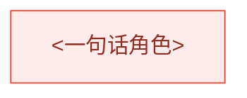

# <Arc 标题>

## 子任务（进度追踪）

| 状态 | 子任务 | spec | plan | PR |
|---|---|---|---|---|
| 🚧 | **<ID>** <一句话范围> | — | — | — |

## 阶段依赖

说明唯一入口、关键路径、可并行层和收敛点。

## 问题与愿景

## 能力矩阵

## 设计原则

## 非目标

## 优先级与缓做项

## Arc 级验收

## 风险与取舍

## 相关文档
