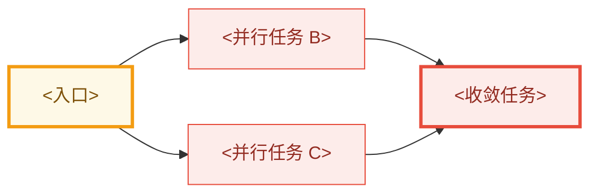

# 开发工作流契约

本文件是 `dev-workflow` bundle 的唯一流程源。所有阶段 skill 在行动前完整读取本文件；不要依赖 bundle
外的流程文档。

## 目录

1. 文档根目录解析
2. 黄金规则
3. 阶段与人工门
4. 文档目录和类型
5. Frontmatter
6. Umbrella 面板与依赖图
7. Plan 并行任务图
8. Goal、sub-agent 与本地 commit
9. 归档
10. Git 与 PR
11. 完成检查

## 1. 文档根目录解析

按以下优先级解析 `DOC_ROOT`：

1. 使用用户在当前请求中明确给出的项目文档根。
2. 否则搜索 memory registry，选择与当前项目直接相关、最新、最具体且仍存在的文档根候选。
3. memory 没有可用候选时，使用 `<repo-root>/docs/workflow/`。

读取 `DOC_ROOT` 和目标子目录下适用的 `AGENTS.md`。具体子目录规则优先于本契约的默认布局。Memory 只用于定位，
不得替代实时文件和当前代码证据。不要把解析出的机器相关绝对路径写回 skill、模板或代码仓库。

默认最小目录布局：

```text
DOC_ROOT/
  specs/
  plans/
  archive/
    specs/
    plans/
```

多阶段 arc 或 roadmap 需要时，可增加：

```text
DOC_ROOT/
  Roadmap.md
  Umbrella.base
  Specs.base
  umbrella/
  archive/
    umbrella/
```

`Roadmap.md`、`.base`、umbrella、wikilink 和对应元数据是可选能力，只在当前请求、现有文档体系或适用
`AGENTS.md` 要求时启用。若 `DOC_ROOT` 已有等价布局，沿用现状，不复制第二套目录。

## 2. 黄金规则

1. 所有设计、spec、plan、umbrella 和 roadmap 文档写入解析后的 `DOC_ROOT`。
2. 用户沟通、设计文档、代码、注释、日志、错误、commit message 和 PR 文本的语言遵循当前请求和适用的
   `AGENTS.md`；没有项目规则时，用户沟通与文档跟随用户语言，代码侧产物保持项目现有约定。
3. 写 spec 前逐条核实代码事实并记录 `file:line`；区分事实、怀疑和提案。
4. 使用适用 `AGENTS.md` 定义的真实生产形态作为行为和验收基准；测试便利形态不能替代生产形态验证，也不应驱动
   特殊架构分支。
5. 永久 guard 只保护长期行为契约。迁移编号、旧符号不存在、精确 owner/file/token/count 等源码形状检查不得作为
   完成态永久 guard；临时迁移检查必须在完成迁移的同一 PR 删除。
6. 设计变更必须回到讨论阶段；不要在 plan 或实现中静默改写 accepted spec。
7. 历史归档是长期知识库。写新 spec/plan 前搜索 active 与 archive，避免重复立项或把已完成能力误判成缺口。

## 3. 阶段与人工门

标准流程：

```text
讨论清楚问题
  -> accepted design
  -> spec / umbrella
  -> Codex Plan mode
  -> approved plan 落盘
  -> goal 驱动的本地实现与验证
  -> 用户另行明确授权
  -> push / PR / archive
```

阶段路由：

| 阶段 | Skill | 终态 |
|---|---|---|
| 讨论 | `$dev-workflow-discuss-design` | 问题、证据、目标、非目标和关键裁决被接受 |
| Spec | `$dev-workflow-write-spec` | 一个 PR spec 或多阶段 umbrella 已落盘 |
| Plan | `$dev-workflow-plan` | Plan mode 批准且 plan 已落盘 |
| Execute | `$dev-workflow-execute` | 本地实现完成且验证通过 |
| Finish | `$dev-workflow-finish` | 明确授权的发布与归档完成 |

只设置两个常规人工门：

1. **设计接受门**：用户明确接受问题定义、目标、非目标和关键设计决策。
2. **计划批准门**：用户在 Codex Plan mode 中批准最终实现计划。

端到端请求可以在阶段完成后自动继续，但 agent 无法自行切换 Codex 模式时，必须提示用户进入 Plan mode。Execute
结束后不得自动发布；push 和 PR 始终需要独立的明确授权。

## 4. 文档目录和类型

- 会派生多个独立 spec 的多阶段 arc：项目启用 umbrella 时写入 `umbrella/`，`type: design-umbrella`；否则按项目
  约定记录父子关系。
- 可独立实现、一个 PR 粒度的执行单元：写入 `specs/`，`type: design-spec`；项目启用 roadmap 时再添加对应字段。
- 批准的实现计划：写入 `plans/`，`type: implementation-plan`、`status: approved`。
- 已开 PR 的完成态文档：移动到 `archive/` 下同名类型目录。

文件命名：

- spec / umbrella：`YYYY-MM-DD-<kebab-slug>-design.md`
- plan：`YYYY-MM-DD-<kebab-slug>-plan.md`

项目启用 umbrella 时，从属某 arc 的 spec 在 frontmatter 添加 `umbrella: "[[<umbrella-basename>]]"`，并在
umbrella 子任务面板建立反向入口。

## 5. Frontmatter

Spec 的最小 frontmatter 使用：

```yaml
---
title: "<ID>：<一句话标题>"
date: YYYY-MM-DD
type: design-spec
status: active
---
```

项目启用 roadmap 时，再增加：

```yaml
roadmap: true
module: <module>
module_label: "<模块显示名>"
priority: TBD
priority_order: 999
roadmap_status: todo
roadmap_status_label: "未开始"
roadmap_source: spec-frontmatter
# legacy_roadmap_items: <旧编号>
# umbrella: "[[<umbrella-basename>]]"
tags:
  - dev-workflow/design
  - dev-workflow/specs
  - dev-workflow/roadmap
```

项目启用 umbrella 时，umbrella 使用相同 Roadmap 字段，但 `type: design-umbrella`，且不写 `umbrella:`。

Plan 使用：

```yaml
---
title: "<Spec 标题>实现计划"
date: YYYY-MM-DD
type: implementation-plan
status: approved
spec: "[[<spec-basename>]]"
tags:
  - dev-workflow/design
  - dev-workflow/plans
---
```

Plan 正文必须链接 spec；spec 必须按项目约定反链 plan，没有既有约定时使用 `## 实现计划` 与 plan wikilink。

项目启用 Roadmap 时，只更新文档 frontmatter、umbrella 子任务面板和阶段依赖图。`Roadmap.md` 由 Bases 聚合时，
不手改其聚合行。

## 6. Umbrella 面板与依赖图

本节仅适用于启用了 umbrella 的项目。Umbrella 正文开头依次放置：

1. `## 子任务（进度追踪）`
2. `## 阶段依赖`

子任务面板固定列：

```markdown
| 状态 | 子任务 | spec | plan | PR |
|---|---|---|---|---|
| ✅ | **<ID>** <一句话范围> | [[<spec>]] | [[<plan>]] | [#N](<url>) |
| ⏳ | **<ID>** <一句话范围> | [[<spec>]] | — | — |
| 🚧 | **<ID>** <一句话范围> | — | — | — |
```

状态机械判定：

- 🚧：既无 spec 也无 plan。
- ⏳：已有 spec 或 plan，但尚未开 PR。
- ✅：已开 PR；被其他任务吸收或明确作废时也可标 ✅，但必须说明原因。
- 多里程碑任务只要仍有里程碑未开 PR，整体保持 ⏳。

Spec、plan 和 PR 分列独立维护。归档后保留 spec/plan wikilink；只更新状态和 PR。

阶段依赖图使用 `flowchart LR`，只画硬依赖。节点填充色表示状态，关键入口和收敛点用粗描边：



图后说明唯一入口、关键路径、可并行层、收敛点及每条硬依赖的原因。面板状态、节点颜色和 umbrella
`roadmap_status` 必须同步：

- 全 🚧：`todo`
- 出现 ⏳/✅ 但未全 ✅：`active`
- 全 ✅：`done`，随后归档 umbrella

## 7. Plan 并行任务图

进入 Plan mode 时明确提示：尽量把实现计划设计成可由多个 sub-agent 安全并行调度的 task graph，但不得为了并行而
制造错误边界。

计划必须包含：

1. **任务 DAG**：稳定 task ID、硬依赖、关键路径、并行 waves 和最终收敛点。
2. **文件所有权**：每个 task 的精确文件 / 模块范围；并行 task 默认不得写同一文件。
3. **输入与输出契约**：前驱提供什么，后继依赖什么。
4. **独立验证**：每个 task 可单独运行的测试、探针或静态检查。
5. **集成验证**：每个 wave 收敛后的组合验证和与项目风险相称的最终生产形态验证。
6. **调度标签**：
   - `sub-agent-safe`：依赖满足、范围独立、可并行；
   - `main-agent`：跨任务整合、共享文件、高风险语义或最终收敛；
   - `serial`：必须按顺序执行。
7. **风险与回退**：高风险切换点、恢复策略和必须回到设计讨论的变化。
8. **Commit 检查点**：完整切片结束后或进入高风险改动前的本地 commit 边界。

优先切分行为完整、可验证、文件范围互不重叠的任务。以下情况保持串行：

- 多个任务必须同时修改同一核心文件或同一共享 schema；
- 后一任务的正确接口取决于前一任务的实现结果；
- 跨模块语义只能整体裁决；
- 并行会造成重复迁移、冲突 owner 或不可独立验证的半状态。

Plan mode 最终输出应提供一张调度表：

```markdown
| Task | Depends on | Wave | Label | File scope | Output | Validation | Commit |
|---|---|---|---|---|---|---|---|
| T1 | — | 1 | sub-agent-safe | <paths> | <contract> | <command> | yes |
| T2 | — | 1 | sub-agent-safe | <paths> | <contract> | <command> | yes |
| T3 | T1,T2 | 2 | main-agent | <paths> | <integration> | <command> | yes |
```

## 8. Goal、Sub-agent 与本地 Commit

Execute 开始时必须创建或继续当前 goal。Goal 明确绑定 spec、approved plan、本地行为结果和验证终态；不得包含 push
或 PR。

持续执行规则：

- 普通编译失败、测试失败、遗漏调用点、耗时超预期和可逆局部重构都由 agent 自主处理。
- 只有需要改变 accepted spec 的目标、外部协议、持久化格式、所有权边界或失败语义，或者缺少用户专属权限 /
  业务裁决、需要未授权破坏性或生产操作时，才暂停询问。
- 只有目标实际完成才标记 `complete`。
- 只有同一阻塞连续至少三个 goal turn 且安全替代路径耗尽后才标记 `blocked`。

Sub-agent 调度：

1. 默认优先调度：存在两个或以上依赖已满足、标记 `sub-agent-safe`、文件范围不冲突且能产生独立证据的 task 时，使用可用
   sub-agent 并行处理；不得仅因协调成本而全部串行化。
2. 仅当串行明显更有优势时才不调度：改动极小、共享高风险语义或同一文件、需要连续交互式调试、并发会拖慢关键构建/测试，或
   主 agent 已在不可安全切分的同一整合范围中工作。例外必须在 plan 或 commentary 中简短说明。
3. 给每个 sub-agent 传递 accepted spec、对应 plan task、精确写入范围、禁止项和验证命令。
4. 主 agent 保留 goal、任务图、共享文件、集成和最终验证所有权。
5. 主 agent 对照代码复核 sub-agent 结论，不直接信任摘要。
6. 共享工作树中的 sub-agent 无论串行或并行都不得 commit；由主 agent 在 wave 集成和验证后创建检查点 commit。
7. 只有显式使用独立 worktree 或独立 clone、并配有任务专用 branch 时，sub-agent 才可各自本地 commit；仍禁止
   push 和 PR，由主 agent 集成。
8. 高风险共享语义、最终收敛和跨 task 冲突由主 agent 串行处理。

本地 commit：

- 只在任务本地开发分支创建，不在 detached HEAD、主分支或无关分支创建。
- 完整章节 / 行为切片完成并通过定向验证后，可以创建检查点 commit。
- 进入高风险、跨模块或难回滚改动前，可以为当前稳定状态创建恢复点。
- 只暂存本任务文件，使用当前请求和适用 `AGENTS.md` 规定的 commit message 语言，并在 plan 执行记录中关联
  task / wave。
- Commit 不表示 plan 或 goal 完成。
- Execute 阶段始终禁止 push 和 PR。

## 9. 归档

`archive/` 是完成态知识库，不是删除区。它保存设计、计划、验收、取舍、失败路径和 PR 入口。

PR 创建成功后：

1. 搜索待归档 spec / plan 的全部 wikilink。
2. 将 spec 移到 `archive/specs/`，plan 移到 `archive/plans/`。
3. 项目启用 umbrella 时，保留其面板中的 spec / plan wikilink。
4. 项目启用 roadmap / umbrella 时，把子任务标为 ✅，填写 PR 链接，并同步依赖图节点颜色。
5. 项目启用 umbrella 且整条 arc 全部完成后，将 umbrella 移到 `archive/umbrella/`。

若一组互相引用的文件一起归档，确认 archive 外没有意外断链。归档文档不继续维护 active 状态；后续工作新建 active
spec/plan，并链接历史归档。

## 10. Git 与 PR

- Push 只能发往用户或适用 `AGENTS.md` 明确授权的 remote；不得把 remote 名称、目标仓库、base 或 head 写死在 skill 中。
- 未明确授权可写 remote 时，不得假定 `origin`、`upstream` 或任何 fork 可写。
- PR 默认创建为 ready for review；目标仓库、base、head 和模板从项目配置、remote、适用 `AGENTS.md` 或用户指令解析。
  关键目标仍不明确时先询问用户。
- Commit、PR 标题和正文的语言及 trailer 规则遵循当前请求和适用 `AGENTS.md`。
- 两个独立 bug / feature 拆为独立 PR；从合适基线建立干净分支。
- 能力缺失应在真正拥有该能力的组件修复，不在错误层级添加 guard / flag 绕过。
- 不在缺少用户需求或兼容证据时引入兼容层、迁移双格式或 shim。
- Push、PR、归档仅由 `$dev-workflow-finish` 在用户明确授权后执行。

## 11. 完成检查

声称阶段完成前：

- Discussion：事实、怀疑、提案分离；重大决策已接受。
- Spec：代码证据当前有效；frontmatter 可解析；启用 Roadmap / umbrella 时，元数据、反链和依赖图一致。
- Plan：用户已在 Plan mode 批准；DAG、并行 waves、文件所有权、验证和 commit 边界完整。
- Execute：plan 必需 task 全部完成；定向、集成和生产形态验证与风险相称；无临时文件和残留进程。
- Finish：发布授权明确；PR 已创建；spec/plan 已归档；启用 umbrella / Roadmap 时，对应状态已更新。
