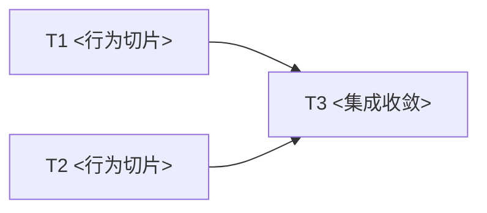

# <Spec 标题>实现计划

<!-- 成稿移除提示。默认保留六章及顺序、每阶段四个小节。示例中的阶段数和并行关系须按真实任务修改。 -->

## 1. 实施目标与代码基线

<链接 [[<spec-basename>]] 及版本，说明交付结果、当前状态、源码基线和实施前提。点出当前代码需要改变的关键位置，
不重复整份 spec 的裁决。区分现有与待新增能力。>

## 2. 关键数据结构与流程

<按关键机制组织子节，给出少量核心数据结构和流程伪代码，标明身份、可变状态、责任持有者、交接及正确性相关的失败分支。
说明哪些名字是示意、哪些接口已冻结，并关联负责阶段。简单任务可以用简短流程文字。>

## 3. 实施阶段与依赖

<图只表达硬依赖。解释前驱提供什么、后继为何需要它，以及并行和串行边界。图中每个节点必须有同名阶段正文。>

### T1：<行为切片>

#### 目标与前置输入

<对应哪项 spec 行为，前置是什么，由谁执行。本示例为 wave 1 / sub-agent-safe。>

#### 修改范围与关键工作

<精确文件或模块范围，消费哪些现有能力，实现第 2 章哪段结构或流程，与 T2 如何隔离写入。>

#### 输出与交接

<后继得到什么、如何使用，不能只写“代码完成”。>

#### 验证与完成条件

<具体定向测试及其证明的行为，可引用第 4 章命令；说明何时可进入后继和建立本地检查点。>

### T2：<行为切片>

#### 目标与前置输入

<说明目标和前置。本示例为 wave 1 / sub-agent-safe；若实际依赖 T1，同步修改 DAG，不为并行硬拆。>

#### 修改范围与关键工作

<给出独占范围和关键流程。>

#### 输出与交接

<定义交给 T3 的具体结果及契约。>

#### 验证与完成条件

<写明具体验证及可交接条件。>

### T3：<集成收敛>

#### 目标与前置输入

<说明如何消费 T1/T2 的输出，本示例为 wave 2 / main-agent。>

#### 修改范围与关键工作

<明确共享文件的串行整合、生产接线和冲突处理；高风险切换引用第 5 章恢复安排。>

#### 输出与交接

<定义集成后的行为结果与最终交付。>

#### 验证与完成条件

<说明组合验证、生产形态验收与最终完成证据。>

## 4. 验证方案

<给出各阶段引用的测试、命令、负载、通过条件和证据。区分待新增与现有用例，说明测试面选择依据。
性能验证写清输入、配置、采集与对照方法，待调查参数指定前置冻结阶段。按风险安排生产形态验证与有依据的全量收敛，
记录已知负载敏感用例及复核方式。>

## 5. 实施边界与风险处理

<说明执行者可决定的局部细节、哪些改变需要回到设计讨论、切换风险、本地检查点和恢复策略。
只在任务本地分支 commit，execute 阶段禁止 push 和 PR。>

## 6. 执行记录

<按实际工作记录进度，不预填通过。尚未执行时明确标注；完成证据链接指向实际产物。>

| 阶段 | 状态 | 检查点 | 验证结果与证据 | 未完成事项 |
|---|---|---|---|---|
