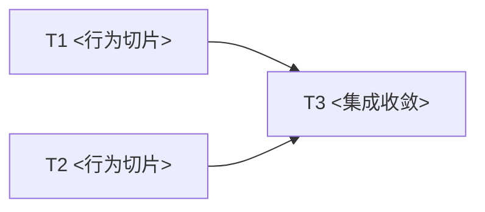

# <Spec 标题>实现计划

## 目标与完成定义

## 输入与设计约束

- Spec：[[<spec-basename>]]

## 代码现状

## Task DAG

说明关键路径、可并行 waves、串行约束和最终收敛点。

## 并行调度表

| Task | Depends on | Wave | Label | File scope | Output | Validation | Commit |
|---|---|---|---|---|---|---|---|
| T1 | — | 1 | sub-agent-safe | `<paths>` | `<contract>` | `<command>` | yes |
| T2 | — | 1 | sub-agent-safe | `<paths>` | `<contract>` | `<command>` | yes |
| T3 | T1,T2 | 2 | main-agent | `<paths>` | `<integration>` | `<command>` | yes |

标签只能使用：

- `sub-agent-safe`：依赖满足后可由 sub-agent 独立执行；
- `main-agent`：共享文件、跨任务集成、高风险语义或最终收敛；
- `serial`：必须与前后任务串行。

`Validation` 列写具体可运行的定向验证目标（测试目标 / 套件 / 用例），不写「跑测试」。需要全量验证的任务
在明细的**影响面判断**里写明理由。

## 任务明细

### T1：<行为增量>

- **Depends on**：
- **Wave / Label**：
- **目标**：
- **文件所有权**：
- **输入 / 输出契约**：
- **实现步骤**：
- **验证**：<本任务改动影响的具体测试目标 / 套件 / 用例及运行命令>
- **影响面判断**：<其余测试为什么不受影响；需要全量验证时写明理由>
- **完成证据**：
- **本地 commit 检查点**：<完成本切片后 / 进入后续高风险改动前 / 不需要>

## Wave 集成与验证

### Wave 1

- **可并行 tasks**：
- **集成顺序**：
- **组合验证**：
- **冲突处理**：
- **检查点 commit**：

## 可由执行者决定的事项

## 必须回到设计讨论的变化

## 最终验证

- 定向验证：<各任务测试面汇总>
- Wave 组合验证：
- 最终集成验证：<全量验证在此运行一次；写明范围与预计代价>
- 生产部署形态验证：
- 负载敏感失败处理：<已知的时间敏感 / 已知失败基线用例，以及单跑复核判据>

## 本地 Commit 策略

- 只允许任务本地开发分支。
- 完整切片完成后或高风险改动前可创建检查点 commit。
- execute 阶段禁止 push 和 PR。

## 执行记录

| Task / Wave | Owner | Status | Commit | Evidence |
|---|---|---|---|---|
