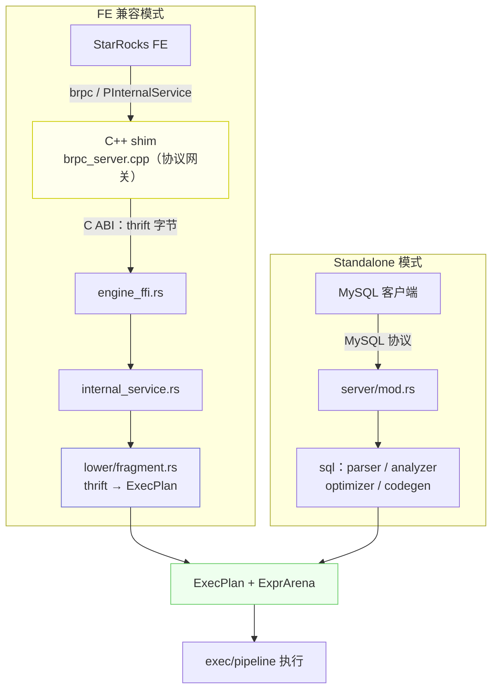

# 一套内核，两个入口：NovaRocks 如何把一棵 thrift 计划树变成可执行计划

> NovaRocks 技术分析系列 · 第 0 篇

StarRocks 的 FE（前端）把一条 SQL 优化、切分之后，会发给后端一棵 **thrift 序列化的执行计划树**——计划节点、表达式、tuple/slot 描述符表，全是结构化的二进制。后端拿到这棵树，要在自己这边把它"翻译"成真正能跑的东西，再把数据一批批算出来。

问题是：如果这个后端**不是 StarRocks 原生的 C++ BE，而是一个用 Rust 从零写的引擎**呢？它怎么读懂别人家协议里长出来的计划树？又怎么保证翻译不出岔子？而当它脱离 StarRocks FE、自己解析 SQL 时，又凭什么能复用同一套执行机器？

这就是本系列要拆开看的引擎——NovaRocks。作为第 0 篇，我们先建立全局地图：它是什么、为什么用 Rust、两种模式如何共享一套内核；然后顺着 FE 那棵计划树，一路走到"可执行计划"为止，把 NovaRocks 最基础也最能体现其设计取向的一层——**Plan Lowering**——讲透。

## NovaRocks 是什么

NovaRocks 是一个 **Rust 原生的、面向存算分离的分析型查询引擎**。它的来历决定了它的形状：最初的目标很具体——做一个和 StarRocks BE（后端）**协议兼容**的运行时，让 StarRocks FE 完全无感知地照常下发计划，由 NovaRocks 接管执行；后来它又长出了第二条腿，**脱离 FE 也能独立跑 SQL**。

先把丑话说在前面，免得后文反复打断：NovaRocks 目前是**实验性**项目，绝大部分代码由 AI 协作完成，没有经过生产级验证。从体量上看，它在约三个半月里累积了近 55 万行 Rust 代码、数百次提交，外加一层很薄（约 3000 行）的 C++ 胶水层。"Rust 占绝对主体、C++ 只剩一层皮"这个比例，本身就是理解它架构的第一把钥匙。

**为什么是 Rust？** 一个分析型执行引擎天然是重并发、对延迟敏感的：pipeline 上有大量并行的 driver，跨节点要做数据 shuffle，底层还有异步 I/O。这类系统用 C++ 写容易踩内存与数据竞争的坑，用带 GC 的语言写又要忍受停顿。Rust 给了"无 GC 的内存安全"和"无畏并发"，同时还保留了和 C/C++ 互操作的能力——这一点尤其关键，因为 StarRocks 与 FE 之间那套 brpc 协议栈过于庞大，从头用 Rust 复刻不现实。于是 NovaRocks 的选择是：**协议这块脏活留给 C++，执行语义全用 Rust 重写。**

这引出了贯穿全系列的一个论点，把它记住，后面每一篇都是在给它的某一块做放大：

> **一套执行内核，两个入口。** 无论计划是 StarRocks FE 用 thrift 下发的，还是 NovaRocks 自己解析 SQL 生成的，它们最终都收敛到同一个数据结构 `ExecPlan`，跑在同一套 pipeline 上。



左边是 StarRocks FE 经 brpc 进来，右边是 MySQL 客户端直连。两条前门走过各自的"翻译"路径后，在中间的 `ExecPlan + ExprArena` 处合流，再交给同一套 pipeline 执行。本篇覆盖左半边那条线（从 brpc 到 `ExecPlan`），右半边的 SQL 栈留给第 2 篇。

## 两个入口：FE 兼容模式与 standalone 模式

两个入口的分流，从进程的第一个命令行参数就开始了。`src/main.rs` 里启动模式是这样判定的：

```rust
// src/main.rs:542
let args: Vec<String> = env::args().collect();
let mut idx = 1usize;
let mode = if args.get(idx).is_some_and(|s| !s.starts_with('-')) {
    let m = args[idx].as_str();
    idx += 1;
    m
} else {
    "run"
};

if mode == "standalone-server" {
    match parse_standalone_server_args(&args[idx..]) {
        Ok(Some(cli)) => {
            if let Err(err) = run_standalone_server_cli(cli) { /* ... */ }
            return;
        }
        // ...
    }
}
```

不带子命令时默认是 `"run"`，也就是 **FE 兼容后端模式**。在这个模式下，NovaRocks 会拉起一组 FE 期望的服务：一个 gRPC server、一个 thrift 心跳服务（`heartbeat_service`，监听 `heartbeat_port`），并通过心跳把自己各个端口报告给 FE；还有 backend thrift 服务（`be_port`）和（可选编译进来的）C++ brpc 网关（`brpc_port`）。FE 据此把查询执行请求路由到 brpc 端口，把任务/表管理请求路由到 be 端口。

```rust
// src/main.rs:774（run 模式启动服务，节选）
novarocks::start_grpc_server(server.host.as_str()).expect("start grpc server");
// Start Rust heartbeat service
let heartbeat_cfg = novarocks::service::heartbeat_service::HeartbeatConfig {
    // host / heartbeat_port / be_port / brpc_port / ...
};
novarocks::service::heartbeat_service::start_heartbeat_server(heartbeat_cfg)
    .expect("start heartbeat server");
```

只有显式写 `standalone-server`，才会岔到独立 SQL 服务那条路——对外暴露一个 MySQL 兼容端口，并按角色（`fe` / `be` / `all-in-one`）分派。

值得强调的是先后顺序：FE 兼容模式是项目的**原始形态**（它就是冲着"替换 StarRocks BE"去的），standalone 是后来在同一套执行内核之上"长"出来的第二个前门。理解这一点，就不会把两种模式的假设混在一起——这也是 NovaRocks 自己写在规则里的一条铁律：FE 兼容路径严格跟随 FE 给的 thrift 元数据，standalone 路径才自己拥有 SQL 解析与目录解析。两种模式的假设绝不能互相串味。

## 协议网关：C++ shim 只做翻译，不碰执行

FE 和后端之间最硬的一块兼容性，是 brpc 协议——StarRocks 的 `PInternalService` 跑在 brpc 上。NovaRocks 的选择是：**把这块脏活留在 C++，但只留这一块。** 这条"协议归 C++、执行归 Rust"的分工线，具体长什么样？

先看 Rust 向 C++ 暴露的 C ABI，整个接口窄得惊人：

```c
// src/shim/compat.h:42
typedef struct NovaRocksRustBuf {
    uint8_t* ptr;
    size_t len;
} NovaRocksRustBuf;

// --- Rust engine FFI ---

// Executes `TExecPlanFragmentParams` from request attachment (Thrift BINARY).
int32_t novarocks_rs_submit_exec_plan_fragment(const uint8_t* ptr, size_t len);

// Returns:
// - 0: OK (a result batch is returned; may be EOS)
// - 1: NOT_FOUND
// - 2: CANCELLED
// - 3: FAILED
// - 4: TIMEOUT
int32_t novarocks_rs_fetch_result_batch(int64_t finst_id_hi,
                                      int64_t finst_id_lo,
                                      int64_t* out_packet_seq,
                                      bool* out_eos,
                                      NovaRocksRustBuf* out_batch,
                                      NovaRocksRustBuf* out_err);

int32_t novarocks_rs_cancel(int64_t finst_id_hi, int64_t finst_id_lo);
```

跨越这条边界的东西少得可怜：提交计划时是一段 **thrift 二进制字节缓冲**（`ptr, len`），取结果和取消时是 **fragment 实例 id**（拆成 `hi/lo` 两个 int64），返回的是简单的整型状态码。没有结构化对象在边界上来回传递、没有共享在 C++/Rust 之间的复杂状态——只有字节、id 和返回码。这种"窄接口"是刻意的：FFI 边界越窄，两侧的耦合越少，出错面越小。

再看 C++ 收到一个 brpc 请求后做了什么：

```cpp
// src/shim/brpc_server.cpp:1135
static void run_exec_plan_fragment(AttachmentProtocol proto,
                                   std::string attachment,
                                   starrocks::PExecPlanFragmentResult* response) {
    if (proto != AttachmentProtocol::Binary) {
        status_err(response->mutable_status(), starrocks::TStatusCode::INVALID_ARGUMENT,
                   "only attachment_protocol=binary is supported for now");
        return;
    }

    starrocks::TExecPlanFragmentParams params;
    std::string err;
    if (!thrift_deserialize(attachment, proto, &params, &err)) { /* 报错返回 */ }
    if (!params.__isset.params) {
        status_err(response->mutable_status(), starrocks::TStatusCode::INVALID_ARGUMENT,
                   "missing fragment_instance_id in TExecPlanFragmentParams.params");
        return;
    }

    int32_t rc = novarocks_rs_submit_exec_plan_fragment(
            reinterpret_cast<const uint8_t*>(attachment.data()), attachment.size());
    if (rc != 0) { /* 报错返回 */ }

    status_ok(response->mutable_status());
}
```

注意这段代码做了什么、又**没**做什么。它做的：校验附件协议是不是 binary、反序列化一次只为做最小校验（带没带 `fragment_instance_id`）、把**原始字节**整体转发给 Rust、最后回填一个 status。它没做的：任何与查询执行有关的事——算子、调度、内存、结果，一个都没碰。C++ 在这里就是一个翻译官：把 brpc 帧拆开，把 thrift 字节原样递进 Rust，再把 Rust 的返回码包成 brpc 响应。启动这套 C++ 网关的引导逻辑在 `src/service/compat.rs`，它通过另一组 `extern "C"` 调用把配置（host、各端口、线程数）传进 C++ 侧。

这种"协议与执行分离"是核心设计取舍。代价是 thrift/protobuf 的兼容细节要在 C++ 里维护；收益是执行语义可以完全用 Rust 表达、独立测试、独立演进，而不被协议层的历史包袱拖住。它也让那条铁律落了地：**C++ Shim 是协议网关，执行语义属于 Rust。**

## 从 thrift 计划到 ExecPlan：Plan Lowering

字节进了 Rust，真正的翻译才开始。这一跳叫 lowering，是连接"FE 的计划"与"NovaRocks 的执行"的关键关节。

### 从提交到执行的接力

FFI 那头对应的 Rust 入口是 `submit_exec_plan_fragment`，它把 thrift 反序列化、组装好查询上下文（query id、实例 id、描述符表、内存追踪器等），最后把活儿交给 `execute_fragment`。光看 `execute_fragment` 的签名，就能感受到"严格跟随 FE 元数据"是什么意思——它接收的几乎全是 FE 提供的东西：

```rust
// src/lower/fragment.rs:148
pub(crate) fn execute_fragment(
    fragment: &planner::TPlanFragment,
    desc_tbl: Option<&descriptors::TDescriptorTable>,
    exec_params: Option<&internal_service::TPlanFragmentExecParams>,
    query_opts: Option<&internal_service::TQueryOptions>,
    session_time_zone: Option<&str>,
    pipeline_dop: i32,
    _group_execution_scan_dop: Option<i32>,
    db_name: Option<&str>,
    profiler: Option<Profiler>,
    last_query_id: Option<&str>,
    fe_addr: Option<&types::TNetworkAddress>,
    backend_num: Option<i32>,
    mem_tracker: Option<std::sync::Arc<crate::runtime::mem_tracker::MemTracker>>,
) -> Result<FragmentOutput, String> {
```

`TPlanFragment`（计划树 + 输出 sink）、`TDescriptorTable`（列/槽元数据）、`TPlanFragmentExecParams`（实例 id、scan range、下游目的地）、`TQueryOptions`——这些全是 FE 在 thrift 里给定的。NovaRocks 在这一层不发明任何东西，它只是忠实地把这些元数据翻译成自己的执行结构。

### 布局推断：slot 该落在哪一列

翻译的第一件事是确定**布局**——一个逻辑上的 `(tuple_id, slot_id)` 在物化出来的列式数据里，到底对应第几列。这件事不能拍脑袋，因为不同 fragment 可能需要不同的列子集，而描述符表才是"哪些槽被物化"的权威来源。`execute_fragment` 因此综合三个 helper：`build_tuple_slot_order`（从 `desc_tbl` 建立槽顺序）、`infer_tuple_slot_order`（从计划本身推断）、以及 `reorder_tuple_slots`（按表声明的列序对齐）——`src/lower/layout.rs` 里的注释把原则说得很清楚：

> The descriptor table already encodes the materialized slots for each tuple, so we use it as the source of truth to avoid producing mismatched layouts at runtime.（`src/lower/fragment.rs:250`）

布局错一位，运行期就会拿错列、悄悄算错。把"描述符表当唯一真相"，是避免这类静默错误的根。

### 节点下降：把 TPlanNode 翻译成 ExecNode

布局定好后，`lower_plan` 把计划树逐节点翻译，再把结果装进 `ExecPlan`：

```rust
// src/lower/fragment.rs:255
let lowered: Lowered = {
    let _lower_timer = profiler.as_ref().map(|p| p.scoped_timer("LowerPlanTime"));
    lower_plan(plan, &mut arena, &tuple_slots, desc_tbl, /* ... */)?
};
// ...
let mut exec_plan = ExecPlan {
    arena,
    root: lowered.node,
};
```

`lower_plan` 内部按节点类型分派。`src/lower/node/mod.rs` 里那个大 `match`，把二十多种 `TPlanNodeType` 一一映射成 NovaRocks 自己的执行节点：

```rust
// src/lower/node/mod.rs:384
let mut lowered = match node.node_type {
    t if t == plan_nodes::TPlanNodeType::EXCHANGE_NODE => lower_exchange_node(/* ... */)?,
    t if t == plan_nodes::TPlanNodeType::SELECT_NODE   => lower_select_node(children)?,
    // ... AGGREGATION_NODE / HASH_JOIN_NODE / SORT_NODE / 各类 SCAN ...
    t if t == plan_nodes::TPlanNodeType::OLAP_SCAN_NODE => {
        return Err(
            "OLAP_SCAN_NODE is not supported in novarocks yet. Phase 1 only supports shared-data LAKE_SCAN_NODE queries"
                .to_string(),
        );
    }
    // ...
    t => {
        return Err(format!("unsupported plan node type: {:?}", t));
    }
};
```

翻译的产物，是这样一对结构——一棵执行节点树（`ExecNode` / `ExecNodeKind`）加一个表达式 arena（`ExprArena`）：

```rust
// src/exec/node/mod.rs:75
pub enum ExecNodeKind {
    AssertNumRows(AssertNumRowsNode), Values(ValuesNode), Project(ProjectNode),
    Filter(FilterNode), /* ... */ Scan(ScanNode), Aggregate(AggregateNode),
    Join(JoinNode), Sort(SortNode), SetOp(SetOpNode), // 二十余个变体
}
pub struct ExecNode { pub kind: ExecNodeKind }
pub struct ExecPlan {
    pub arena: ExprArena,
    pub root: ExecNode,
}
```

### 表达式 arena：用下标而非指针建图

表达式这一侧的设计值得单独说。NovaRocks 没有用"指针 + Box"去搭表达式树，而是用一个 **arena**：所有表达式节点平铺在一个 `Vec` 里，彼此用下标 `ExprId(usize)` 互相引用。

```rust
// src/exec/expr/mod.rs:135
pub struct ExprArena {
    nodes: Vec<ExprNode>,
    types: Vec<DataType>,
    field_schemas: Vec<Option<ChunkFieldSchema>>,
    // ...
}
impl ExprArena {
    pub fn push_typed(&mut self, node: ExprNode, data_type: DataType) -> ExprId {
        let id = ExprId(self.nodes.len());
        self.nodes.push(node);
        self.types.push(data_type);
        self.field_schemas.push(None);
        id
    }
```

用下标而非指针，在 Rust 里是很实在的选择：`ExprId` 是 `Copy` 的，到处传递零成本；多个父节点可以引用同一个子表达式（DAG 复用）而不必跟借用检查器搏斗；`nodes / types / field_schemas` 三个平行数组让"取某个表达式的类型"是一次 O(1) 的下标访问，元数据不必塞进枚举本身。

FE 还会下发"公共子表达式"（`common_slot_map`，把重复的子表达式抽出来共享）。NovaRocks 在下降这类引用时做了两件事：缓存已下降的结果以复用，以及——用一个 DFS 栈检测环：

```rust
// src/lower/expr/mod.rs:442
if ctx.stack.contains(&slot.slot_id) {
    return Err(format!(
        "common_slot_map contains a cycle at slot_id={}",
        slot.slot_id
    ));
}
ctx.stack.push(slot.slot_id);
```

一个本应是 DAG 的结构里如果出现环，与其无限递归、栈溢出，不如就地报错。

### 类型下降：严格，不猜

最后是类型。`arrow_type_from_nodes` 递归地把 thrift 的 `TTypeNode` 翻译成 Arrow `DataType`，标量类型一一对应：

```rust
// src/lower/type_lowering.rs:141
let data_type = match scalar.type_ {
    t if t == types::TPrimitiveType::NULL_TYPE => DataType::Null,
    t if t == types::TPrimitiveType::BOOLEAN  => DataType::Boolean,
    t if t == types::TPrimitiveType::INT      => DataType::Int32,
    t if t == types::TPrimitiveType::BIGINT   => DataType::Int64,
    t if t == types::TPrimitiveType::LARGEINT => DataType::FixedSizeBinary(16),
    t if t == types::TPrimitiveType::DATE     => DataType::Date32,
    t if t == types::TPrimitiveType::DATETIME => {
        let unit = match scalar.time_unit {
            None => TimeUnit::Microsecond,
            Some(c) if c == THRIFT_TIME_UNIT_MICROS => TimeUnit::Microsecond,
            Some(c) if c == THRIFT_TIME_UNIT_NANOS  => TimeUnit::Nanosecond,
            Some(_) => return None,
        };
        DataType::Timestamp(unit, None)
    }
    // ... STRUCT / ARRAY / MAP 递归处理 ...
};
```

两个细节体现了"严格"的态度。其一，`DATETIME` 会按 `time_unit` 落成微秒或纳秒精度（纳秒正是 Iceberg v3 的新能力，第 3 篇会再遇到它），而对任何未知 unit 直接返回 `None`（即失败）。其二，DECIMAL 的精度和小数位**必须**由描述符显式给出，缺一个就让 `?` 把 `None` 一路传上去导致失败，绝不退回某个"默认精度"——代码注释写得很直白：

```rust
// src/lower/type_lowering.rs:116
// Decimal requires precision/scale from TTypeDesc; without that metadata we cannot build a
// correct Arrow decimal type, except for legacy DECIMALV2 which has a fixed BE shape.
```

因为一个错误的默认精度，意味着静默的数据精度损失——这正是 NovaRocks 最不能容忍的那类 bug。

至此，闭环完成：一段 thrift 字节，变成了 `ExecPlan { arena, root }`——一棵节点树，加一个表达式 arena。这就是后续 pipeline 真正调度的对象。而 standalone 模式那条线，区别只在于 `ExecPlan` 不是从 thrift lower 出来的，而是 SQL 经 codegen 直接生成的；汇流之后，两者面对的是同一套执行栈。

## 一个贯穿始终的选择：fail-fast

读 lowering 的代码，会反复撞见同一种态度：**碰到不支持或语义不明确的东西，就地显式报错，绝不"尽力而为"地猜一个默认值糊过去。** 这不是零散的防御式编程，而是一条写进项目规则的设计原则——"严格跟随 FE 提供的计划与类型元数据，不做 fallback、不猜默认、不隐式降级"。

前面已经见过好几个例子，把它们摆在一起看会更清楚：

- **未支持的计划节点**：`t => return Err(format!("unsupported plan node type: {:?}", t))`。
- **`OLAP_SCAN_NODE` 被直接拒绝**，报错信息写着"Phase 1 only supports shared-data LAKE_SCAN_NODE"——这一句顺带点出了 NovaRocks 的主战场：**存算分离（shared-data）**，本地表（share-nothing）暂不在射程内。
- **表达式缺类型描述符**：

```rust
// src/lower/expr/mod.rs:406
None if cfg!(test) => {
    // Unit tests in this module intentionally use minimal dummy thrift type descriptors.
    // Production lowering must not guess a fallback type.
    DataType::Null
}
None => return Err(missing_type_descriptor_err(node)),
```

那行注释——`Production lowering must not guess a fallback type.`（生产路径的 lowering 绝不允许猜一个兜底类型）——几乎是整个引擎设计哲学的一句话浓缩。
- **DECIMAL 精度缺失、`common_slot_map` 出现环**：如上节，都是当场失败。
- 这种态度甚至延伸到 lowering 之外的服务边界：提交计划时，对网络地址（`validate_network_address`：hostname 为空或端口非正即报错）、对各类 data sink 的 payload（缺字段即报错）都会做显式校验，而不是带着半个非法请求继续往下跑。

为什么宁可报错也不兜底？因为对一个**协议兼容**的后端来说，"猜"意味着偏离 FE 的语义契约，而偏离往往不会立刻 crash，而是悄悄产出错误结果——这是最难排查、危害最大的一类 bug。fail-fast 把每一处"还没做/不确定"都变成一条可检索的明确错误，而不是一个潜伏的雷。

## 取舍与对照

回头看，这一层有几个一以贯之的选择：

- **协议与执行分离**。brpc 兼容这种"又脏又重又不变"的活留在 C++ 薄层，执行语义全部用 Rust 表达。代价是 thrift/protobuf 的兼容细节要在 C++ 维护；收益是执行层可以独立测试、独立演进，不被协议历史包袱绑住。对照 StarRocks BE 那个成熟的单体 C++ 引擎，NovaRocks 等于把"执行"整块切出来、用 Rust 重做，只在协议处留了一道窄窄的 FFI 缝。
- **严格 fail-fast，而非尽力而为**。这是协议兼容场景下的理性选择：宁可暴露能力边界，不可静默算错。它也让"实验阶段覆盖面还窄"这件事变得可控——每一处没做的，都明明白白报出来。
- **arena 化的表达式模型**。用下标代替指针，换来零成本传递、DAG 复用和 O(1) 的元数据查询，同时绕开了 Rust 借用检查器对"图结构"的天然不友好。
- **描述符表是唯一真相**。布局推断不靠猜，一切以 FE 给的 `desc_tbl` 为准——这是把"列对得上"这件事做对的根。

## 小结：下一站，执行引擎

这一篇我们建立了全局地图，并走完了左半边那条线：FE 通过 brpc 把 thrift 计划送到 C++ 协议网关，网关做最小校验后原样转发字节给 Rust，Rust 在 `lower/` 里把它翻译成 `ExecPlan { arena, root }`——一棵节点树加一个表达式 arena。"一套内核、两个入口"的论点，也在 `ExecPlan` 这个汇流点上得到了印证。

但 `ExecPlan` 只是一张"怎么跑"的蓝图，还没真正跑起来。数据是怎么以列式批量流过算子的？算子之间如何并行调度、又如何在跨节点时搬运数据、施加背压？取消一个查询时，那些阻塞在等待上的算子又如何被干净地唤醒？这些是下一篇《执行引擎》的主题——我们会进入 `Chunk`、算子与表达式求值、pipeline 调度，以及 exchange 与运行时。
