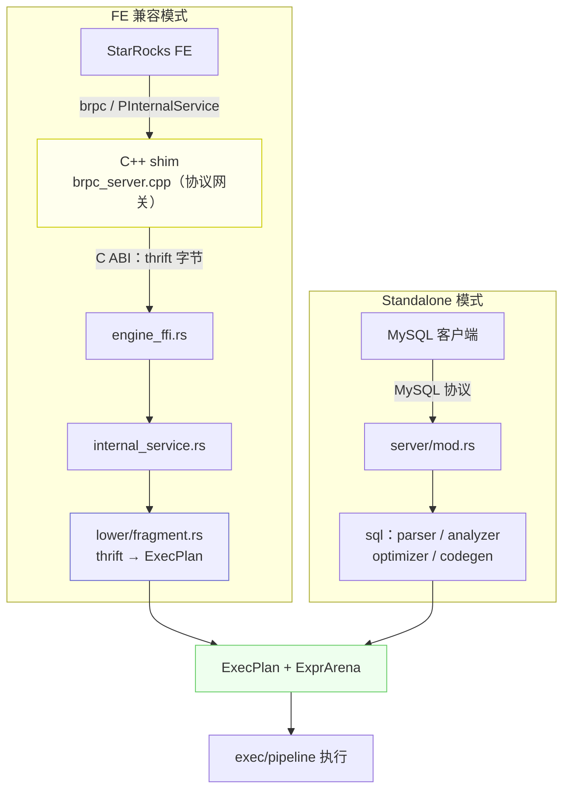

# 一套内核，两个入口：NovaRocks 如何把一棵 thrift 计划树变成可执行计划

> NovaRocks 技术分析系列 · 第 0 篇

StarRocks 的 FE（前端）把一条 SQL 优化、切分之后，会发给后端一棵 **thrift 序列化的执行计划树**——节点、表达式、描述符表，全是结构化的二进制。问题来了：一个**用 Rust 从零写的后端**，怎么把这棵别人家协议里长出来的树，变成自己真正能跑的东西？

这就是本系列要拆开看的引擎——NovaRocks。第 0 篇我们先建立全局地图，然后顺着这棵计划树，一路走到"可执行计划"为止。

## NovaRocks 是什么

NovaRocks 是一个 **Rust 原生的分析型查询引擎**。它最初的目标很具体：做一个和 StarRocks BE（后端）协议兼容的运行时——FE 完全无感知，照常下发计划，由 NovaRocks 接管执行。后来它又长出了第二条腿：**脱离 FE 也能独立跑 SQL**。

先把丑话说在前面，免得后文反复打断：NovaRocks 目前是**实验性**项目，大量代码由 AI 协作完成，没有经过生产级验证。从体量上看，它在约三个半月里累积了近 55 万行 Rust 代码、数百次提交，外加一层很薄（约 3000 行）的 C++ 胶水层。这个"Rust 占绝对主体、C++ 只剩一层皮"的比例，本身就是理解它架构的第一把钥匙。

这篇文章不打算逐个目录罗列模块，而是想讲清一个贯穿全系列的论点：

> **一套执行内核，两个入口。** 无论计划是 StarRocks FE 用 thrift 下发的，还是 NovaRocks 自己解析 SQL 生成的，它们最终都收敛到同一个数据结构 `ExecPlan`，跑在同一套 pipeline 上。

把这张图记住，后面所有篇章都是在给它的某一块做放大：



两条前门——左边是 StarRocks FE 通过 brpc 进来，右边是 MySQL 客户端直连——走过各自的"翻译"路径后，在中间的 `ExecPlan + ExprArena` 处合流，再交给同一套 pipeline 执行。本篇覆盖左半边那条线（从 brpc 到 `ExecPlan`），右半边的 SQL 栈留给第 2 篇。

## 两个入口：FE 兼容模式与 standalone 模式

两个入口的分流，从进程的第一行参数解析就开始了。`src/main.rs` 里，启动模式是这样判定的：

```rust
// src/main.rs:542
let args: Vec<String> = env::args().collect();
let mut idx = 1usize;
let mode = if args.get(idx).is_some_and(|s| !s.starts_with('-')) {
    let m = args[idx].as_str();
    idx += 1;
    m
} else {
    "run"
};

if mode == "standalone-server" {
    match parse_standalone_server_args(&args[idx..]) {
        Ok(Some(cli)) => {
            if let Err(err) = run_standalone_server_cli(cli) { /* ... */ }
            return;
        }
        // ...
    }
}
```

逻辑很直白：不带子命令时默认是 `"run"`，也就是 **FE 兼容后端模式**——启动 thrift 心跳服务、backend 服务，以及（可选的）C++ brpc 网关，然后安静地等 FE 下发计划。只有显式写 `standalone-server`，才会岔到独立 SQL 服务那条路，对外暴露一个 MySQL 兼容端口。

值得强调的是先后顺序：FE 兼容模式是项目的**原始形态**，standalone 是后来在同一套执行内核之上"长"出来的第二个前门。理解这一点，就不会把两种模式的假设混在一起——这也是 NovaRocks 自己的一条铁律：FE 兼容路径严格跟随 FE 给的 thrift 元数据，standalone 路径才自己拥有 SQL 解析与目录解析。

## 协议网关：C++ shim 只做翻译，不碰执行

FE 和后端之间最硬的一块兼容性，是 brpc 协议。StarRocks 的 `PInternalService` 跑在 brpc 上，要从头用 Rust 复刻 brpc 协议栈代价极高。NovaRocks 的选择是：**把这块脏活留在 C++，但只留这一块。**

于是有了一条清晰的分工线——C++ 侧只做协议网关，执行语义一律在 Rust。这条线具体长什么样？先看 Rust 向 C++ 暴露的 C ABI，整个接口窄得惊人：

```c
// src/shim/compat.h:42
typedef struct NovaRocksRustBuf {
    uint8_t* ptr;
    size_t len;
} NovaRocksRustBuf;

// --- Rust engine FFI ---

// Executes `TExecPlanFragmentParams` from request attachment (Thrift BINARY).
int32_t novarocks_rs_submit_exec_plan_fragment(const uint8_t* ptr, size_t len);

int32_t novarocks_rs_fetch_result_batch(int64_t finst_id_hi,
                                      int64_t finst_id_lo,
                                      int64_t* out_packet_seq,
                                      bool* out_eos,
                                      NovaRocksRustBuf* out_batch,
                                      NovaRocksRustBuf* out_err);

int32_t novarocks_rs_cancel(int64_t finst_id_hi, int64_t finst_id_lo);
```

跨越这条边界的东西少得可怜：提交计划时是一段 **thrift 二进制字节缓冲**（`ptr, len`），取结果和取消时是 **fragment 实例 id**（拆成 `hi/lo` 两个 int64）。没有结构化对象、没有共享内存里的复杂状态——只有字节和 id。

再看 C++ 这一侧收到 brpc 请求后做了什么：

```cpp
// src/shim/brpc_server.cpp:1135
static void run_exec_plan_fragment(AttachmentProtocol proto,
                                   std::string attachment,
                                   starrocks::PExecPlanFragmentResult* response) {
    if (proto != AttachmentProtocol::Binary) {
        status_err(response->mutable_status(), starrocks::TStatusCode::INVALID_ARGUMENT,
                   "only attachment_protocol=binary is supported for now");
        return;
    }

    starrocks::TExecPlanFragmentParams params;
    std::string err;
    if (!thrift_deserialize(attachment, proto, &params, &err)) { /* 报错返回 */ }
    if (!params.__isset.params) {
        status_err(response->mutable_status(), starrocks::TStatusCode::INVALID_ARGUMENT,
                   "missing fragment_instance_id in TExecPlanFragmentParams.params");
        return;
    }

    int32_t rc = novarocks_rs_submit_exec_plan_fragment(
            reinterpret_cast<const uint8_t*>(attachment.data()), attachment.size());
    if (rc != 0) { /* 报错返回 */ }

    status_ok(response->mutable_status());
}
```

注意这段代码做了什么、又**没**做什么。它做的：校验附件协议是不是 binary、反序列化一次只为确认"带没带 fragment_instance_id"、把**原始字节**整体转发给 Rust、最后回填一个 status。它没做的：任何与查询执行有关的事。算子、调度、内存、结果——一个都没碰。C++ 在这里就是一个翻译官：把 brpc 帧拆开，把 thrift 字节原样递进 Rust，再把 Rust 的返回码包成 brpc 响应。

这种"协议与执行分离"是刻意的设计取舍。代价是 thrift/protobuf 的兼容细节要在 C++ 里维护；收益是执行语义可以完全用 Rust 表达、独立测试、独立演进，而不被协议层的历史包袱拖住。

## 从 thrift 计划到 ExecPlan：Plan Lowering

字节进了 Rust，真正的翻译才开始。FFI 那头对应的 Rust 入口是 `submit_exec_plan_fragment`，它把 thrift 反序列化、组装好查询上下文（query id、实例 id、描述符表、内存追踪器等）之后，把活儿交给 `execute_fragment`：

```rust
// src/service/internal_service.rs:1581
let exec_result = execute_fragment(
    &fragment,
    desc_tbl.as_ref(),
    Some(&params),
    query_opts,
    session_time_zone,
    pipeline_dop,
    group_execution_scan_dop,
    one.db_name.as_deref(),
    None,
    last_query_id,
    one.coord.as_ref(),
    one.backend_num,
    Some(fragment_mem_tracker),
);
```

`execute_fragment`（在 `src/lower/fragment.rs`）是"计划 → 可执行"这一跳的主舞台。它建好运行时状态和表达式 arena、推断 tuple/slot 布局之后，调用 `lower_plan` 把 thrift 计划树翻译成节点树，再把结果装进 `ExecPlan`：

```rust
// src/lower/fragment.rs:255
let lowered: Lowered = {
    let _lower_timer = profiler.as_ref().map(|p| p.scoped_timer("LowerPlanTime"));
    lower_plan(
        plan, &mut arena, &tuple_slots, desc_tbl,
        fragment.query_global_dicts.as_deref(),
        fragment.query_global_dict_exprs.as_ref(),
        exec_params, query_opts.as_ref(), db_name,
        &connectors, &layout_hints, last_query_id, fe_addr, None,
    )?
};

// ...

let mut exec_plan = ExecPlan {
    arena,
    root: lowered.node,
};
```

`lower_plan` 内部按节点类型逐个分派。`src/lower/node/mod.rs` 里那个大 `match`，把二十多种 `TPlanNodeType` 一一映射成 NovaRocks 自己的执行节点：

```rust
// src/lower/node/mod.rs:384
let mut lowered = match node.node_type {
    t if t == plan_nodes::TPlanNodeType::EXCHANGE_NODE => lower_exchange_node(/* ... */)?,
    t if t == plan_nodes::TPlanNodeType::SELECT_NODE   => lower_select_node(children)?,
    // ... AGGREGATION_NODE / HASH_JOIN_NODE / SORT_NODE / 各类 SCAN ...
```

翻译的产物，是这样一对结构——一棵节点树加一个表达式 arena：

```rust
// src/exec/node/mod.rs:75
pub enum ExecNodeKind {
    AssertNumRows(AssertNumRowsNode),
    Values(ValuesNode),
    Project(ProjectNode),
    Filter(FilterNode),
    // ... 二十余个变体：Scan / Aggregate / Join / Sort / SetOp ...
}

pub struct ExecNode { pub kind: ExecNodeKind }

pub struct ExecPlan {
    pub arena: ExprArena,
    pub root: ExecNode,
}
```

表达式这一侧值得单独说一句。NovaRocks 没有用"指针 + Box"去搭表达式树，而是用了一个 **arena**：所有表达式节点平铺在一个 `Vec` 里，彼此用下标 `ExprId(usize)` 互相引用。

```rust
// src/exec/expr/mod.rs:135
pub struct ExprArena {
    nodes: Vec<ExprNode>,
    types: Vec<DataType>,
    field_schemas: Vec<Option<ChunkFieldSchema>>,
    // ...
}

impl ExprArena {
    pub fn push_typed(&mut self, node: ExprNode, data_type: DataType) -> ExprId {
        let id = ExprId(self.nodes.len());
        self.nodes.push(node);
        self.types.push(data_type);
        self.field_schemas.push(None);
        id
    }
```

用下标而非指针，在 Rust 里是很实在的选择：`ExprId` 是 `Copy` 的，到处传递零成本；多个父节点可以引用同一个子表达式（DAG 复用）而不必跟借用检查器搏斗；`nodes / types / field_schemas` 三个平行数组让"取某个表达式的类型"是一次 O(1) 的下标访问，元数据不必塞进枚举本身。

至此，闭环完成：一段 thrift 字节，变成了 `ExecPlan { arena, root }`——一棵节点树，加一个表达式 arena。这就是后续 pipeline 真正调度的对象。而 standalone 模式那条线，区别只在于 `ExecPlan` 不是从 thrift lower 出来的，而是 SQL 经 codegen 直接生成的；汇流之后，两者面对的是同一套执行栈。

## 一个贯穿始终的选择：fail-fast

读 lowering 的代码，会反复撞见同一种态度：**碰到不支持或语义不明确的东西，就地显式报错，绝不"尽力而为"地猜一个默认值糊过去。**

最直白的例子，是那个大 `match` 的兜底分支：

```rust
// src/lower/node/mod.rs:640
t => {
    return Err(format!("unsupported plan node type: {:?}", t));
}
```

更有意思的是 `OLAP_SCAN_NODE`。在 StarRocks 里这是最常见的本地表扫描节点，但 NovaRocks 直接把它挡在门外：

```rust
// src/lower/node/mod.rs:560
t if t == plan_nodes::TPlanNodeType::OLAP_SCAN_NODE => {
    return Err(
        "OLAP_SCAN_NODE is not supported in novarocks yet. Phase 1 only supports shared-data LAKE_SCAN_NODE queries"
            .to_string(),
    );
}
```

这一句报错信息透露了 NovaRocks 的主战场：**存算分离（shared-data）**，本地表（share-nothing）暂不在射程内。与其假装支持、跑出错误结果，不如在 lowering 阶段就明明白白拒绝。

类型这一层更能体现这种洁癖。表达式 lowering 在拿不到类型描述符时，是这样处理的：

```rust
// src/lower/expr/mod.rs:406
let data_type = match choose_node_data_type(
    node,
    resolve_node_data_type(node),
    infer_function_return_type_from_children(node, &children, arena),
) {
    Some(data_type) => data_type,
    None if cfg!(test) => {
        // Unit tests in this module intentionally use minimal dummy thrift type descriptors.
        // Production lowering must not guess a fallback type.
        DataType::Null
    }
    None => return Err(missing_type_descriptor_err(node)),
};
```

那行注释——`Production lowering must not guess a fallback type.`（生产路径的 lowering 绝不允许猜一个兜底类型）——几乎是整个引擎设计哲学的一句话浓缩。同样的态度也体现在 DECIMAL 上：精度和小数位必须由描述符显式给出，缺一个就让 `?` 把 `None` 一路传上去导致失败，绝不退回某个"默认精度"——因为那意味着静默的数据精度损失。

```rust
// src/lower/type_lowering.rs:175
let precision = scalar.precision.and_then(|v| u8::try_from(v).ok())?;
let scale = scalar.scale.and_then(|v| i8::try_from(v).ok())?;
```

对照来看，StarRocks BE 是一个成熟的单体 C++ 引擎；NovaRocks 把执行语义整体搬到了 Rust，C++ 只剩协议薄层。fail-fast 是这种"重写"姿态的自然结果：覆盖面还窄，很多节点和类型尚未支持，与其用脆弱的兜底掩盖缺口，不如让边界清清楚楚地暴露出来。这既是实验阶段的务实，也让每一处"还没做"都变成一条可检索的明确错误，而不是一个潜伏的 bug。

## 小结：下一站，执行引擎

这一篇我们建立了全局地图，并走完了左半边那条线：FE 通过 brpc 把 thrift 计划送到 C++ 协议网关，网关原样转发字节给 Rust，Rust 在 `lower/` 里把它翻译成 `ExecPlan { arena, root }`。一套内核、两个入口的论点，也在 `ExecPlan` 这个汇流点上得到了印证。

但 `ExecPlan` 只是一张"怎么跑"的蓝图，还没真正跑起来。数据是怎么一批批流过算子的？算子之间如何并行调度、又如何在跨节点时搬运数据、施加背压？这些是下一篇《执行引擎》的主题——我们会进入 `Chunk`、算子与表达式求值、pipeline 调度，以及 exchange 与运行时。
