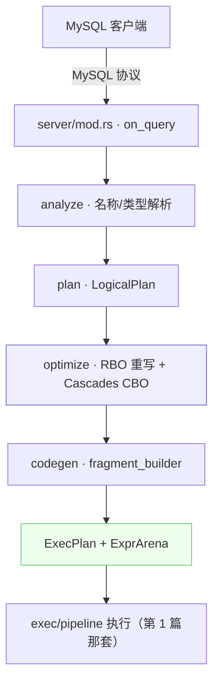

# 脱离 FE 的大脑：Standalone SQL 栈与优化器

> NovaRocks 技术分析系列 · 第 2 篇

前两篇我们反复说"`ExecPlan` 拿到手之后怎么跑"，但都默认它是 StarRocks FE 用 thrift 下发、再经 lowering 得到的。问题是：NovaRocks 还能**完全脱离 FE** 自己跑 SQL。那这条线上，一句 `SELECT` 字符串是怎么一路变成能在上一篇那套 pipeline 上执行的 `ExecPlan` 的？

这一篇就拆 standalone 模式的"另一个前门"——NovaRocks 自带的那颗 SQL 大脑：解析、分析、优化、codegen。

## 定位：同一套内核的另一个前门

回到第 0 篇那张总览图的右半边。standalone 模式下，一个 MySQL 客户端直连进来，全链路完全由 NovaRocks 自己负责：



关键在最后两步：codegen 产出的，是和 FE 路径**同一个 `ExecPlan` 类型**，因此能复用同一套 pipeline。换句话说，NovaRocks 不是"两个引擎"，而是"一套执行内核 + 两套前端"。

入口在 `src/server/mod.rs` 的 `on_query`（一个 MySQL 协议 shim），它把 SQL 拆成语句、维护会话状态（当前库、`SET` 的会话变量等），再交给引擎执行。分析阶段的入口是 `src/sql/analyzer/mod.rs:49` 的 `analyze`——负责名称解析、类型推断，产出一个已解析的查询 IR 加一个全局列 id 工厂。之后 plan 成 `LogicalPlan`，进入优化器。

## 优化器：RBO 重写 + Cascades CBO

优化器是这颗大脑里最重的一块。`src/sql/optimizer/mod.rs:61` 的 `optimize` 把整条流水线串了起来，读它的注释就能看清分层：

```rust
// src/sql/optimizer/mod.rs:61
pub(crate) fn optimize(
    plan: LogicalPlan,
    table_stats: &HashMap<String, TableStatistics>,
    factory: ColumnRefFactory,
    dictionary_provider: Option<...>,
) -> Result<PhysicalPlanNode, String> {
    // 1. Query logical rewrite pipeline. The ordered stages preserve the
    //    legacy-safe sequence: pushdown → join reorder → pushdown →
    //    aggregate pushdown → column pruning → low-cardinality dict rewrite.
    let rewritten =
        rewrite::registry::query_rewrite_pipeline(table_stats).rewrite(plan, &mut rewrite_ctx)?;
    // ...
    // 5. Convert to Memo.
    let root_group = convert::logical_plan_to_memo(&rewritten, &mut memo);
    // 6. Derive initial statistics.
    stats::derive_group_statistics(&mut memo, table_stats);
    // 7. Explore: apply transformation rules (logical -> logical).
    explore(&mut memo, &transform_rules, &options, deadline)?;
    // 8. Implement: apply implementation rules (logical -> physical).
    implement(&mut memo, &impl_rules, &options);
    // ... 10. top-down search with property enforcement; 11. extract best ...
}
```

两段式很清晰：**先 RBO**——一条规则重写流水线，按"谓词下推 → join 重排 → 再下推 → 聚合下推 → 列裁剪 → 低基数字典重写"的固定顺序把逻辑计划改写到一个稳定形态；**再 CBO**——把逻辑计划灌进 `Memo`，派生统计、explore（逻辑→逻辑的变换规则）、implement（逻辑→物理的实现规则），最后自顶向下做带属性强制的代价搜索、抽出最优物理计划。这是经典的 Cascades 框架。

规则本身被抽象成 trait。逻辑重写规则长这样：

```rust
// src/sql/optimizer/rewrite/rule.rs:12
pub(crate) trait LogicalRewriteRule: Send + Sync {
    fn name(&self) -> &'static str;
    fn phase(&self) -> RewritePhase;
    fn traversal(&self) -> RewriteTraversal { RewriteTraversal::BottomUp }
    fn matches(&self, plan: &LogicalPlan, ctx: &RewriteContext) -> bool;
    fn apply(&self, plan: LogicalPlan, ctx: &mut RewriteContext) -> Result<RewriteResult, String>;
}
```

`name / phase / matches / apply` 四件套——框架负责遍历、定点迭代、disable 处理和 tracing，规则只管"匹配某种形状、改写成另一种形状"。

## 一个规则的工程细节：聚合下推与幂等护栏

抽象讲完，看一个真实规则的难点。聚合下推（`AggregatePushdown`）想把聚合推过 join 往叶子靠，以减少 join 的输入行数——但它有个经典陷阱：改写产出的计划里仍然有一个聚合节点，规则会不会对自己的输出再次开火、无限下推？NovaRocks 用一个标志位封住了这个口子：

```rust
// src/sql/planner/plan.rs:287
/// ... The collector treats `already_pushed = true` as a hard
/// "skip" signal so the rule does not re-fire on its own output.
/// Other rules (predicate pushdown, column pruning, cte rewrite,
/// etc.) MUST preserve this flag when cloning `AggregateNode`.
pub already_pushed: bool,
```

注意那句注释里的硬约束：**其他规则在克隆 `AggregateNode` 时必须保留这个标志**。这不是一句空话——比如 CTE 重写在重建节点时就老老实实地带上了它（`src/sql/optimizer/cte_rewrite.rs` 里 `already_pushed: node.already_pushed`）。一个跨规则的不变量，靠的是每条相关规则的自觉；NovaRocks 把这个约定写进了注释，并在测试里钉住了默认值。要不要真的下推，则由统计/NDV 估算（`should_push`）决定——没有收益就不动。

## 可观测、可 bisect

优化器最难调试。两个工程化的口子值得一提。其一，规则可以按会话关掉：

```rust
// src/server/mod.rs:993
for name in ["disable_optimizer_rules", "cbo_disabled_rules"] {
    if let Some(rules) = parse_set_string_csv(trimmed, name) {
        for rule in &rules {
            if !crate::sql::optimizer::is_known_rule_name(rule) {
                warn!("unknown optimizer rule disabled via session: {rule}");
            }
        }
        // ...
    }
}
```

`SET disable_optimizer_rules = 'AggregatePushdown,JoinCommutativity'` 就能把可疑规则逐个关掉做二分定位；写错规则名还会告警（`is_known_rule_name` 校验）。其二，`EXPLAIN` 有分级：

```rust
// src/sql/explain.rs:100
pub(crate) enum ExplainLevel {
    Normal,
    Verbose,
    Costs,
    Analyze,
}
```

`Costs` 会把每个节点的行数估计、列统计（min/max/NDV/置信度）打出来，`Analyze` 再叠上 planning/execution 耗时——misestimate 的根因（是 NDV 不准？还是回退到了默认统计？）因此变得可见。

## 汇流：codegen 产出同一个 ExecPlan

最后一步把优化后的物理计划交给 codegen，落成那个我们已经很熟悉的类型：

```rust
// src/engine/mod.rs:3363
let mut exec_plan = ExecPlan { arena, root };
push_down_local_runtime_filters(&mut exec_plan.root, &exec_plan.arena);
```

`ExecPlan { arena, root }`——和第 0 篇里 FE 路径 lower 出来的，是**同一个结构体**。到这里，"一套内核两个入口"不再是一句口号，而是落在同一个类型上的事实：两条前门各自把"SQL/thrift 计划"翻译成 `ExecPlan`，之后共享第 1 篇那套 pipeline。

## 取舍与对照

- **一套执行内核，两套前端**。standalone 优化器可以独立演进（加 CBO 规则、改统计模型）而完全不动执行层——因为它们的接口就是 `ExecPlan` 这一个类型。
- **RBO 重写 + Cascades CBO 并存**。先用固定顺序的规则把计划改写到稳定形态，再交给 memo 做代价搜索。这是工程上的折中：纯 Cascades 启动慢、规则爆炸难控，先 RBO 收一遍能显著缩小搜索空间。
- **通用逻辑重写框架仍在渐进迁移**。`docs/design/2026-05-25-general-logical-rewrite-framework.md` 描述了一个统一的重写框架愿景；当前的现实是新框架与旧 RBO 驱动并存——简单规则走新框架（含聚合下推的幂等控制），复杂规则暂留旧路径。这是诚实的中间态，不是终态。
- **优化器要可调试**。`disable_optimizer_rules` 的会话级二分 + 分级 `EXPLAIN`，让"优化器为什么选了这个计划"从玄学变成可排查的问题——这对一个仍在快速演进的引擎尤其重要。

## 小结：下一站，把湖接进来

到这里，两条前门都走通了：thrift 计划也好、SQL 字符串也好，最终都收敛成 `ExecPlan`，跑在同一套 pipeline 上。但我们一直回避了一个问题——**数据到底从哪来？** 前几篇要么是内存里的数据，要么含糊地说"扫描"。真实世界里，NovaRocks 的主战场是数据湖。

下一篇进入 Iceberg：三种 catalog、读写路径，以及它在开源引擎里都算少见的 **format v3** 完整度（deletion vector、row lineage、variant、纳秒时间戳），还有怎么和 Spark 跨引擎互通。
