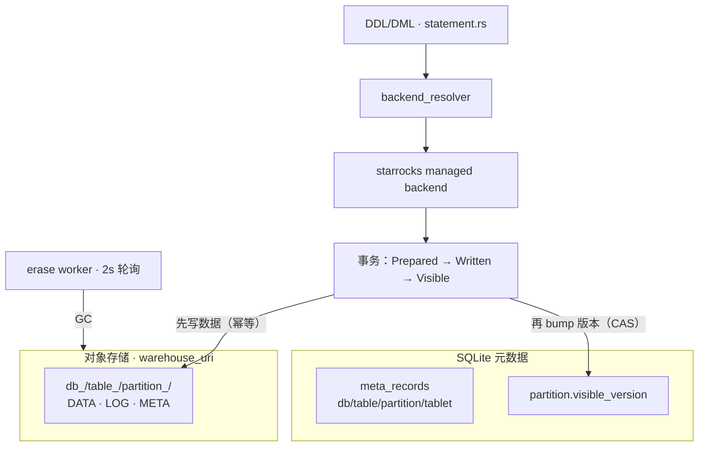

# 自管的湖：Managed-Lake 元数据与事务

> NovaRocks 技术分析系列 · 第 4 篇

上一篇 NovaRocks 是"接别人的湖"——Iceberg 表由外部 catalog 管理，它做读写参与方。但 standalone 模式下还有另一种玩法：**自管一个湖**。没有 StarRocks FE、没有外部 metastore，NovaRocks 自己维护表、分区、版本和事务。

问题立刻就来了：元数据放哪？事务怎么做到原子可见？多个写入并发时怎么不打架？删表后那一堆对象存储文件谁来清？这一篇就拆这个 managed-lake，重点是它那套"靠版本号原子推进可见性"的事务模型。

## 定位：SQLite 管元数据，对象存储放数据

managed-lake 的骨架可以一句话概括：**SQLite 当元数据库，对象存储放数据**。这是存算分离在 standalone 模式下最朴素的落地。



## 元数据模型：一个通用的版本化 KV

打开 SQLite，会发现它的 schema 出乎意料地简单——不是一堆业务表，而是一张通用的版本化 KV：

```sql
-- src/meta/sqlite/schema.rs:30
CREATE TABLE IF NOT EXISTS meta_records (
    namespace TEXT NOT NULL,
    key TEXT NOT NULL,
    kind TEXT NOT NULL,
    revision INTEGER NOT NULL,
    payload_encoding TEXT NOT NULL,
    payload_schema_id INTEGER NOT NULL,
    payload_schema_fingerprint TEXT NOT NULL,
    payload BLOB NOT NULL,
    created_at_ms INTEGER NOT NULL,
    updated_at_ms INTEGER NOT NULL,
    PRIMARY KEY(namespace, key)
);

CREATE TABLE IF NOT EXISTS meta_id_scopes (
    scope TEXT PRIMARY KEY,
    next_id INTEGER NOT NULL
);
```

所有 catalog 的元数据都落在这张 `meta_records` 里：`(namespace, key)` 定位一条记录，`payload` 是 Avro 编码的二进制，`revision` 用于乐观并发控制；`meta_id_scopes` 则是单调 id 分配器。StarRocks 表的逻辑模型（数据库、表、schema、分区、tablet）就是以这种记录形式存进去的。把"业务结构"和"存储载体"解耦成"通用 KV + 编码 payload"，好处是元数据演进不必频繁改 SQLite schema——这也呼应了项目"不写历史兼容代码、需要就直接改格式"的取向。

## 事务生命周期：版本号原子推进可见性

写入的核心是事务，而事务的核心是一个四状态机：

```rust
// src/meta/repository/starrocks_txn.rs:32
pub enum StarRocksTxnState {
    Prepared,  // begin 后，对象存储里的写入已 stage
    Written,   // publish 完成，事务日志已落对象存储
    Visible,   // 分区版本号已 bump，读者可见
    Aborted,
}
```

每个分区维护两个版本号：`visible_version`（读者看到的）和 `next_version`（事务的暂存目标）。事务一开始的 `prepare` 做的就是"占一个版本槽"：

```rust
// src/meta/repository/starrocks_txn.rs:51
pub fn prepare(&self, /* ... */ table_id: i64, partition_id: i64)
    -> RepositoryResult<StoredStarRocksTxn> {
    let partition = meta_repo.load_partition(txn, partition_id)? /* ... */;
    // ... 校验 partition 属于这张表 ...
    let base_version = partition.visible_version;
    let commit_version = next_version(base_version, "commit")?;
    let stored = StoredStarRocksTxn {
        txn_id: txn.allocate_id(id_scopes::starrocks_txn())?,
        table_id, partition_id, base_version, commit_version,
        state: StarRocksTxnState::Prepared,
        retry_at_ms: None, updated_at_ms: 0,
    };
    put_txn(txn, &stored, ExpectedRevision::NotExists)?;
    Ok(stored)
}
```

它快照下当前可见版本作为 `base_version`、把 `base+1` 作为这次的 `commit_version`，记一条 `Prepared` 事务。随后数据先写进对象存储（这一步幂等），`mark_written` 把状态推到 Written；最后 `mark_visible` 才是真正让数据"可见"的临门一脚——它用一次版本 CAS 完成：

```rust
// src/meta/repository/starrocks_txn.rs:206
if partition.visible_version != stored.value.base_version {
    return Err(RepositoryError::conflict(format!(
        "partition {} visible version is {}, expected {}",
        stored.value.partition_id, partition.visible_version, stored.value.base_version
    )));
}
if partition.next_version != stored.value.commit_version {
    return Err(RepositoryError::conflict(/* ... */));
}

partition.visible_version = stored.value.commit_version;
partition.next_version = next_version(stored.value.commit_version, "next")?;
meta_repo.update_partition_exact(txn, &partition, partition_revision)?;

stored.value.state = StarRocksTxnState::Visible;
put_txn(txn, &stored.value, ExpectedRevision::Exact(stored.record_revision))
```

关键在于：分区版本 bump 和事务状态改写在**同一个 SQLite 事务**里完成；而且两处都带条件——分区的 `visible_version` 必须仍等于当初快照的 `base_version`，写记录时用 `ExpectedRevision::Exact` 乐观锁。只要有并发写者抢先改了版本，这里的比较就会失败、返回 `conflict`，提交方退避重试。整个一致性模型就建立在这把"版本 CAS"上。

数据与元数据的 happens-before 也很清楚：**先把数据写进对象存储**（可重试、幂等），**再 bump SQLite 里的可见版本号**——后者是唯一的同步点。读者永远按 `visible_version` 去对象存储里取对应版本的元数据快照，因此不会读到一个"写了一半"的事务。这是分布式一致性里一个屡试不爽的套路：把不确定的、可能重试的副作用做成幂等，再用一个原子的元数据切换作为"提交点"。

## DDL/DML 怎么落到这套后端

SQL 这一侧由 `src/engine/statement.rs` 统一路由：先用 `backend_resolver` 判定目标是 starrocks 还是 iceberg backend，再走对应连接器的 `create_table` / `table_sink`——SQL 分派与存储实现始终是分开的（连接器后端抽象，是第 7 篇之外贯穿全项目的一条线）。对 StarRocks managed 表，`CREATE TABLE` 会分配 id、把 schema/列/分区/tablet 元数据写进 SQLite、建初始版本，并在 `warehouse_uri` 下建好对象布局；`INSERT` 则走 `insert_flow`：`begin_txn`（即上面的 `prepare`）→ 路由各行到 tablet → 写 rowset 与事务日志到对象存储 → `publish_version` → 把事务状态从 Prepared 推到 Written 再到 Visible。DELETE/TRUNCATE 同理，只是写进事务日志的是删除谓词或截断标记。

## 后台的 erase worker

删表、删分区不能在前台同步做——对象存储上可能有大量文件要清。NovaRocks 用一个后台 worker 异步回收：

```rust
// src/connector/starrocks/table/erase.rs:119
pub(crate) fn spawn_erase_worker(state: Arc<StandaloneState>) {
    let weak = Arc::downgrade(&state);
    thread::spawn(move || erase_worker_loop(weak));
}

fn erase_worker_loop(state: Weak<StandaloneState>) {
    loop {
        let Some(strong) = state.upgrade() else { return; };  // 状态已释放 → 优雅退出
        if strong.metadata_provider.is_none() { return; }
        if strong.starrocks_table_config.is_none() { return; }
        if let Err(err) = run_erase_jobs_once(&strong) {
            warn!("StarRocks table erase worker iteration failed: {err}");
        }
        drop(strong);
        thread::sleep(ERASE_WORKER_POLL_INTERVAL);  // 2 秒
    }
}
```

两个细节：它用 `Weak<StandaloneState>` 持有状态，每轮 `upgrade()`——一旦主状态被释放（进程要退出），`upgrade()` 返回 `None`，worker 自己干净退出，不会拖住关停。每轮 `run_erase_jobs_once` 的内部逻辑是"读写分离"：先无锁读出可执行的 GC job，再逐个原子 `claim`（避免多 worker 抢同一个 job），删对象存储数据后在一个写事务里把退役元数据 purge 掉；删除失败就记失败、按退避时间重排。幂等删除 + 原子认领 + 失败重试，是这个 worker 的三板斧。

## 对象布局

数据落盘的物理布局也值得一瞥：

```rust
// src/connector/starrocks/table/config.rs:54
pub(crate) fn tablet_root_path(&self, db_id: i64, table_id: i64, partition_id: i64) -> String {
    format!("{}/db_{db_id}/table_{table_id}/partition_{partition_id}", self.warehouse_uri)
}
```

一个分区下的所有 tablet 共享同一个根，根下分 META（元数据快照，带版本号）、LOG（事务日志）、DATA（rowset/segment）。分区替换时只需切换可见版本指向新的 META 快照，而不必重排 tablet 内部的对象布局——这让"版本切换"成为一次轻量的元数据操作。

## 取舍与对照

- **用 SQLite 当 metastore**。代价是单写者瓶颈，收益是零外部依赖、可独立部署、无网络协调开销，元数据压缩后也就 MB 级。并发写靠 `ExpectedRevision::Exact` 乐观锁 + 应用层重试来兜，而不是引入分布式协调器。对一个"本地就能跑起来做实验"的引擎，这个折中很合理。
- **版本 CAS 而非 2PC**。事务可见性靠"分区版本号的原子比较交换"达成，比两阶段提交简单得多；前提是写者在 `prepare` 时就预占了版本槽（base/commit），冲突即重试。
- **先对象存储、后 SQLite 的 happens-before**。数据写入做成幂等可重试，把"唯一同步点"收敛到 SQLite 的一次版本 bump，避免分布式两端不一致的经典陷阱。
- **后台 GC 的优雅退出**。erase worker 用 `Weak` 句柄感知主状态生命周期，关停时自动收手——一个小细节，但体现了对"后台线程别拖住进程"的注意。
- **通用 KV + 编码 payload 的元数据层**。元数据结构演进不必动 SQLite schema，付出的代价是要维护 payload 的编码/schema 指纹。

## 小结：下一站，增量物化视图

到这里，NovaRocks 自管的湖已经能把表、分区、版本、事务都管起来了。但它还管一样更难的东西——**物化视图**。MV 不难建，难的是刷新：当基表只变了一小部分，怎么只刷新"受影响的那部分"，而不是把整个 MV 重算一遍？

这正是下一篇、也是整个系列最硬核的一篇要讲的：增量物化视图（IMV）的 property framework——NovaRocks 怎么用一套"能力属性"来描述一个 MV 该如何增量刷新，以及哪些已经落地、哪些还在路上。
