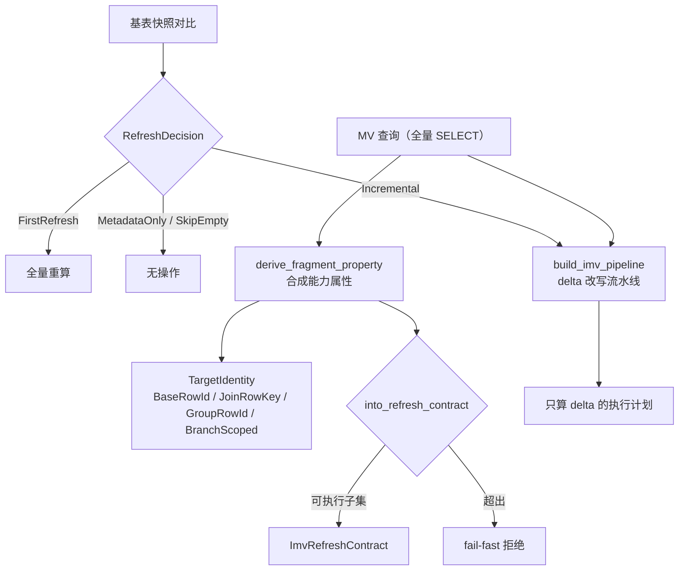

# 增量物化视图：IMV 的 property framework

> NovaRocks 技术分析系列 · 第 5 篇（压轴）

物化视图（MV）不难建——把一个 `SELECT` 的结果物化下来就是了。难的是**刷新**：当基表只变了一小部分，怎么只刷新"受影响的那部分"，而不是把整个 MV 推倒重算？这就是增量物化视图（IMV），也是 NovaRocks 这套引擎能力的天花板，配得上做整个系列的压轴。

增量刷新难在两个子问题：其一，这次刷新到底**该不该**增量、增量到什么程度；其二，对一个**任意形状**的 MV 查询（带 join？带聚合？带 UNION ALL？还是它们的嵌套？），怎么自动推导出一个"只算 delta"的执行计划，并且保证结果正确。NovaRocks 对这两个问题的回答，分别是一个刷新决策器和一套 **property framework**。



## 第一步：这次该怎么刷？

刷新的第一个判断不是"怎么算"，而是"要不要算、算多少"。NovaRocks 把它收敛成一个枚举：

```rust
// src/engine/mv/refresh_driver.rs:31
pub(crate) enum RefreshDecision {
    SkipEmpty,
    FirstRefresh,
    MetadataOnly,
    Incremental,
    FailFast { reason: String },
}
```

单基表的决策逻辑非常干净——它只比较"上次刷到哪个快照"和"现在基表在哪个快照"：

```rust
// src/engine/mv/refresh_driver.rs:81
match (status.previous_snapshot_id, status.current_snapshot_id_before_pin) {
    (None, None) => RefreshDecision::SkipEmpty,
    (None, Some(_)) => RefreshDecision::FirstRefresh,
    (Some(_), None) => fail_fast(/* 之前刷过的快照已不可达 */),
    (Some(previous), Some(current)) if previous == current => RefreshDecision::MetadataOnly,
    (Some(_), Some(_)) => RefreshDecision::Incremental,
}
```

第一次刷新（之前没刷过、现在有数据）必须全量；快照没变就只更新元数据；两个快照都在、且不同，才走真正的增量。注意那条 `(Some(_), None)` 的 fail-fast——之前刷过的基准快照如果已经被回收得不可达了，增量没法继续，于是明确报错而不是悄悄全量兜底。这又是那个一以贯之的态度。

## 核心思想：用"能力属性"取代"形状分类"

真正的难点在第二个子问题。一个朴素的做法是：枚举 MV 查询的所有"形状"——纯投影/过滤、单表聚合、join、join+聚合、UNION ALL……每种写一套增量逻辑。但这条路会组合爆炸：`UNION ALL of (聚合 over join)` 这种嵌套，要么落不进任何一类，要么逼你为每种组合写 special case。

NovaRocks 换了个抽象层级——不问"这个查询长什么形状"，而问"**这个 MV 的一行输出，由什么来标识**"。这就是 `TargetIdentity`：

```rust
// src/engine/mv/refresh_property.rs:54
pub(crate) enum TargetIdentity {
    /// 单个基表行（直接扫描）
    BaseRowId,
    /// join 出来的行，由两个输入身份的组合标识
    JoinRowKey(Box<TargetIdentity>, Box<TargetIdentity>),
    /// 聚合分组行，由 group-key 列标识
    GroupRowId(Vec<String>),
    /// 分支作用域身份（UNION ALL）：每个分支的身份再打上分支判别
    BranchScoped(Box<TargetIdentity>),
}
```

关键在于它是一个**可组合的代数**：join 的身份是两个子身份的组合，UNION ALL 的身份是 `BranchScoped(子身份)`，而且构造时会把嵌套的 `BranchScoped` 拍平（`BranchScoped(BranchScoped(x)) == BranchScoped(x)`）。一个"聚合 over join 的 UNION ALL"，就自然表达成 `BranchScoped(GroupRowId)`——不需要为这个组合单独开一类。身份再配上一个 `StateContract`（这一行携带的是无状态投影、还是可增量合并的聚合状态），就构成了完整的"能力属性"。

属性合成出来后，`into_refresh_contract` 把它映射成一个可执行的刷新契约 `ImvRefreshContract`。这里有一个诚实的设计：**属性代数能表达的形状，比实际可执行的形状更多**；超出可执行集合的，明确拒绝：

```rust
// src/engine/mv/refresh_property.rs:625
// Every other property shape (e.g. UNION ALL of joins) is outside
// the legacy-supported set.
_ => Err(format!(
    "Iceberg IMV refresh contract does not support the synthesized property shape \
     (identity={identity:?}, state={state:?})"
)),
```

`UNION ALL of joins` 这种属性能合成出来，但映射成可执行契约时被 fail-fast 挡掉。把"能表达"和"能执行"分开、用一道显式的边界收口——这是在最复杂的地方仍然坚持 fail-fast。

## 把"全量查询"改写成"只算 delta"

光有属性还不够，还得把 MV 的全量 `SELECT` 真正改写成一个"只算变化量"的执行计划。这件事被做成了一条可组合的重写流水线：

```rust
// src/sql/optimizer/rewrite/imv/pipeline.rs:29
pub(crate) fn build_imv_pipeline() -> RewritePipeline {
    RewritePipeline::from_stages(vec![
        // imv-delta-marker：把 root 包成 ImvDelta 标记
        RewriteStage::new("imv-delta-marker", /* ... */
            vec![Box::new(WrapRootInImvDeltaRule::new())]),
        // imv-branch-union：给 UNION ALL 的每个分支打上分支作用域
        RewriteStage::new("imv-branch-union", /* ... */
            vec![Box::new(RewriteBranchUnionRule)]),
        // imv-union-delta / imv-aggregate-state：聚合的带符号增量状态
        RewriteStage::new("imv-union-delta", /* ... */
            vec![Box::new(RewriteUnionAggregateDeltaRule),
                 Box::new(RewriteTopLevelUnionDeltaRule)]),
        RewriteStage::new("imv-aggregate-state", /* ... */
            vec![Box::new(RewriteAggregateStateRule)]),
        // imv-delta-pushdown：把 delta 推过一元算子、推过 join
        RewriteStage::new("imv-delta-pushdown", /* ... */
            vec![Box::new(PushDeltaThroughUnaryRule),
                 Box::new(RewriteJoinDeltaRule)]),
        // ... scan 绑定、action/row-id 注入、apply-key、校验 ...
    ])
}
```

读这条流水线，就读懂了"增量正确性"是怎么被拆解的：先把根标记成 delta，再让分支作用域规则处理 UNION ALL，让聚合规则把 `SUM/COUNT` 改写成可加减的带符号增量状态，让 join-delta 规则把 delta 推过 join（`Δ(A⋈B) = ΔA⋈B ∪ A⋈ΔB ∪ ...` 的工程实现），最后注入行身份列与 apply key、做一致性校验。每一种代数结构（聚合、join、union）对应一条规则，组合起来就能处理它们的嵌套——这正是"可组合属性"在执行侧的兑现。

而驱动这一切的，是合成出来的属性本身，不再是形状分类器。CREATE 路径上的注释把这个设计说得很直白：

> Drive CREATE off the synthesized capability property + identity instead of the legacy flat shape classifier.（`src/engine/mv/iceberg_refresh.rs:148`）

刷新时直接 `match property.identity` 来决定目标列、gating 和契约构建。第 3 篇里那个"物理写进 Parquet 的 `_row_id`"在这里兑现了价值——它正是 apply key 得以稳定对应"哪一行变了"的基础。

## 取舍与对照

- **从"形状分类"到"能力属性"，是这篇最核心的设计跃迁**。shape-dispatch 的复杂度随形状种类组合爆炸；property 是可组合代数，嵌套结构（join 套在 union 里、聚合套在 join 上）能自然表达，对应的增量改写也由可组合的规则拼出，而不是一个巨型 special-case 函数。
- **表达力 > 可执行性，用 fail-fast 收口**。属性代数刻意做得比可执行集合更宽，再用 `into_refresh_contract` 一道显式边界把"还不能正确增量"的形状挡在外面。在系统最复杂的角落，仍然是"宁可明确拒绝，不可悄悄算错"。
- **正确性靠规则可组合，而非穷举**。`Δ(join)`、`Δ(aggregate)`、`Δ(union)` 各是一条规则，靠重写流水线的定点迭代拼装；新增一种结构的增量支持，是加一条规则、而不是改一个上帝函数。
- **诚实的边界与中间态**。大量 fail-fast 守卫（不支持 DISTINCT/HAVING/子查询、join 被限制在受支持的形状内、自连接被拒绝）划清了能力边界。另外，面向 StarRocks-table 后端的旧 `IncrementalMvShape` 形状分类器仍然并存——Iceberg 路径已完全切到 property framework，两条后端路径处于迁移的中间态。

## 小结：最后，凭什么相信它是对的？

到这里，系列把 NovaRocks 从入口、执行内核、SQL 大脑、数据湖一路讲到了能力天花板——增量物化视图。一个用可组合的能力属性来描述"如何增量"、用一串重写规则来兑现"正确增量"的系统，确实是这套引擎里最见功力的一块。

但一个近 55 万行、3.5 个月、大量由 AI 协作写出来的引擎，凭什么敢说这些都是对的？增量刷新这种地方，错一个符号、漏一条 delta 路径，结果就静默地错了。最后一篇收尾，我们就讲这件事的另一面——**正确性是怎么炼成的**：把 SQL 回归测试当作 ground truth 的工程闭环，以及它如何成为高速 AI 协作迭代不至于失控的护栏。
