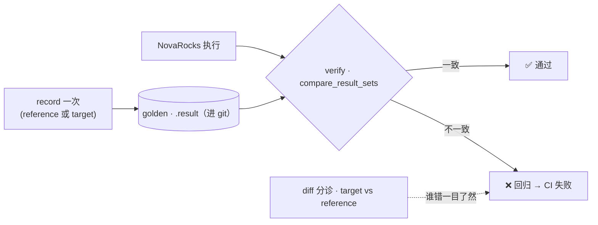

# 正确性是怎么炼成的：SQL 回归作为 ground truth

> NovaRocks 技术分析系列 · 第 6 篇（收尾）

前五篇展示了 NovaRocks 的能力：一套内核两个入口、列式 pipeline、自带的 SQL 大脑、Iceberg v3、增量物化视图。但有个问题一直悬着——**一个近 55 万行、3.5 个月、大量由 AI 协作写出来的引擎，凭什么相信它是对的？** 尤其像增量刷新那种地方，错一个符号、漏一条 delta 路径，结果就静默地错了，连 panic 都不会有。

这一篇收尾，讲的就是这件事的另一面：正确性不是"测出来"的，是用一套工程闭环"炼"出来的。而这套闭环，恰恰是高速 AI 协作迭代没有失控的护栏。

## 三种模式：record 一次，verify 永远，diff 分诊

NovaRocks 有一个统一的 SQL 回归 runner（`sql-tests`），它的核心是两个枚举：

```rust
// tests/sql-test-runner/src/main.rs:60
enum Mode { Verify, Record, Diff }

enum RecordFrom { Target, Reference }
```

三种模式构成一个闭环：

- **record**：把一批 SQL 跑一遍，把结果存成 golden 文件（`.result`）。可以从一个**参考引擎**录（`RecordFrom::Reference`，比如让 Spark/StarRocks 当基准），也可以从 NovaRocks 自己录（`Target`，NovaRocks-only 的场景）。这是一次性的"立基准"，而且必须显式触发——golden 永远不会被自动改写。
- **verify**：跑 NovaRocks，把结果和 golden 逐行对账。确定性、快——不碰参考引擎，只比 golden。**这是 gate 提交的那一关**：回归 → 测试失败 → 代码进不来。
- **diff**：同时跑 NovaRocks 和参考引擎，直接两两对账。当 golden 和实际产生分歧时，人用它来分诊——到底是 NovaRocks 错了，还是 golden 过时了。



## 比对的核心：先比表头，再按语义比行

对账逻辑在 `compare_result_sets`，干净得能直接讲清楚：

```rust
// tests/sql-test-runner/src/results.rs:439
pub fn compare_result_sets(
    expected_header: &[String], expected_rows: &[Vec<String>],
    actual_header: &[String], actual_rows: &[Vec<String>],
    order_sensitive: bool, epsilon: Option<f64>,
) -> (bool, String) {
    let (ok, msg) = compare_headers(expected_header, actual_header);
    if !ok { return (false, msg); }
    if order_sensitive {
        compare_rows_ordered(expected_rows, actual_rows, epsilon)
    } else {
        compare_rows_unordered(expected_rows, actual_rows, epsilon)
    }
}
```

先比表头（列名、列数），再按 `order_sensitive` 选择逐行对比还是**多重集**对比。默认是多重集，实现就是把两边的行各自计数、比较计数器，不一致时还能精确报出第一条缺失/多出的行及其重数：

```rust
// tests/sql-test-runner/src/results.rs:371
if epsilon.is_none() {
    let mut expected_counter: HashMap<Vec<String>, usize> = HashMap::new();
    let mut actual_counter: HashMap<Vec<String>, usize> = HashMap::new();
    for row in expected_rows { *expected_counter.entry(row.clone()).or_insert(0) += 1; }
    for row in actual_rows   { *actual_counter.entry(row.clone()).or_insert(0) += 1; }
    if expected_counter == actual_counter { return (true, String::new()); }
    // ... 找出第一条 "missing row x{n}" 报告出来 ...
}
```

为什么默认多重集而不是逐行？因为分析型查询不带 `ORDER BY` 时行序本就不确定，强行按行序比会制造大量假阳性、把测试变得脆弱。要比行序的用例显式标注 `@order_sensitive=true` 即可。浮点数则走一条带 `epsilon` 容差的路径（先按容差归一再比），避免末位抖动。一句话：**压住噪声（行序、末位），但不放过真信号（行数、重数、值）。**

## 不过度归一：让 plan-shape 漂移无处藏

最能体现这套测试品味的，是它对"归一化"的克制。`EXPLAIN ANALYZE` 的输出里有耗时，每次跑都不一样，必须归一才能进 golden。但归一到什么程度？看这段注释：

```rust
// tests/sql-test-runner/src/results.rs:485
/// Replace timing values in the canonical EXPLAIN ANALYZE header line
/// with literal `<MS>` tokens. Only cells matching
/// `^Planning: \d+ ms / Execution: \d+ ms / Rows: (\d+)$` are rewritten;
/// row count is preserved. All other cells pass through verbatim.
///
/// Resist the urge to normalize more — silent normalization is how
/// plan-shape drift hides.
pub fn normalize_explain_timing_cell(cell: &str) -> String {
```

"克制住多归一的冲动——悄悄的归一化正是 plan-shape 漂移藏身之处。" 只把耗时换成 `<MS>`、连行数都原样保留，别的一概不动。配合用例里可写的 `@explain_contains` 断言，**连计划形状的漂移都被纳入护栏**——优化器某天悄悄换了个 join 顺序、少推了个 runtime filter，行数对得上但计划变了，照样会被逮住。这把"正确性"从"结果对"扩展到了"计划也别偷偷变"——对第 2 篇那个仍在快速演进的优化器尤其重要。

## 用例即数据：声明式的断言

一个用例就是一个 `.sql` 文件，用 `-- query N` 标记产出结果的步骤，配一个 `.result` golden（TSV 格式）。除了对结果，还能在注释里写一串声明式指令（`tests/sql-test-runner/src/parser.rs` 的 `parse_meta` 负责解析）：

- `@order_sensitive` / `@float_epsilon`——行序语义与浮点容差；
- `@expect_error`——断言这条 SQL 应当报错（且错误信息含某子串）——这让第 0 篇那些 fail-fast 也变成可回归的正向断言；
- `@result_contains` / `@explain_contains`——文本级、计划级断言；
- `@normalize_explain_timing`——开启上面那种"只归一耗时"的处理；
- `@skip_result_check`——DDL/INSERT 这类只执行不对结果的步骤；
- `@retry_count` / `@wait_alter_*`——容忍异步操作（如后台 schema change）的就绪等待。

加上 `${case_db}` 这种用例级数据库占位（每个用例跑在隔离的库里，互不污染）、以及 `@sequential` 标记（让需要独占状态的用例串行跑），整套用例既可读、又能并行跑。

## 跨引擎 fixture：让 Spark 当裁判

NovaRocks-only 的 golden 能防自身回归，但防不了"我和别人理解得不一样"。所以有一套 `docker/iceberg-rest/` 固定环境——Iceberg REST Catalog + MinIO + Spark。它有个工程细节很贴心：**按 worktree 隔离**。`up.sh` 用工作区路径的 slug + hash 算出一个 `env_id`，每个 worktree 拿到自己的一组端口和生成的 `env.sh`：

```bash
# docker/iceberg-rest/up.sh:13
env_id="${slug}-${hash}"
runtime_dir="$runtime_base/$env_id"
```

于是多个 worktree 能共用底层 Docker 服务、又各自有独立的 NovaRocks 端口，互不打架（这对"多个分支并行开发"很关键）。在它之上，`iceberg-compatibility` 套件让 **Spark 通过 REST Catalog + MinIO 写表、NovaRocks 读回来**——用一个成熟引擎当裁判，对账跨引擎语义；`iceberg-rest` 套件则是 NovaRocks 自写自读的端到端冒烟。

## 取舍：为什么高速 AI 协作没有失控

把这套东西连起来看，它就是那道护栏：

- **确定性优先，低 flaky**。多重集默认 + 浮点容差 + 只归一耗时——既压住了噪声（行序、末位抖动、时间），又不放过真信号（行数、重数、值、计划形状）。测试不 flaky，开发者才会信任红灯、红灯才有意义；这对"改动频繁、由 AI 大量产出"的代码尤其重要。
- **三态闭环，分工明确**。record 是显式 opt-in 的（golden 永远不会"自动更新"，必须有人主动录），verify 是 CI 的 gate，diff 是分歧时的三方对账（target/reference/golden 谁错一目了然）。这让"改对了没有"始终是个能机械判定的问题。
- **计划形状也进护栏**。"克制归一化"这个小决定，把优化器的隐性回归也关进了笼子——行数对、但计划悄悄变差，会被 `@explain_contains` 抓住。
- **这正是 AI 高速协作的安全带**。golden 进 git、每次提交对 golden 验证、回归即 CI 失败即不合并。几百个用例构成一个自动化的 oracle，让"快"和"对"不必二选一——AI 可以大胆改，但改坏了立刻有红灯。
- **但要诚实**：这是工程纪律，不是形式化证明。它能高效逮住回归和跨引擎不一致，却不能证明"所有输入都对"。对一个自陈实验性的引擎来说，这是务实且足够有力的底线。

## 系列结语

六篇走下来，我们把 NovaRocks 拆了个遍：第 0 篇的"一套内核、两个入口"与 fail-fast 哲学，第 1 篇把 `ExecPlan` 跑起来的列式 pipeline，第 2 篇脱离 FE 的 SQL 大脑与优化器，第 3 篇啃到 v3 的 Iceberg 集成，第 4 篇自管一个湖的元数据与事务，第 5 篇用可组合"能力属性"做增量物化视图，到这一篇把它们都钉在正确性闭环上。

NovaRocks 是一个实验性的、AI 协作为主的引擎——它的看点从来不是"完成度"，而是它用一组清晰且一以贯之的设计原则，把一个真实分析型查询引擎的骨架立了起来：**协议与执行分离、严格 fail-fast、一套执行内核服务两个前门、用可组合的属性而非穷举的形状、把正确性做成工程闭环**。这些原则彼此呼应——fail-fast 之所以敢用，是因为有正确性闭环兜底；一套内核之所以能服务两个前门，是因为它们都收敛到 `ExecPlan`；增量物化视图之所以能做对，是因为 row-lineage 在更底层把行身份钉住了。

读它的代码，与其说是在看"一个已完成的产品"，不如说是在看"这些原则如何把一个复杂系统组织得仍然可读、可改、可信"。对任何想理解现代分析型查询引擎是怎么搭起来的人，这都是一份难得的、能一路读到底的活样本。

系列完。
