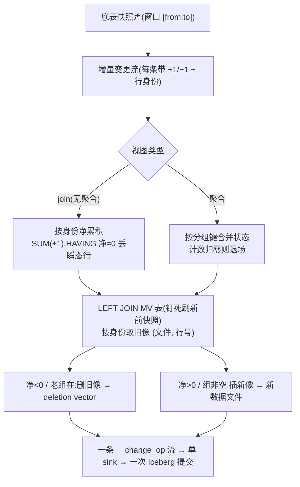

<!--
Licensed to the Apache Software Foundation (ASF) under one
or more contributor license agreements.  See the NOTICE file
distributed with this work for additional information
regarding copyright ownership.  The ASF licenses this file
to you under the Apache License, Version 2.0 (the
"License"); you may not use this file except in compliance
with the License.  You may obtain a copy of the License at

  http://www.apache.org/licenses/LICENSE-2.0

Unless required by applicable law or agreed to in writing,
software distributed under the License is distributed on an
"AS IS" BASIS, WITHOUT WARRANTIES OR CONDITIONS OF ANY
KIND, either express or implied.  See the License for the
specific language governing permissions and limitations
under the License.
-->

# 一条 SQL 把增量刷新算清楚:变更怎么落到 Iceberg 物化视图上

增量物化视图的前半段——「从底表的快照差里算出一串带正负的变更」——已经有很成熟的代数。真正容易被低估的是后半段:**这串变更怎么落到 MV 上**。

如果 MV 只是引擎内部某个私有结构,落地很简单:内存里改改就行。但 NovaRocks 把 MV 也存成一张标准的 **Iceberg 表**:数据文件不可变,删一行不能就地改,而要写一个 **deletion vector**(删除向量)去标记「某数据文件的第几行作废了」。于是「把变更落上去」一下子变成一件需要小心的事——既要把新结果写成新数据文件,又要精确地把旧结果标记删除,还得在并发和崩溃面前保持一致。

可以把这一步做成一台专用机器:一个内存里的「应用器」,逐条变更去改 MV。NovaRocks 选了相反的方向:**把整次刷新——算增量、归并、定位旧行、写新行——表达成一条对 MV 表自身的关系查询,一次执行、一次原子提交**,不另造任何「应用变更」专用的黑盒。

这篇文章就**围着这条 SQL 讲**:对 join 视图和聚合视图各给出完整的查询,然后顺着它一段一段执行下去,把**数据在每个阶段长什么样**摊开看,并解释**每一段为什么这么写**。

---

## 一、先认清难点:变更只有「逻辑身份」,删除却要「物理位置」

增量算出来的变更流,每一条长这样:一个**变更标记**(`+1` 要新增、`−1` 要删除),加上这条结果行**是谁**——它的**行身份**。

- 对一张 `A JOIN B` 的视图,一条结果行的身份是「由哪条 A 行、哪条 B 行 join 出来的」(两侧底表行的血统组合)。
- 对一张分组聚合视图,一条结果行的身份就是它的**分组键**。

这个身份是**逻辑**的,而且稳定:同一条底表行(或同一个分组)无论经过多少次压实、文件重写,身份不变——这是 Iceberg v3 的行血统(row lineage)给的能力。MV 表里每条结果行也带着自己的身份(存成一个隐藏列)。

问题在于:要在 Iceberg 上**删**掉 MV 里一条旧结果,deletion vector 需要的是这条行的**物理位置**——它此刻落在**哪个数据文件、第几行**。而物理位置只存在于 MV 表**当前快照**的文件布局里,增量变更流里**根本没有**。

> **一点背景**:Iceberg 表每次提交产生一个**快照**,快照 = 一组数据文件 + 删除标记。v3 的删除用 deletion vector:对某个数据文件记一个「这些行号作废」的位图。所以「删一行」= 找到它的 `(文件, 行号)`,把这个行号记进对应文件的删除位图。行血统给的稳定身份能跨文件重写存活,但它**不是**文件内的物理行号,二者不能互相替代。

于是后半段冒出第一个核心动作:**拿变更流里的逻辑身份,去当前 MV 表里「换」出它的物理位置。** 用关系运算表达,这个「换」就是一次 **JOIN**——把「要动的身份」和「MV 表扫描出的 `(身份, 文件, 行号)`」按身份连接。记住这个桥,后面两条 SQL 的最后一段都是它。

但在定位之前,变更流本身**不能直接照着落**。下面这条 join 的 SQL,会让原因自己浮出来。

---

## 二、join 视图、两侧同时变:完整 SQL,逐段走数据

举一张最容易出问题的视图:两张底表 join,而且**两侧在同一次刷新里都变了**。

```sql
fact(fid, dim_id, amt)        dim(did, region)
MV = SELECT fid, region, amt FROM fact JOIN dim ON fact.dim_id = dim.did
```

**刷新前**:

| 底表 | 内容 | | MV(刷新前) | 行身份 |
|---|---|---|---|---|
| fact | F1=(1,10,100), F2=(2,10,200) | | (1, west, 100) | F1·D1 |
| dim | D1=(did=10, region=west) | | (2, west, 200) | F2·D1 |

**这一轮两侧都变**:

- 新增一条 fact:`F3 = (3, 10, 300)`
- 把 `D1` 的 region 从 `west` 改成 `east`——在 Iceberg 里,改一行 = 删旧行 + 插新行,所以新行 `D1'` 是一条**新身份**的行

直觉上 MV 应变成 `(1,east,100) (2,east,200) (3,east,300)`。最终版里,**这整次刷新就是下面这一条 SQL**:

```sql
INSERT INTO «MV 变更 sink»                              -- 单 sink:按 __change_op 路由 + 一次原子提交
WITH
  -- 支1:本轮变更的 fact 行  ⋈  dim 的「刷新前」快照
  b1 AS (
    SELECT df.fid, d.region, df.amt,
           df.__change_op                    AS op,
           apply_key(df._row_id, d._row_id)  AS id        -- 行身份 = 两侧行血统的组合
    FROM   __delta('fact', :from, :to) df                 -- fact 在窗口 [from,to] 的变更(每条带 +1/−1)
    JOIN   dim FOR VERSION AS OF :from   d  ON df.dim_id = d.did
  ),
  -- 支2:fact 的「刷新后」快照  ⋈  本轮变更的 dim 行
  b2 AS (
    SELECT f.fid, dd.region, f.amt,
           dd.__change_op                    AS op,
           apply_key(f._row_id, dd._row_id)  AS id
    FROM   fact FOR VERSION AS OF :to   f
    JOIN   __delta('dim', :from, :to)  dd   ON f.dim_id = dd.did
  ),
  change_stream AS ( SELECT * FROM b1 UNION ALL SELECT * FROM b2 ),
  -- 按身份净累积;净零的瞬态行在「写」之前就消掉
  coalesced AS (
    SELECT id, SUM(op) AS net,
           any_value(fid) fid, any_value(region) region, any_value(amt) amt
    FROM   change_stream
    GROUP  BY id
    HAVING SUM(op) <> 0
  )
-- 一条带 __change_op 的流:净>0 插新像、净<0 删旧像(旧像位置由 LEFT JOIN 取出)
SELECT
  CASE WHEN c.net > 0 THEN +1 ELSE -1 END  AS __change_op,
  c.fid, c.region, c.amt,                              -- 新像 payload(插入用)
  t._file, t._pos                                       -- 旧像物理位置(删除用;插入行没有,为 NULL)
FROM   coalesced c
LEFT JOIN mv_target FOR VERSION AS OF :mv_base  t       -- 钉死「刷新前」的 MV 快照
  ON   t.id = c.id;
```

下面顺着它一段一段执行,看数据怎么变。

### 2.1 `b1` / `b2`:为什么是两支,且各配一侧的不同快照

经典增量代数对 join 的处理,是把变更拆成**两支**,各算「一侧的变更 × 另一侧的某个快照」,这样既不漏也不重。关键在两支配的快照**不对称**:支1 的 dim 取**刷新前**(`:from`),支2 的 fact 取**刷新后**(`:to`)。这样「两侧都变的那些组合」只会落在支2 里算一次,不会被两支重复计入。

逐行展开(`__delta` 给出带 `+1/−1` 的变更行):

| 来源 | op | 结果行 | 行身份 |
|---|---|---|---|
| **b1**: `Δfact ⋈ dim@from` | **+1** | (3, **west**, 300) | F3·D1 |
| **b2**: `fact@to ⋈ Δdim` | −1 | (1, west, 100) | F1·D1 |
| b2 | −1 | (2, west, 200) | F2·D1 |
| b2 | **−1** | (3, **west**, 300) | F3·D1 |
| b2 | +1 | (1, east, 100) | F1·D1' |
| b2 | +1 | (2, east, 200) | F2·D1' |
| b2 | +1 | (3, east, 300) | F3·D1' |

`apply_key(...)` 把两侧行的血统拼成这条结果行的身份。注意 dim 那条更新:`D1`(旧)和 `D1'`(新)是两条不同血统的行,所以 `F3·D1` 和 `F3·D1'` 是**不同身份**。

### 2.2 `change_stream` / `coalesced`:为什么必须「写前净化」

`UNION ALL` 把两支拼成一条流(上表 7 行)。看 **第 1 行和第 4 行**:它们是**同一条结果行**——同一身份 `F3·D1`、同一内容 `(3,west,300)`——却一支 `+1`、一支 `−1`。

这不是 bug,而是两支分解的必然产物:`F3` 是这一轮新插的,它在支1 里临时和**旧的 west 维度** join 出了 `(3,west,300)`;可现实中 `F3` 从头到尾只和 east 维度共存。这条 `(3,west,300)` 是个**瞬态幽灵行**,从不该真正出现在 MV 里。

**顺着直觉、把变更流直接照落,会怎样?** 第 1 行说「插入 (3,west,300)」,写出一条新数据文件行;第 4 行说「删除 (3,west,300)」,要发 deletion vector——可这条 `(3,west,300)` 是**本轮自己刚写出来的**,它根本不在「刷新前」的 MV 快照里。删除去定位它时(就是最后那段桥),在旧快照里找不到——要么定位失败,要么那条幽灵行没人删、留在了 MV 里。无论哪种,结果都错。

所以落地前必须**按身份净化**:`GROUP BY id, SUM(op)`,再用 `HAVING SUM(op) <> 0` 把净值为 0 的瞬态行**在进入「写」之前就丢掉**。净化后:

| 行身份 | net | |
|---|---|---|
| F3·D1 | +1 − 1 = **0** | ← `HAVING` 丢弃,从不落盘 |
| F1·D1 | −1 | |
| F2·D1 | −1 | |
| F1·D1' | +1 | |
| F2·D1' | +1 | |
| F3·D1' | +1 | |

`any_value(...)` 取这一身份的代表内容——因为同身份必然同内容,取哪条都一样。

### 2.3 最后一段:`LEFT JOIN` 同时完成「定位」和「分流」

`coalesced` 出来后,每条都要落地:`net<0` 要**删旧像**,`net>0` 要**插新像**。插新像直接写数据文件即可;删旧像需要旧像的物理 `(_file, _pos)`——而我们手里只有逻辑身份 `id`。

这就是第一节那个桥:`LEFT JOIN mv_target ... ON t.id = c.id`。MV 表扫描吐出每行的 `(身份, _file, _pos)`,和 `coalesced` 按身份连接。一次 `LEFT JOIN` 把两件事一起办了:

| 身份 | net | JOIN 是否命中 MV 旧行 | 取到 `_file/_pos`? | __change_op | 落地 |
|---|---|---|---|---|---|
| F1·D1 | −1 | 命中(就是旧行 M1) | 是 | −1 | 删 M1 → deletion vector |
| F2·D1 | −1 | 命中(M2) | 是 | −1 | 删 M2 → deletion vector |
| F1·D1' | +1 | **不命中**(新身份) | 否(NULL) | +1 | 插 (1,east,100) |
| F2·D1' | +1 | 不命中 | NULL | +1 | 插 (2,east,200) |
| F3·D1' | +1 | 不命中 | NULL | +1 | 插 (3,east,300) |

之所以能用一个 `LEFT JOIN` 干净分流,靠一个性质:**`net<0` 必是老身份(MV 里有,JOIN 命中,拿到位置)、`net>0` 必是新身份(MV 里没有,不命中,`_file` 为 NULL)**。命中与否天然把「删」和「插」分开了,旧像位置也顺带取出。这里还守着一个不变式:凡 `net<0` 都**必须**命中——命不中说明要删的旧行不存在,这是上游算错了,当场报错而不静默丢数。

为什么 `FOR VERSION AS OF :mv_base`(钉死刷新前的 MV 快照)?因为这一步在**读** MV 表去找旧像,而整次刷新又在**写** MV 表。不钉快照,JOIN 可能读到本轮自己正在写、或并发别的刷新刚提交的新行,定位就乱了。钉死刷新前的快照,JOIN 只看得见旧像。(join 视图里新旧身份不同,危害还轻;到了聚合会看到它有多致命。)

### 2.4 收口:一条流、一个 sink、一次提交

最后这条 `SELECT` 产出的是**一条带 `__change_op` 的统一流**(插入行带 payload、删除行带 `_file/_pos`),喂给**一个** sink。sink 按 `__change_op` 两路:`+1` 写新数据文件、`−1` 把 `_pos` 聚成对应文件的 deletion vector。两类写入汇进**同一笔 Iceberg 提交**——要么一起成为新快照,要么一起不发生(否则中途崩溃会「删了没插」或「插了没删」,留下谁都没见过的中间态)。

**刷新后 MV** = `(1,east,100) (2,east,200) (3,east,300)`,正确。那个瞬态的 `(3,west,300)` 被 `HAVING net<>0` 在写之前就抹掉了,既没被插、也没去尝试一次不可能的删除。

整条 SQL,从底表快照差到 MV 新快照,**一次执行**走完。

---

## 三、聚合视图:同一个骨架,但不是数 `±1`,而是合并「状态」

join 视图是按身份**净计数**(`SUM(op)`)。一个自然的追问:聚合也这么收吗?

不能直接套。把一条明细加进 `SUM`,不是 `+1`,而是「把它的值累进这一组的和里」。聚合维护的是每组一份**可合并的状态**;落地的 SQL 因此换了形状,但骨架还是那套「delta → 按身份归并 → `LEFT JOIN` MV 表 → 产 `__change_op` 流 → 单 sink 一次提交」。

```sql
sales(id, region, amt)
MV = SELECT region, SUM(amt) AS total, COUNT(*) AS cnt FROM sales GROUP BY region
```

**刷新前**(MV 行除了可见值,还存着每个聚合的**部分状态**):

| MV(刷新前) | 可见值 | SUM 状态 (计数, 和) | COUNT 状态 (计数) |
|---|---|---|---|
| region=west | total=300, cnt=2 | (2, 300) | (2) |
| region=east | total=50, cnt=1 | (1, 50) | (1) |

**这一轮 sales 变更**(凑齐三种结局):`+ (west,50)`、`− (east,50)`、`+ (north,70)`。

这整次刷新是下面这条 SQL:

```sql
INSERT INTO «MV 变更 sink»
WITH
  -- ① delta 侧:按分组键聚成「带符号的部分状态」(删的行贡献负状态)
  delta_state AS (
    SELECT region                              AS id,
           sum_state_signed(amt, __change_op)  AS d_total,   -- SUM 的 Δ状态 = (Δ计数, Δ和)
           count_state_signed(__change_op)     AS d_cnt      -- COUNT 的 Δ状态 = (Δ计数)
    FROM   __delta('sales', :from, :to)
    GROUP  BY region
  ),
  -- ② LEFT JOIN 老状态:一个 JOIN 同时干三件事——取老态合并、取旧像位置、判「老组在不在」
  merged AS (
    SELECT d.id,
           CASE WHEN m.id IS NULL THEN d.d_total
                ELSE state_merge(m.total_state, d.d_total) END  AS total_state,
           CASE WHEN m.id IS NULL THEN d.d_cnt
                ELSE state_merge(m.cnt_state,   d.d_cnt) END    AS cnt_state,
           (m.id IS NOT NULL)                                   AS had_old,   -- 老组是否存在
           m._file, m._pos                                                     -- 旧像位置(新组为 NULL)
    FROM   delta_state d
    LEFT JOIN mv_target FOR VERSION AS OF :mv_base  m  ON m.id = d.id
  )
-- ③ 从 merged 产出一条带 __change_op 的流(两段都源自 merged,MV 表只扫一次)
SELECT -1 AS __change_op, m._file AS _file, m._pos AS _pos               -- (a) 删旧像:凡「老组在」的
FROM   merged WHERE had_old
UNION ALL
SELECT +1 AS __change_op, id AS region,                                  -- (b) 插新像:合并后未归零的组
       state_value(total_state) AS total, total_state, cnt_state
FROM   merged WHERE NOT state_is_empty(cnt_state);
```

逐段走:

### 3.1 `delta_state`:把变更聚成「带符号的部分状态」

`sum_state_signed(amt, __change_op)`:新增的明细贡献 `(计数 +1, 和 +amt)`,删除的贡献 `(计数 −1, 和 −amt)`。按 `region` 聚一下:

| region | Δ SUM 状态 (计数, 和) | Δ COUNT 状态 (计数) |
|---|---|---|
| west | (+1, +50) | (+1) |
| east | (−1, −50) | (−1) |
| north | (+1, +70) | (+1) |

### 3.2 `merged`:一个 `LEFT JOIN` 干三件事

`LEFT JOIN mv_target ON m.id = d.id` 把 delta 侧的每个组和 MV 里的老状态对上。这一个 JOIN 同时拿到三样东西:① 老状态(`m.total_state` 等,用来 `state_merge` 合并);② 旧像位置(`m._file, m._pos`,等会删旧像要用);③ `had_old`(老组在不在)。**定位和合并共用同一个 JOIN**,MV 表只扫一次。

`state_merge` 就是状态对应相加。合并后:

| region | 老状态 | 合并后 SUM 状态 | 合并后 COUNT 状态 | had_old | 旧像位置 |
|---|---|---|---|---|---|
| west | (2,300) | **(3,350)** | (3) | 是 | M_west 的 `_file,_pos` |
| east | (1,50) | **(0,0)** | **(0)** | 是 | M_east 的 `_file,_pos` |
| north | —(NULL) | (1,70) | (1) | 否 | NULL |

### 3.3 产变更流:退场为什么看「计数」而不看「值」

第 ③ 段把 `merged` 拆成两路 `UNION ALL`,合成那条带 `__change_op` 的流:

- **(a) 删旧像**:`WHERE had_old`——凡老组存在的,旧像都要删(存活的组要被新像替换,退场的组要被移除)。
- **(b) 插新像**:`WHERE NOT state_is_empty(cnt_state)`——合并后**还有行**的组才插新像。

逐组结局:

| region | (a) 删旧像 had_old? | (b) 插新像 非空? | 净效果 |
|---|---|---|---|
| west | 是 → 删 M_west | 是 → 插 (west,350,3) | **替换**(删旧 + 插新) |
| east | 是 → 删 M_east | 否(状态空)→ 不插 | **退场**(只删) |
| north | 否(无旧像) | 是 → 插 (north,70,1) | **新组**(只插) |

这里藏着聚合最容易踩的坑:**一个组什么时候退场?** 直觉会说「汇总值变 0 就删」。错。设想一组先 `+5` 再 `−5`,可它**还剩两行**,`SUM` 恰好是 0,却绝不该删。判断退场只能看状态里的**计数归零**(`state_is_empty` 看的是 COUNT 状态),而不是可见的汇总值。这正是状态里非得带计数的原因——它让「这组还有没有行」可被精确判断,而不被「值恰好抵消」骗到。`state_value(total_state)` 则是从状态反算出要写回的可见值。

### 3.4 快照钉定:在聚合里为什么尤其致命

回到 `FOR VERSION AS OF :mv_base`。聚合的身份是**分组键**——一个组的**旧状态行**和我们这一轮要插的**新状态行**,身份是**同一个**(都叫 `west`)。如果那个 `LEFT JOIN` 读的是「最新」而非刷新前快照,它会同时看到刚插进去的新 `west` 行——对同一个身份 `west` 匹配出**两行**,定位歧义、删错行,甚至违反「每身份恰一命中」的不变式。钉死刷新前的快照,JOIN 只看得见旧的那行,干净。join 视图里新旧身份不同所以危害轻,聚合里新旧同身份,这一钉就成了正确性的硬要求。

**刷新后 MV** = `west(350,3)`、`north(70,1)`,`east` 消失。同样,**一次执行**走完。

---

## 四、两条 SQL,同一个骨架

join 和聚合的查询长得不一样,但拆开看是同一副骨架:

| 阶段 | join 视图 | 聚合视图 |
|---|---|---|
| delta → | 两支 telescoping `UNION ALL`(原始结果行) | 按分组键聚成**带符号状态** |
| 按身份归并 | `GROUP BY id, SUM(op)` + `HAVING net<>0`(净计数,丢瞬态行) | `state_merge` 合并老态⊕Δ态;`state_is_empty` 判退场 |
| 和老 MV 的关系 | `LEFT JOIN` **只为取旧像位置**(compute 不读老 MV) | `LEFT JOIN` **兼做**合并 + 取位置 + 判 had_old |
| 删谁 | `net<0` 的身份 | 所有 `had_old` 的组 |
| 插谁 | `net>0` 的身份 | 合并后非空的组 |
| 收口 | 一条 `__change_op` 流 → 单 sink → 一次提交 | 同 |

差异都来自语义本身:join 视图的结果行由两侧 join 决定、不依赖老结果,所以**净计数**就够、且 compute 不用读老 MV;聚合的新值 = 老值⊕增量,所以**必须读老状态来合并**,那个 `LEFT JOIN` 也就顺带把定位和退场判断一起做了。但「delta → 按身份归并 → `LEFT JOIN` MV 表(钉刷新前快照)→ 产 `__change_op` 流 → 单 sink 一次提交」这条主干,两者完全一致。

整条主干画出来:



值得一提的是,这副骨架里**没有任何一步是「应用变更」专用的黑盒**:`UNION ALL`、`GROUP BY`、`LEFT JOIN`、聚合、扫描、写——全是引擎处理普通查询时用的关系算子。区别只在 `__delta(...)` 这个变更来源、和 `state_*` 这族聚合状态函数,而它们也只是普通的表函数和聚合函数。

---

## 五、为什么要做成一条关系查询

回到开头那个取舍。把变更「落到 MV 表上」,本可以做成一台专用机器:一个内存里的应用器,逐条变更去查、去改 MV。NovaRocks 选了相反的方向——**把整次刷新表达成一条对 MV 表的关系查询,一次执行、一次原子提交**。

这条路要求把几件事在 SQL 里想清楚:两支分解产生的瞬态行,靠 `HAVING net<>0` **写前净化**;聚合的退场看**计数归零**而非可见值;旧像定位是一次**钉死刷新前快照**的 `LEFT JOIN`,它在聚合里还兼做状态合并;插与删合成一条 `__change_op` 流、走**同一笔提交**。

但想清楚之后,回报是结构上的统一。因为刷新就是一条普通查询,它**天然继承**了查询引擎的一切:可以被优化器优化、被调度器分布式执行、在执行计划里被完整看见——而不是 MV 子系统里一段不透明、只能单点跑、出了问题难观测的旁路。代价是它不是「毫秒级持续物化」,而是一次批处理刷新;换来的是不引入任何专用的变更应用机制,MV 自始至终是湖仓里和底表同构的一张普通 Iceberg 表。

一句话收束:**让刷新和查询说同一种语言**——增量变更不是被一台特殊机器「应用」上去的,而是被一条关系查询**算**出来、再一次性发布的。
