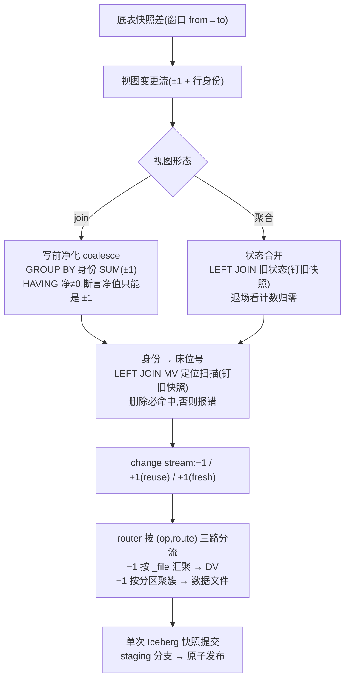

# 一条查询把增量刷新算清楚:变更怎么落到 Iceberg 物化视图上

增量物化视图(incremental materialized view;物化视图下文简称 MV)的刷新有两半。前半段——「从底表的快照差里算出一串带正负号的变更」——有成熟的增量代数,我们在[上一篇](incremental-materialized-views-on-iceberg-v3/incremental-materialized-views-on-iceberg-v3.md)里讲过。真正容易被低估的是后半段:**这串变更,怎么落到 MV 上。**

如果 MV 只是引擎内部的私有结构,落地很简单:内存里改改就行。但 NovaRocks 把 MV 也存成一张标准的 **Iceberg 表**——数据文件不可变,删一行不能就地改。于是「把变更落上去」一下子变成一件需要小心的事:既要把新结果写成新文件,又要精确地把旧结果标记删除,还得在崩溃和并发面前保持一致。

做这件事有两条路:

- **做一台专用机器**:一个内存里的「变更应用器」,逐条变更去查、去改 MV;
- **做一条关系查询**:把整次刷新——算增量、归并、定位旧行、分流写入——表达成一条对 MV 表自身的关系查询,交给查询引擎一次执行、一次原子提交。

NovaRocks 两条路都走过。第一版就是那台专用机器,它能跑,但撞上了三条架构红线(本文最后一节细讲);之后整个数据面被推倒重来,变成第二条路。**这篇文章讲的就是第二条路的完整形态**:对 join 视图和聚合视图各给出一条完整的查询,顺着它一段一段执行下去,把数据在每个阶段长什么样摊开看,并解释每一段为什么非这么写不可。

> **先澄清一件容易误会的事**:下文会用 SQL 来展示这条查询,但引擎里**并不存在这段 SQL 文本**。刷新计划是由改写规则直接在逻辑计划(logical plan,查询解析后的算子树)上构造出来的,不经过「拼 SQL 字符串再解析」这一步。SQL 只是它最好读的书写形式;它的「真身」可以用 `EXPLAIN REFRESH MATERIALIZED VIEW` 直接打印出来,第七节会看真实输出。

---

## 一、地基:在「不许改文件」的仓库里,怎么删一行

先把 Iceberg 这一层铺平。已经熟悉 Iceberg v3 的读者可以扫一眼小结直接到第二节。

一张 Iceberg 表由两部分组成:一堆**不可变的数据文件**(Parquet 等格式,写完就永不修改),加一条**快照**(snapshot)链——每次提交产生一个新快照,描述「此刻表由哪些文件组成」。写入从不改老文件,只会:写新文件,然后提交一个新快照把它们收编进来。

那删除一行怎么办?老文件不许改,v3 的答案是**删除向量**(deletion vector,下文简称 DV):对某个数据文件记一个位图,「这个文件的第 3、17、42 行作废了」。读取时把位图套在文件上,被标记的行就当不存在。所以在 Iceberg 上,「删一行」的确切含义是:**找到这行所在的 `(数据文件, 文件内行号)`,把行号记进那个文件的删除位图**。

这里埋着全文最重要的一个区分:同一行数据,有两种「地址」。

| | 行血统 `_row_id` | 物理位置 `(_file, _pos)` |
|---|---|---|
| 是什么 | Iceberg v3 行血统(row lineage)给每行分配的稳定标识 | 这行此刻在哪个数据文件的第几行 |
| 类比 | **身份证号** | **床位号** |
| 稳定性 | 跨压实、跨文件重写不变(v3 规范保证结转) | 一次压实重打包后全部改变 |
| 谁需要它 | 增量计算:跨快照追踪「同一行」 | 删除:DV 的位图索引的就是 `_pos` |

身份证号能证明「你是谁」,但护士查房要的是床位号。**增量变更流里带的是身份证号,而 DV 要的是床位号**——这个错位就是本文后半段一切结构的来源。

最后一块地基:**NovaRocks 的 MV 本身也是一张普通的 Iceberg v3 表**(带行血统、可被任何引擎直接读)。除了用户可见的列,它还多存几个隐藏列——最重要的是一列**行身份**,记着「MV 的这一行结果对应视图查询的哪条逻辑行」。这是建 MV 时就埋好的「回程票」,增量刷新全靠它对号入座。

---

## 二、贯穿全文的例子:一张订单表、一张客户表、两张 MV

后面所有推演都用这一个场景,请记住这几个数字。

**底表**(都是 Iceberg v3 表,开启行血统;`r*` / `s*` 是各行的 `_row_id`,表本身还各有一个全局唯一的 table UUID,记作 `U_o` / `U_c`):

| orders | oid | cid | city | amt | | customers | cid | name |
|---|---|---|---|---|---|---|---|---|
| 行 r1 | o1 | c1 | 北京 | 100 | | 行 s1 | c1 | 王五 |
| 行 r2 | o2 | c2 | 北京 | 200 | | 行 s2 | c2 | 李四 |
| 行 r3 | o3 | c3 | 上海 | 30 | | 行 s3 | c3 | 张三 |

**两张 MV**:

```sql
-- join 视图:订单明细宽表
CREATE MATERIALIZED VIEW mv_order_wide AS
SELECT o.oid, c.name, o.amt
FROM orders o JOIN customers c ON o.cid = c.cid;

-- 聚合视图:按城市汇总
CREATE MATERIALIZED VIEW mv_city_sales AS
SELECT city, SUM(amt) AS total, COUNT(*) AS cnt
FROM orders GROUP BY city;
```

**两张 MV 刷新前的完整物理内容**(含隐藏列;这是两张真实的 Iceberg 表,`_file/_pos` 是各行此刻的物理位置,简记为 F1#0 = 文件 F1 第 0 行):

`mv_order_wide`——行身份是 `__nova_join_row_key`:两侧行的血统对 `(U_o, 左 _row_id, U_c, 右 _row_id)` 经 SHA-256 哈希成的稳定字符串。下文把 `join_row_key(U_o, r2, U_c, s2)` 简记为 **K(r2·s2)**:

| oid | name | amt | `__nova_join_row_key` | 物理位置 |
|---|---|---|---|---|
| o1 | 王五 | 100 | K(r1·s1) | F1#0 |
| o2 | 李四 | 200 | K(r2·s2) | F1#1 |
| o3 | 张三 | 30 | K(r3·s3) | F1#2 |

`mv_city_sales`——行身份是 `__row_id__`:分组键经 `mv_group_row_id(...)` 编码成的稳定字符串,简记为 **G(北京)**;每个聚合还各存一列不透明的**聚合状态**(`__agg_state_*`,二进制,记着「可回缩的证据」,比如 SUM 的状态里除了和还有行数):

| city | total | cnt | `__row_id__` | `__agg_state_total` | `__agg_state_cnt` | 物理位置 |
|---|---|---|---|---|---|---|
| 北京 | 300 | 2 | G(北京) | ⟨2 行, 和 300⟩ | ⟨2 行⟩ | P1#0 |
| 上海 | 30 | 1 | G(上海) | ⟨1 行, 和 30⟩ | ⟨1 行⟩ | P1#1 |

**本轮变更**(一个刷新窗口内,底表发生四笔写入):

1. 新订单 `o8 (c1, 北京, 50)` → orders 新行 **r8**
2. 新订单 `o9 (c2, 杭州, 120)` → orders 新行 **r9**
3. 撤销订单 `o3` → 删除行 r3
4. 客户 c2 改名「李四 → 李四四」→ 在 Iceberg 里,改一行 = 删旧行 + 插新行,所以是删除 s2、新增 **s2'**(一条**新身份**的行)

**刷新后两张 MV 应该变成**(终点先亮出来,后面看引擎怎么一步步走到):

| mv_order_wide | | | mv_city_sales | | |
|---|---|---|---|---|---|
| (o1, 王五, 100) | 不动 | | 北京 | (350, 3) | 替换 |
| (o2, **李四四**, 200) | 改名 | | 上海 | — | **退场** |
| (o8, 王五, 50) | 新增 | | **杭州** | (120, 1) | **新组** |
| (o9, 李四四, 120) | 新增 | | | | |

上一篇讲过前半段:引擎沿 orders / customers 的快照链读出两表在窗口内的**变更流**——每条变更带一列 `__change_op`(**+1** 表示新增、**−1** 表示删除)和这行的血统。本文从这里接手:

- Δorders = { +1 (r8: o8,c1,北京,50), +1 (r9: o9,c2,杭州,120), −1 (r3: o3,c3,上海,30) }
- Δcustomers = { −1 (s2: c2,李四), +1 (s2': c2,李四四) }

---

## 三、难点正名:变更说的是「谁」,删除要的是「在哪」

顺着第一节的两种地址,把后半段的核心矛盾摆出来。

从底表变更推导出**视图**的变更之后(第四、五节的主体工作),每条视图变更长这样:一个 `__change_op`(±1),加这条结果行**是谁**——它的行身份:

- join 视图一行的身份 = 参与配对的两侧底表行的血统组合(K(r2·s2) 这样的键);
- 聚合视图一行的身份 = 分组键(G(北京))。

这个身份是**逻辑**的,而且稳定——底表行血统跨压实不变,分组键更不会变。MV 表里每行也存着自己的身份(第二节那两个隐藏列)。

问题是:要在 Iceberg 上**删**掉 MV 里一条旧结果,DV 需要的是**床位号** `(_file, _pos)`——它只存在于 MV 表**当前快照**的文件布局里,变更流里**根本没有**,也不可能有(变更是在逻辑空间里算出来的,算的时候不知道、也不该知道 MV 的文件长什么样)。

于是后半段的第一个核心动作浮出水面:**拿变更流里的逻辑身份,去 MV 表里「换」出物理位置**。用关系运算表达,「换」就是一次 **JOIN**——把「要动的身份」和「MV 表扫描出的 (身份, `_file`, `_pos`)」按身份连接。这座桥没法设计掉:它是 position-based 删除的本质步骤;能选择的只是它**在哪一层发生**——是引擎绕过执行框架直接调 Iceberg API 建哈希表(第一版的做法),还是作为计划里的一个普通 JOIN 交给分布式执行框架(现在的做法)。

但在过桥之前,变更流本身还**不能直接照着落**。为什么不能,让 join 视图的完整查询自己把原因演出来。

---

## 四、join 视图:顺着一条查询走到底

`mv_order_wide` 这一轮最麻烦:**两侧底表在同一个窗口里都变了**。整次刷新等价于下面这条查询(叙述体;`:o_from/:o_to/:c_from/:c_to` 是两张底表的窗口快照,`:mv_base` 是 MV 刷新前的快照,`U_o/U_c` 是两张表的 UUID 字面量):

```sql
INSERT INTO «mv_order_wide 的变更流写入 DAG»            -- 写入侧见第六节
WITH
  -- 支 1:orders 的本轮变更  ⋈  customers 的「刷新前」快照
  b1 AS (
    SELECT o.oid, c.name, o.amt,
           o.__change_op                        AS op,
           join_row_key(U_o, o._row_id,
                        U_c, c._row_id)         AS key      -- 行身份 = 两侧血统的组合
    FROM   __nr_ivm_delta('orders', :o_from, :o_to) o      -- 窗口内的变更行,每条带 ±1
    JOIN   customers VERSION AS OF :c_from c   ON o.cid = c.cid
  ),
  -- 支 2:orders 的「刷新后」快照  ⋈  customers 的本轮变更
  b2 AS (
    SELECT o.oid, c.name, o.amt,
           c.__change_op                        AS op,
           join_row_key(U_o, o._row_id,
                        U_c, c._row_id)         AS key
    FROM   orders VERSION AS OF :o_to o
    JOIN   __nr_ivm_delta('customers', :c_from, :c_to) c  ON o.cid = c.cid
  ),
  change_stream AS ( SELECT * FROM b1 UNION ALL SELECT * FROM b2 ),
  -- 按身份净累积;净零的瞬态行在「写」之前就消掉
  coalesced AS (
    SELECT oid, name, amt, key, SUM(op) AS net
    FROM   change_stream
    GROUP  BY oid, name, amt, key
    HAVING SUM(op) <> 0
       AND assert_true(ABS(SUM(op)) <= 1,       -- 净值只可能是 ±1;越界 = 上游算错,当场报错
                       'join delta per-payload net change exceeds 1')
  )
-- 产出一条带 __change_op 的流:净>0 插新像,净<0 删旧像(旧像位置由 LEFT JOIN 换出)
SELECT CASE WHEN c.net > 0 THEN +1 ELSE -1 END  AS __change_op,
       c.oid, c.name, c.amt,                    -- 新像 payload(插入用)
       t._file, t._pos                          -- 旧像床位号(删除用;插入行为 NULL)
FROM   coalesced c
LEFT JOIN mv_order_wide VERSION AS OF :mv_base t     -- 钉死「刷新前」的 MV 快照
  ON   c.net < 0                                     -- 只有删除行需要定位
  AND  t.__nova_join_row_key = c.key
WHERE  assert_true(c.net >= 0 OR t._file IS NOT NULL,
                   'join delta DELETE row missing target locator');
```

这里出现的都是实现里的真名:`__nr_ivm_delta` 是把「两快照之差」暴露成关系的表函数;`VERSION AS OF` 是 Iceberg 时间旅行读;`join_row_key` 把 `(表 UUID, 行血统)` 对哈希成身份键(带上表 UUID 是因为行血统只在**表内**唯一,两张表可能撞出相同的 `_row_id`);`assert_true` 是一个「条件不成立就让整条查询失败」的守卫函数。下面一段一段执行。

### 4.1 两支望远镜:为什么拆两支,而且各配一侧的「不同时刻」

join 的结果会因**任意一侧**变化而增减,经典增量代数把它拆成两支,各算「一侧的变更 × 另一侧的某个快照」。关键在快照的取法**不对称**(术语叫 telescoping):支 1 里 customers 取**刷新前**(`:c_from`),支 2 里 orders 取**刷新后**(`:o_to`)。这样「两侧都变的组合」只会落在支 2 里、恰好算一次——因为 `orders@to` 已经包含了 Δorders,而支 1 里的 customers 还停在变更前,两支不会重复覆盖同一块。

逐行展开(customers@from 里 c2 还叫「李四」;orders@to 里 o3 已删、o8/o9 已在):

| 来源 | op | 结果行 | 身份 |
|---|---|---|---|
| **b1**: Δorders ⋈ customers@from | +1 | (o8, 王五, 50) | K(r8·s1) |
| b1 | **+1** | (o9, **李四**, 120) | **K(r9·s2)** |
| b1 | −1 | (o3, 张三, 30) | K(r3·s3) |
| **b2**: orders@to ⋈ Δcustomers | −1 | (o2, 李四, 200) | K(r2·s2) |
| b2 | +1 | (o2, 李四四, 200) | K(r2·s2') |
| b2 | **−1** | (o9, **李四**, 120) | **K(r9·s2)** |
| b2 | +1 | (o9, 李四四, 120) | K(r9·s2') |

注意 c2 那次改名:s2(李四)和 s2'(李四四)是两条**不同血统**的行,所以 K(r2·s2) 和 K(r2·s2') 是**不同身份**——「更新」在这套体系里天然表达为「删一个身份 + 插另一个身份」,不需要任何特殊的 UPDATE 通道。

### 4.2 瞬态幽灵行:第 2 行和第 6 行

看加粗的两行:**同一身份 K(r9·s2)、同一内容 (o9, 李四, 120)**,一支给了 `+1`、另一支给了 `−1`。

> **这是 bug 还是必然?** 是必然,而且值得把两层拆开:
>
> **概念层**:这是两支分解的固有产物。o9 是本轮新插的订单,支 1 用「刷新前」的 customers 陪它 join,于是临时配出了 (o9, 李四);可现实里 o9 从头到尾只和「李四四」共存过——(o9, 李四) 是一条**从不该出现在 MV 里**的瞬态行。支 2 里 `orders@to ⋈ Δcustomers` 恰好产生一条等值反号的记录把它抵掉。数学上这就是分解式成立的方式:两支各自都不完备,**加起来**才是正确的增量。任何按这条代数做增量的系统都会产生它,躲不掉。
>
> **工程层**:能选择的只是**在哪里消掉它**。如果不消、把变更流直接照落会怎样?第 2 行说「插入 (o9, 李四)」——写出一条新数据文件行;第 6 行说「删除 (o9, 李四)」——要去定位它的床位号。可这条行**不在「刷新前」的 MV 快照里**(它是本轮自己刚写的),定位 JOIN 在旧快照里找不到它:要么触发 fail-loud 断言报错,要么那条幽灵行没人删、永远留在 MV 里。无论哪种,都错。

所以必须**写前净化**:`GROUP BY 身份, SUM(op)`,再用 `HAVING SUM(op) <> 0` 把净值为零的行在进入「写」之前丢掉。这一步在 NovaRocks 里叫 **coalesce**(净化归并)。净化后:

| 身份 | net | 结局 |
|---|---|---|
| K(r9·s2) | +1 − 1 = **0** | **HAVING 丢弃,从不落盘** |
| K(r8·s1) | +1 | 插 (o8, 王五, 50) |
| K(r3·s3) | −1 | 删 |
| K(r2·s2) | −1 | 删 |
| K(r2·s2') | +1 | 插 (o2, 李四四, 200) |
| K(r9·s2') | +1 | 插 (o9, 李四四, 120) |

两个实现细节值得点破:

- **GROUP BY 的键是「行内容 + 身份」而不只是身份**。理论上同一身份必然对应同一行内容(payload;身份由两侧血统决定,血统定了内容就定了),按身份分组、内容随便取一条就够。但实现没有把这条性质当信仰,而是把行内容一起放进分组键,再用**第二层聚合**断言「同一身份下待插入、待删除的不同内容各最多一条」——性质成立时零开销,性质被上游 bug 打破时立即报错,而不是静默写错数据。
- **`ABS(net) ≤ 1` 断言**。同一身份的净值物理上只可能是 −1、0、+1(一条逻辑行不可能被插两次)。真出现 ±2,一定是上游增量算错了,当场炸掉比带病提交好。这是整条管线「fail-loud(响亮地失败)」哲学的一贯体现。

### 4.3 定位与分流:一个 LEFT JOIN 干两件事

`coalesced` 里每条要么删(net<0)、要么插(net>0)。插新像直接写数据文件;删旧像需要床位号——这就是第三节那座桥:

```
LEFT JOIN mv_order_wide VERSION AS OF :mv_base t
  ON c.net < 0 AND t.__nova_join_row_key = c.key
```

MV 表扫描吐出每行的 (身份, `_file`, `_pos`),按身份连接。JOIN 条件里带着 `net < 0`,所以**只有删除行去匹配**;插入行天然不匹配,`_file` 为 NULL。一次 JOIN 同时完成「取位置」和「分流」:

| 身份 | net | 命中 MV 旧行? | `_file/_pos` | 落地 |
|---|---|---|---|---|
| K(r3·s3) | −1 | 命中(F1#2) | F1, 2 | 删旧像 → DV |
| K(r2·s2) | −1 | 命中(F1#1) | F1, 1 | 删旧像 → DV |
| K(r8·s1) | +1 | 不参与匹配 | NULL | 插 (o8, 王五, 50) |
| K(r2·s2') | +1 | 不参与匹配 | NULL | 插 (o2, 李四四, 200) |
| K(r9·s2') | +1 | 不参与匹配 | NULL | 插 (o9, 李四四, 120) |

最后的 `WHERE assert_true(net >= 0 OR _file IS NOT NULL, ...)` 守着一条不变式:**凡要删的,必须在旧快照里找得到**。找不到说明上游算出了一条不存在的删除(或者瞬态行漏净化了),这属于「宁可刷新失败也不能静默丢数」的错误。

两个配角也别漏看:

- **`VERSION AS OF :mv_base`(钉死刷新前的 MV 快照)**:这一步在**读** MV,而整次刷新又在**写**同一张 MV。钉住旧快照,JOIN 才保证只看得见旧像、看不见本轮正在写入的新行。join 视图里新旧身份不同,不钉最多是读到脏数据;到了聚合视图它会升级成正确性的硬要求(5.5 节)。
- **单侧退化**:如果这一轮只有一侧变了(比如只有 orders 有新行),另一支是空的——执行时只生成有变更的那一支。更进一步,如果窗口内全是追加(没有删除、没有更新)且是内连接(inner join),那么整条流里不存在 −1、不可能有瞬态对,coalesce 的 GROUP BY 被整体跳过,退化成纯追加的快路径——省一次按键重分布(shuffle,分布式聚合前把同键的行汇到同一节点的数据搬运)。

刷新后 `mv_order_wide` = (o1,王五,100), (o2,李四四,200), (o8,王五,50), (o9,李四四,120),正确。那条 (o9, 李四) 从头到尾没碰过磁盘。

---

## 五、聚合视图:同一副骨架,换一种「归并」

join 视图按身份**净计数**(SUM ±1)就够了,因为一条 join 结果行的内容由两侧底表行完全决定,和「MV 里原来是什么」无关。聚合不行:把一条明细并进 `SUM`,不是 +1,而是「把它的值累进这一组的和里」——**新值 = 老值 ⊕ 增量**,必须读老结果。所以聚合的查询换了归并方式,但骨架不变:delta → 按身份归并 → LEFT JOIN 旧 MV → 产 `__change_op` 流 → 写入。

`mv_city_sales` 的整次刷新等价于:

```sql
INSERT INTO «mv_city_sales 的变更流写入 DAG»
WITH
  -- ① delta 侧:按分组键聚成「带符号的部分状态」
  delta_state AS (
    SELECT mv_group_row_id(city)                AS __row_id__,   -- 分组键的稳定编码
           city,
           sum_state_signed(amt, __change_op)   AS d_total,      -- +1 行累加、−1 行回缩
           count_state_signed(1,  __change_op)  AS d_cnt
    FROM   __nr_ivm_delta('orders', :from, :to)
    GROUP  BY city
  ),
  -- ② 一个 LEFT JOIN 干三件事:取老状态、取旧像床位号、判「老组在不在」
  merged AS (
    SELECT d.__row_id__, d.city, d.d_total, d.d_cnt,
           m.__agg_state_total   AS old_total,
           m.__agg_state_cnt     AS old_cnt,
           (m.__row_id__ IS NOT NULL)  AS had_old,
           m._file, m._pos,                    -- 旧像床位号(删除用)
           m._row_id                           -- 旧像的 MV 行血统(新像继承用,见第六节)
    FROM   delta_state d
    LEFT JOIN mv_city_sales VERSION AS OF :mv_base m
      ON   m.__row_id__ = d.__row_id__
  )
-- ③ 从 merged 一次产出两路:老组删旧像;合并后未空的组插新像
SELECT CASE b.branch WHEN 'DELETE' THEN -1 ELSE +1 END          AS __change_op,
       m.city,
       sum_state_visible(sum_state_union(m.old_total, m.d_total))   AS total,  -- 新可见值
       count_state_visible(count_state_union(m.old_cnt, m.d_cnt))   AS cnt,
       sum_state_union(m.old_total, m.d_total)   AS __agg_state_total,  -- 新状态(随行存回)
       count_state_union(m.old_cnt, m.d_cnt)     AS __agg_state_cnt,
       m._file, m._pos, m._row_id
FROM   merged m
CROSS JOIN (VALUES ('DELETE'), ('INSERT')) AS b(branch)
WHERE  (b.branch = 'DELETE' AND m.had_old)
   OR  (b.branch = 'INSERT' AND
        NOT state_all_zero(count_state_union(m.old_cnt, m.d_cnt)));
```

逐段走。

### 5.1 `delta_state`:把变更聚成「带符号的部分状态」

`sum_state_signed(amt, __change_op)` 是普通聚合函数的**带符号变体**:遇到 +1 行,把值累进状态;遇到 −1 行,从状态里**回缩**。状态本身是可合并的中间表示——SUM 的状态里除了「和」还有「行数」(为什么必须有,5.4 节见分晓)。把 Δorders 按 city 聚一下:

| city | `__row_id__` | Δ SUM 状态 | Δ COUNT 状态 |
|---|---|---|---|
| 北京 | G(北京) | ⟨+1 行, +50⟩(o8) | ⟨+1⟩ |
| 杭州 | G(杭州) | ⟨+1 行, +120⟩(o9) | ⟨+1⟩ |
| 上海 | G(上海) | ⟨−1 行, −30⟩(o3 被删) | ⟨−1⟩ |

注意 c2 改名对这张 MV **毫无影响**——customers 根本不是它的底表。两张 MV 消费同一轮底表变更,但各自只为「真正影响自己」的部分付费。

### 5.2 `merged`:一个 LEFT JOIN 干三件事

`LEFT JOIN mv_city_sales ... ON __row_id__` 把 delta 侧每个组和 MV 里的老行对上。这一个 JOIN 同时拿到三样东西:**① 老状态**(用来合并);**② 旧像床位号**(等会儿删除用);**③ `had_old`**(老组在不在)。定位和合并共用同一次 MV 扫描——这正是聚合与 join 的关键分工差异:join 的计算侧不读老 MV(只在定位时碰一次),聚合的计算侧**必须**读老 MV,于是干脆把定位也捎上。

还有一个容易忽略的优化:这次 MV 扫描**不是全量扫**。计划把「delta 侧出现过的身份集合」作为过滤条件下推给扫描(scan 声明为只需 delta 触到的行,执行层按半连接方式收窄),所以只有北京、上海、杭州三个组的老行会被读出来——MV 里如果还有一万个别的城市,一个都不用碰。

合并结果(`state_union` 就是状态对应相加):

| city | 老状态 (SUM/CNT) | Δ 状态 | 合并后 | had_old | 旧像位置 |
|---|---|---|---|---|---|
| 北京 | ⟨2, 300⟩ / ⟨2⟩ | ⟨+1, +50⟩ / ⟨+1⟩ | **⟨3, 350⟩ / ⟨3⟩** | 是 | P1#0 |
| 上海 | ⟨1, 30⟩ / ⟨1⟩ | ⟨−1, −30⟩ / ⟨−1⟩ | **⟨0, 0⟩ / ⟨0⟩** | 是 | P1#1 |
| 杭州 | —(没这组) | ⟨+1, +120⟩ / ⟨+1⟩ | ⟨1, 120⟩ / ⟨1⟩ | 否 | NULL |

### 5.3 一次计算,两路产出:那个奇怪的 CROSS JOIN

第 ③ 段没有写成「两个 SELECT UNION ALL」,而是让 `merged` **CROSS JOIN 一张只有两行的常量表**(`'DELETE'`、`'INSERT'`),再用谓词过滤。效果完全等价——每个组被复制成两份,一份走删除判定、一份走插入判定——但有一个实打实的执行差别:**`merged` 只被计算一次**。如果写成 UNION ALL 的两个 SELECT,`merged` 这棵子树(delta 聚合 + LEFT JOIN MV 扫描)会被执行两遍,把最贵的部分白算一次。第七节的真实计划里,你能直接看到这个 `CROSS JOIN` + `VALUES (2 rows)`。

两路谓词决定每组的结局:

- **DELETE 路**:`had_old`——凡老组存在,旧像一律删(存活的组也要删,因为它将被新像替换);
- **INSERT 路**:`NOT state_all_zero(合并后的计数状态)`——合并后**还有行**的组才插新像。

| city | DELETE 路(had_old?) | INSERT 路(非空?) | 净效果 |
|---|---|---|---|
| 北京 | 是 → 删 P1#0 | 是 → 插 (北京, 350, 3, 新状态) | **替换** |
| 上海 | 是 → 删 P1#1 | 否(计数归零)→ 不插 | **退场** |
| 杭州 | 否 | 是 → 插 (杭州, 120, 1, 新状态) | **新组** |

### 5.4 退场为什么看「计数」而不看「值」

> **一个容易踩的坑,拆开讲清**:一个组什么时候该从 MV 里消失?直觉说「汇总值变 0 就删」。**错**——这是概念错误,不是工程取舍。设想某组先来一单 +5、又来一单 −5:`SUM` 恰好是 0,可组里**还有 2 行**,绝不该删。反过来上海是真的一行不剩,才该退场。「值为 0」和「没有行了」是两个完全不同的命题,只是在多数样本上碰巧同真,靠值判退场的系统迟早写错数据。
>
> 所以退场判定只认**计数状态归零**(`state_all_zero` 解码的是 COUNT 的状态)。这也是聚合状态里非带行数不可的根本原因——它让「这组还有没有行」成为可精确回答的问题。我们的例子里查询本身就有 `COUNT(*)`,直接复用它的状态;如果用户的查询没写 COUNT,引擎会自动多藏一列行数状态(`__agg_state___ivm_row_count`)专供退场判定。

### 5.5 快照钉定:在聚合里从「卫生习惯」升级成「正确性前提」

回看 `VERSION AS OF :mv_base`。聚合的身份是分组键——北京的**旧行**和本轮要插的**新行,身份是同一个 G(北京)**。如果那个 LEFT JOIN 读的是「最新」而不是钉死的旧快照,它可能同时看见旧行和刚写入的新行:同一身份匹配出两行,定位歧义、删错行。join 视图里新旧身份必然不同(K(r2·s2) vs K(r2·s2')),所以不钉快照只是不卫生;聚合里新旧同身份,这一钉就是硬性的正确性前提。

刷新后 `mv_city_sales` = 北京 (350, 3)、杭州 (120, 1),上海消失。

---

## 六、落盘:一条变更流的三种去处

到这里,两条查询各自产出了一条带 `__change_op` 的**变更流**(change stream)。最后一程是把它写成 Iceberg 提交。先把两个例子的流合在一张表里看——注意「插入」其实分成了两种:

| 来源 | 行 | `__change_op` | 带床位号? | 带 MV 行血统 `_row_id`? | 去处 |
|---|---|---|---|---|---|
| join | K(r3·s3) 旧像 | −1 | F1#2 | — | **删除:写 DV** |
| join | K(r2·s2) 旧像 | −1 | F1#1 | — | **删除:写 DV** |
| join | (o8, 王五, 50) 等 3 条新像 | +1 | NULL | NULL | **插入(fresh):写新文件,分配新血统** |
| 聚合 | 北京旧像 | −1 | P1#0 | — | **删除:写 DV** |
| 聚合 | 北京新像 (350, 3) | +1 | NULL | **继承旧行的 `_row_id`** | **插入(reuse):写新文件,保留血统** |
| 聚合 | 上海旧像 | −1 | P1#1 | — | **删除:写 DV** |
| 聚合 | 杭州新像 (120, 1) | +1 | NULL | NULL | **插入(fresh):分配新血统** |

**reuse 和 fresh 的区别**在最后一列的「行血统」上。MV 自己也是一张 v3 表、也有 `_row_id`。北京这个组只是**换了个值**,组还是那个组——所以新像**继承**旧行的 `_row_id`(聚合查询的 ③ 段里,INSERT 路的 `_row_id` 正是从 LEFT JOIN 的老行侧取的),提交时不分配新血统;杭州是全新的组,提交时从表的 next-row-id 分配全新血统。这不是洁癖:MV 的行血统稳定,意味着 MV 之上还能再挂增量消费者(比如 MV 套 MV),「北京」这行的身份不会因为每次刷新而漂移。每行走哪条插入通道,由行上是否带血统动态决定——正是「有 `_row_id` 就 reuse,没有就 fresh」。

### 6.1 为什么不能「一个 sink 全吃」

> **这是概念问题还是工程权衡?** 是硬约束,值得单独拆开。三种去处对数据的**物理分布**要求互相冲突:
>
> | 去处 | 必须按什么分布 | 原因 |
> |---|---|---|
> | −1 → DV | **按 `_file` 哈希汇聚** | DV 是「每个数据文件一个位图」;同一文件的删除行必须汇到同一个写手,否则一个文件会产出多个 DV 位图,提交层直接拒绝 |
> | +1 (reuse) | 按目标表分区规则聚簇 | 写数据文件,要按 MV 的分区布局归堆 |
> | +1 (fresh) | 按目标表分区规则聚簇 | 同上,且要走「分配新血统」的提交通道;**reuse 与 fresh 的行不能混进同一个数据文件**(两种血统策略在文件粒度上互斥) |
>
> 分布式计划里,一条数据交换通道(exchange 边,节点间搬运数据的管道)只能有一种分布方式;一个写入端(sink)只消费一条通道。想塞进一个 sink,要么全部汇到单点(退回第一版的单点内存路线),要么迁就其中一种分布而破坏另外两种的正确性。所以**分流必须发生在计划层**,而不是某个 sink 内部。

### 6.2 router、三条写入腿、一次提交

NovaRocks 的做法:变更流的产出计划(第四、五节那两棵树)**只执行一次**,根部接一个**变更流路由器**(router,一个只做「按行分发」的数据交换算子)。每行按 `(__change_op, 数据路由)` 这个类型化的键做 O(1) 分发,进入 1..3 条**写入腿**(write leg)——整体构成一个多分支的写入 DAG(有向无环图):

```
           变更流(只算一次)
                 │
        ┌────────┼─────────┐
        │ router 按 (op, route) 逐行分发;未声明的键 → 当场报错
        ▼        ▼         ▼
     −1 删除   +1 reuse   +1 fresh
   按 _file    按分区      按分区
   哈希汇聚    聚簇        聚簇
        │        │         │
     DV 写手   数据写手    数据写手
        └────────┼─────────┘
                 ▼
      一个提交协调者收齐三路的文件清单
      ── 拼成一次 Iceberg 快照提交(row-delta:
         新数据文件 + 新 DV 同进同出)
```

几个要点:

- **分支集合由计划静态声明**。聚合刷新声明三条腿;join 的 coalesce 刷新也声明三条(插入行按是否带血统逐行路由,这一轮 reuse 腿收到 0 行——空腿正常收尾,不产出空文件);append-only 快路径只声明 fresh 一条。**只有一条腿时 router 整个不物化**,拓扑退化成普通的单 sink 写入——单纯的 INSERT 场景不为通用性付一分钱。
- **router 只认 ±1**。它不理解「UPDATE」「MERGE」这些来源语义;任何上游都必须先把自己规整成 +1/−1 的原始事件流再进来。这个决定的分量在第九节揭晓。
- **一次原子提交**。三路写手各自上报写出的文件,由一个提交协调者收口成**单次** Iceberg 快照提交:新数据文件和新 DV 要么一起生效、要么一起不存在。不会出现「删了旧像、新像没写上」的中间态。
- **staging 分支兜底**。这次提交并不直接落在 MV 的 main 分支上,而是先落在一条私有分支(`__nova_mv_refresh_*`)上,校验后原子地快进(fast-forward)发布到 main——隔离、发布、崩溃恢复的完整机制在[上一篇第七节](incremental-materialized-views-on-iceberg-v3/incremental-materialized-views-on-iceberg-v3.md)展开过,这里不重复。

至此,整条链路走完:**底表快照差 → 视图变更流 → 写前净化/状态合并 → 身份换床位号 → 三路分流 → 一次提交**。全程是一条(或者说一棵)普通的分布式查询计划,外加一次普通的 Iceberg 提交。

---

## 七、眼见为实:EXPLAIN REFRESH

上面所有 SQL 都是叙述体,现在看真身。NovaRocks 提供 `EXPLAIN [VERBOSE] REFRESH MATERIALIZED VIEW`,它跑的是**和真实刷新同一条**计划构造管线,打印出来的就是将要执行的逻辑计划。下面是本文例子在真实环境里的输出(原始输出较长,这里截断了重复的列清单、把 `CASE WHEN 0 = __imv_change_branch` 缩写为 `branch=DELETE`,并加了 `←` 注记;树形结构与算子原样保留)。

聚合视图 `mv_city_sales`(默认级别),从下往上读:

```
PROJECT [__row_id__, city,
         CASE WHEN branch=DELETE THEN NULL
              ELSE sum_state_visible(sum_state_union(...)) END AS total,
         ...,
         CASE WHEN branch=DELETE THEN _file ELSE NULL END AS _file,
         ...,
         CASE WHEN branch=DELETE THEN -1 ELSE 1 END AS __change_op]
  FILTER
    predicate: branch=DELETE AND __row_id__ IS NOT NULL
            OR branch=INSERT AND NOT state_all_zero(
                                     count_state_union(__agg_state_cnt, __agg_state_cnt))
    CROSS JOIN
      LEFT OUTER JOIN
        on: __row_id__ = __row_id__
        PROJECT [mv_group_row_id(city) AS __row_id__, city, __agg_state_total, __agg_state_cnt]
          AGGREGATE
            group by: city
            aggregations: sum_state_signed(...amt, __change_op...),
                          count_state_signed(...1, __change_op...)
            0:SCAN shop.orders                          ← delta 扫描
        0:SCAN shop.__nr_mv_mv_city_sales               ← MV 旧状态扫描
      VALUES (2 rows)                                   ← DELETE / INSERT 两行分支常量表
```

第五节的每一段都在:带符号状态聚合(`*_state_signed`)、`mv_group_row_id` 身份编码、LEFT OUTER JOIN 旧状态、`CROSS JOIN + VALUES (2 rows)` 的一次计算两路产出、`state_all_zero` 退场判定、`__change_op` 的 CASE。顺带露出了一个实现细节:MV 的存储表叫 `__nr_mv_mv_city_sales`——MV 对外是个视图名,数据落在这张带隐藏列的 Iceberg 表里。

join 视图 `mv_order_wide` 用 VERBOSE 看,两支望远镜的快照错位直接印在扫描源上:

```
  ...
  UNION ALL
    PROJECT [..., join_row_key('019f20c1-fc7a-...', o._row_id,
                               '019f20c1-fc8b-...', c._row_id) AS __nova_join_row_key]
      INNER JOIN  on: o.cid = c.cid
        0:SCAN shop.orders    source: IcebergDeltaTable   from_snapshot_id=... to_snapshot_id=...
        0:SCAN shop.customers source: IcebergVersionTable snapshot_id=...      ← 钉在「改名前」
    PROJECT [..., join_row_key(...)]
      INNER JOIN  on: o.cid = c.cid
        0:SCAN shop.orders    source: IcebergVersionTable snapshot_id=...      ← 钉在「刷新后」
        0:SCAN shop.customers source: IcebergDeltaTable   from_snapshot_id=... to_snapshot_id=...
  ...
  0:SCAN shop.__nr_mv_mv_order_wide
       source: IcebergMvTargetLocator target=... apply_key=__nova_join_row_key  ← 定位扫描
```

`join_row_key` 的前两个参数就是两张底表的 UUID 字面量;`IcebergDeltaTable` / `IcebergVersionTable` 是 `__nr_ivm_delta(...)` / `VERSION AS OF` 落到计划里的样子;`IcebergMvTargetLocator` 是那次「发射身份 + 床位号」的 MV 定位扫描。(coalesce 的净化聚合按窗口内容在执行期挂载,append-only 窗口会整体跳过它。)

EXPLAIN 与执行同源还有一层工程价值:刷新计划的**形态**从此可以被回归测试锁住——SQL 测试用例里用 `@explain_contains` 断言「计划必须包含 LEFT OUTER JOIN / state_all_zero / IcebergMvTargetLocator」,任何让刷新悄悄变形的改动都会当场现形。

---

## 八、两条查询,同一副骨架

把 join 和聚合并排放,差异全部来自语义本身,主干完全一致:

| 阶段 | join 视图 | 聚合视图 |
|---|---|---|
| delta → | 两支 telescoping UNION ALL(原始结果行) | 按分组键聚成**带符号状态** |
| 行身份 | `join_row_key(表UUID+血统 ×2)` | `mv_group_row_id(分组键)` |
| 按身份归并 | GROUP BY + SUM(op),HAVING 净≠0 丢瞬态行 | `state_union` 合并老态⊕Δ态 |
| 读老 MV | **只为定位**(compute 不读) | 合并 + 定位 + 判 had_old,**一次 JOIN 三件事** |
| 删谁 | net < 0 的身份 | 所有 had_old 的组 |
| 插谁 | net > 0 的身份(fresh) | 合并后计数未归零的组(替换=reuse,新组=fresh) |
| 守卫 | \|net\| ≤ 1;删除必命中定位 | 退场只认计数归零 |
| 落盘 | 同一个三路写入 DAG,单次快照提交 | 同 |



值得盯着看一会儿:这副骨架里**没有任何一步是「应用变更」专用的黑盒**。UNION ALL、GROUP BY、LEFT JOIN、CROSS JOIN、Filter、扫描、exchange——全是引擎跑普通查询的原生算子;特殊之处只在几个「素材」上:`__nr_ivm_delta` 变更源、`VERSION AS OF` 时间旅行、`*_state_*` 状态函数家族、身份编码函数——而它们也只是普通的表函数、标量函数和聚合函数。

---

## 九、为什么要全关系化:一段走过弯路的诚实记录

最后回到开头那个取舍。这套「整次刷新 = 一条关系查询」不是一开始就想清楚的——**NovaRocks 的第一版恰恰是那台专用机器**,而且它工作了相当一段时间:

- 聚合合并前,先在**协调者**(coordinator,负责规划和调度的节点)上把 delta 查询**预跑一遍**,拿结果去预绑定老状态的位置——协调者成了数据面的计算节点;
- 「身份换床位号」由一个专用定位器完成:**绕过执行框架**、直连 Iceberg API 扫 MV 表,在**单节点内存里建一张身份→位置的哈希表**;
- join 的净化归并是一个单驱动算子,把整条变更流收进**单点的有序映射**里净抵,内存兜不住时靠一个 `max_keys` 上限**硬报错**:「请全量刷新,或把 delta 拆小」。

每一条都能跑通功能,合起来触了三条架构红线:

| 红线 | 第一版的违规 | 全关系化后 |
|---|---|---|
| ① 协调者不做数据面计算 | delta 预跑发生在协调者上,且同一份 delta 被算了两遍 | delta 只在计划里出现一次,跑在执行框架里 |
| ② 不绕过执行框架直连存储做数据面 | 定位器直连 Iceberg API 自建哈希表 | 定位是计划内的一次普通扫描 + JOIN |
| ③ 不允许单点囤全量数据 | 预跑结果、定位哈希表、归并映射全在单节点内存,无溢写,有硬墙 | GROUP BY / JOIN 是标准分布式算子:按键 shuffle、多并行度、内存不够**溢写到磁盘**(spill),硬墙退役 |

> **这是能力问题还是路线问题?** 值得拆开:第一版的每个组件单看都不难修——给哈希表加溢写、给预跑加缓存……但那是沿着「把专用机器越造越好」的路线走。关系化是换路线:**这些组件根本不该存在**。「按身份归并」就是 GROUP BY,「身份换床位号」就是 JOIN,「只读被触及的组」就是扫描下推——查询引擎为这些算子准备的分布式执行、溢写、并行调度、优化规则,MV 刷新一行不写就全部继承。红线不是被修好的,是被**取消**的。

换来的东西可以列得很具体:

- **可扩展**:刷新吞吐随执行框架横向扩,大 delta 不再撞单点内存墙;
- **可观测**:`EXPLAIN REFRESH` 打印的就是真实执行计划,计划形态可被回归测试锁定;
- **可优化**:刷新计划过的是和普通查询同一个优化器,谓词下推、join 策略、并行度这些能力自动生效;
- **可组合**——这条最深远。第六节那个「只认 ±1」的三路写入 DAG **不是 MV 专属设施**:普通 DML 的 `UPDATE` / `MERGE` 也被改造成同一形态——把「命中的行」展开成 `−1(旧行进 DV)+1(带血统的替换行)` 或 `+1(全新行)` 的原始事件流,进同一个 router、同一组写入腿、同一个提交协调者。MV 刷新和 DML 写入在写侧**合流成一条主干**;未来任何新的变更来源(外部 changelog、消息队列),只要能把自己规整成 ±1 事件流,写侧一行代码都不用加。

也要把代价说白:这条路线是**批式**的。一次刷新是一个批处理作业——不是 Materialize 那种毫秒级持续物化。换来的是不引入任何常驻状态系统,MV 自始至终是湖仓里和底表同构的一张开放 Iceberg 表,谁都能读、坏了能对账。这是一个立场鲜明的权衡,不是技术上做不到另一边。

一句话收束:**让刷新和查询说同一种语言**——增量变更不是被一台特殊机器「应用」上去的,而是被一条关系查询**算**出来、按三种去处分流、再以一次原子提交**发布**出去的。而当 DML 也汇入同一条写侧主干时,这句话可以再进一步:刷新、写入、查询,说的都是同一种语言。
