# 用 Iceberg v3 实现增量物化视图的原理

物化视图(Materialized View, MV)的价值很直白:把一段昂贵的查询结果**预先算好、存下来**,
查询时直接读结果。难点也很直白:底表一直在变,**怎么用尽量小的代价让 MV 跟着变新**?

朴素做法是「全量重算」——底表变了就把整个视图重跑一遍。数据量一大,这条路就走死了。
真正想要的是**增量维护**(Incremental View Maintenance, IVM):底表发生了 1000 行变更,
就只为这 1000 行付出代价,而不是为全表的 10 亿行付出代价。

这篇文章讲 NovaRocks 是怎么做增量物化视图的,以及为什么这套设计**几乎完全建立在 Iceberg v3 的能力之上**。
重点是设计思路,不是代码细节。

---

## 一、增量物化视图为什么难,湖仓给了什么新答案

如果只说「把结果缓存起来」,物化视图很容易被理解成某个引擎里的加速结构:
为了查得快,多存一份结果。但在湖仓里,这还不够。结果一旦落进私有缓存、专用 cube,
或另一套报表存储,它就变成了需要单独搬运、授权、治理和对账的第二份数据。

NovaRocks 想要的不是这种 MV。它把 MV 本身也存成一张**标准 Iceberg v3 表**,
和底表待在同一个 catalog、同一份对象存储里。这样一来,汇总结果不是被锁在 NovaRocks
内部的私有产物,而是湖仓里一张普通的开放表:Spark 可以跑批,Trino / Presto 可以做交互式查询,
Flink 也可以继续接下游,不需要 NovaRocks 在场,也不需要额外导出 / 转换。

这还顺手把明细和汇总收回到了同一个入口。明细报表查底表,汇总报表查 MV,但它们共享同一套
catalog、权限、治理和口径;汇总结果不再是另一条 ETL 算出来的「第二份真相」,
而是从底表增量推导出来、和底表同构保存的一部分湖仓资产。

学术界和工业界处理增量维护,大致有两条脉络:

- **经典 IVM**:把视图看作关系代数表达式,用「增量代数」推导每个算子的 delta 规则
  (`Δ(A⋈B) = ΔA⋈B ∪ A⋈ΔB ∪ ΔA⋈ΔB` 是其中最有名的一条),聚合则维护可合并的「聚合态」。
- **流式 dataflow**:以 Materialize / differential dataflow、Flink 为代表,把视图编译成长驻算子,
  持续消费输入变更、增量更新算子内部状态。

这两条路都绕不开一个核心问题:**「变更」从哪来?算子的状态存在哪?** 流式系统通常要自带一个状态后端
和一条独立的变更日志(changelog),这是额外的系统复杂度与运维成本。

NovaRocks 的取舍是另一条路——**批式、快照锚定、把表自身的提交历史当作 changelog**:

- 不引入独立的流式引擎,也不维护独立的 state store;
- 底表本身既是数据、又是变更日志;
- 一次「刷新」就是一个批处理作业,可由手动触发、定时触发,或在底表产生新快照时触发。

这条路之所以走得通,是因为 **Iceberg v3 第一次让一张普通的湖仓表具备了做 changelog 的全部要件**。
代价是它不是「毫秒级持续物化」,但换来的是:没有额外状态系统、存储原生、可移植——
这也正是上面两个红利能成立的根本原因。

---

## 二、地基:Iceberg v3 给了哪三样东西

增量维护需要三件东西,而它们恰好对应 v3 的三项能力。

### 1. 行血缘(row lineage):跨快照稳定的行身份

增量更新的本质是「定位目标表里**那一行**,把它删掉 / 改掉」。这要求每一行有一个
**经历压实、重写之后依然不变的身份**。

Iceberg v3 引入了行血缘:每行带两个系统列——`_row_id`(行的稳定标识)和
`_last_updated_sequence_number`(该行最后被修改的序列号)。关键在于 v3 **规定**:
压实型的 `REPLACE` 提交(把小文件重打包成大文件,内容不变)**必须把未变行的 `_row_id` 结转下去**。

这就是「稳定」的来源。NovaRocks 读取时优先用存储的 `_row_id`,缺失时回退到
`first_row_id + 文件内行号` 合成,对上层始终呈现一个稳定的行身份。

### 2. 快照 + 序列号:免数据 I/O 就知道「变了哪些文件」

Iceberg 的每次提交产生一个**快照**(snapshot),快照之间构成父子链,每个快照都标注了
它做了什么(追加、删除、覆盖)以及一个单调递增的序列号。

刷新时,NovaRocks 从「上次刷新所锚定的快照」沿父链走到「当前快照」,把这段窗口里的每个快照
分类成一个增量动作(Append / Delete / Overwrite / Replace)。**这一步纯粹读元数据,不碰一个数据文件**。

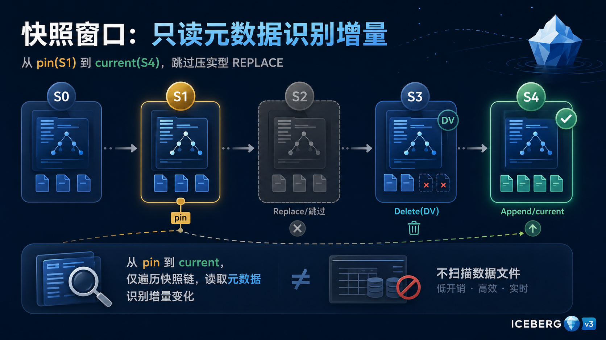

<!--
Mermaid 逻辑图:快照窗口。注释掉以避免 preview 渲染,保留核心逻辑。
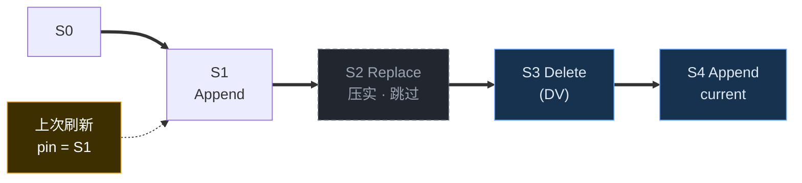
-->

*窗口 = 从 pin(S1)到 current(S4)。`S2` 被验证为「压实型 REPLACE」(总记录数不变、schema 不变、
增删文件数符合压实特征)而**直接跳过**——因为它逻辑内容没变,行血缘也已结转。
真正要消费的只有 `S3`(删除)和 `S4`(追加)。*

### 3. 删除向量(deletion vector):MOR 删除也能被增量消费

v3 把删除向量(Puffin 格式的 `deletion-vector-v1`)作为一等的删除编码。NovaRocks 把它与
v2 的位置删除(position delete)走同一条路径,按文件合并成一个位图。这样「读时合并」(MOR)
风格的删除——不重写数据文件、只记录哪些行被删——也能被增量管线消费。

### 为什么 v2 做不到

把这三点反过来看,就明白为什么增量维护**必须**站在 v3 上:

- **身份会漂移**:v2 唯一的行身份是 `(文件路径, 文件内行号)`。一次压实重打包,每行的
  `(文件, 行号)` 全部改变——目标表里再也找不到「原来那一行」。
- **压实不透明**:v2 看不出某次重写「逻辑内容没变」,只能当成「整批删 + 整批插」,从而被迫全量刷新。
- **没有 DV**:删除无法以增量友好的方式表达。

---

## 三、一条增量流贯穿全篇:`__change_op` +1 / −1

上面把变更窗口拆成了若干「增量动作」,接下来要把它们**统一**成一种下游能消费的形式。

NovaRocks 的做法是给增量流加一列 `__change_op`:**插入 = +1,删除 = −1**。无论变更来自哪种动作、
落到哪种视图形态,下游都只看这一列。这是整套设计的「统一货币」。

- **插入侧**很简单:扫描窗口内新增的数据文件,每行贴上 `+1`。
- **删除侧**是这套设计里最值得讲的一点。它不是「告诉你删了多少」,而是**把被删的行本身从底表数据文件里
  读回来**,贴上它们的 `_row_id`,再标上 `−1`。因为只有把「删了哪一行的什么内容」完整还原出来,
  才能在目标表里精确定位并回退它。删除向量是**按文件累积**的语义(这一版包含上一版),
  所以删除侧还要减去「上次刷新已经处理过的删除位置」,避免重复扣减。

最终,三种来源——新增数据文件、位置删除 / DV、等值删除——都汇聚成一条带 `__change_op` 和
四列行血缘的统一增量流。

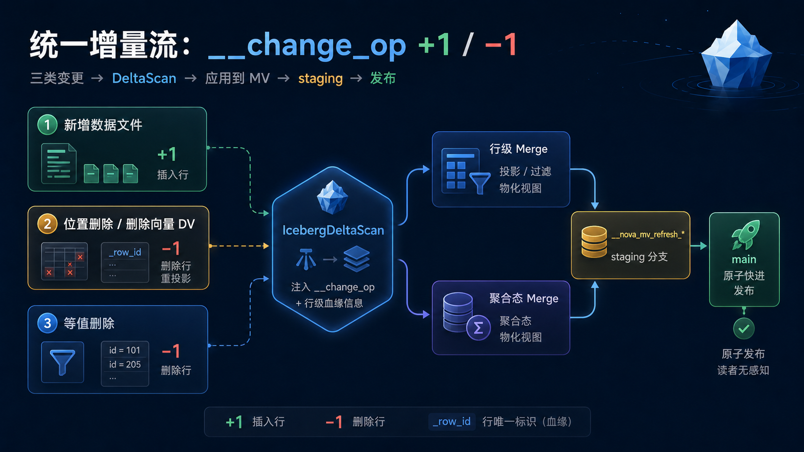

<!--
Mermaid 逻辑图:统一增量流。注释掉以避免 preview 渲染,保留核心逻辑。
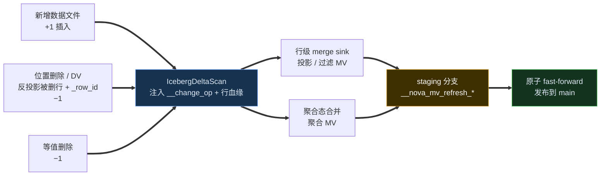
-->

---

## 四、怎么把增量「应用」到 MV 目标表

有了带符号的增量流,接下来要把它**合并进**目标表。根据视图在做什么,有两条 apply 路径——下面各用一个 SQL 例子,把数据的每一步变化走一遍。

### 行级合并:投影 / 过滤型 MV

视图只对底表做投影、过滤、列计算时,MV 的每一行都一一对应底表的一行——**行的身份就是底表的 `_row_id`**。

```sql
CREATE MATERIALIZED VIEW big_orders AS
SELECT order_id, city, amount
FROM orders
WHERE amount >= 100;
```

假设某次刷新窗口里,底表 `orders` 发生两处变更:新下了一单 `(o9, BJ, 120)`,撤销了一单 `(o3, SH, 200)`。
套用 MV 自己的过滤 / 投影之后,增量流长这样(`_row_id` 是底表给每行的稳定身份):

| `__change_op` | `_row_id` | order_id | city | amount |
|:-:|:-:|:-:|:-:|:-:|
| **+1** | r9 | o9 | BJ | 120 |
| **−1** | r3 | o3 | SH | 200 |

> 删除侧有个微妙处:`o3` 的 `amount = 200` 满足 `>= 100`,它**曾经进过 MV**,所以要带 `−1` 把它移除;
> 反过来,若被删的行原本就不满足过滤条件,这条 delta 会被 MV 的过滤直接挡掉、什么都不做——
> 增量天然只为「真正影响了视图的变更」付费。

apply 这一步把底表 `_row_id` 当作隐藏的 **apply-key**:`−1` 行按 `r3` 在目标表里定位、删除;`+1` 行 `r9` 追加。一次提交,MV 就跟着窗口前进一步:

| MV `big_orders` | 内容(节选) |
|:-:|:--|
| before | …,`(o3, SH, 200)`,`(o7, BJ, 150)` |
| after | …,`(o7, BJ, 150)`,`(o9, BJ, 120)` &nbsp;—— o3 已删、o9 已加 |

### 聚合态合并:聚合型 MV

聚合视图没法「只存看得见的结果」就完事——一次删除可能要求把结果**回退**(`MAX` 删掉了当前最大值,该退回到谁?)。
所以聚合 MV 的每个分组,除了可见列,还多存:每个聚合一列**可合并、可回缩的中间状态**(不透明二进制),外加一列隐藏的**分组行数**,用来判断分组是否已空。

```sql
CREATE MATERIALIZED VIEW sales_by_city AS
SELECT city, SUM(amount) AS total, COUNT(*) AS cnt
FROM orders
GROUP BY city;
```

它的物理布局(`__` 开头为隐藏列):

| city | total | cnt | `__state_total` | `__state_cnt` | `__row_count` |
|:-:|:-:|:-:|:-:|:-:|:-:|
| SH | 300 | 4 | ⟨sum 态⟩ | ⟨cnt 态⟩ | 4 |
| BJ | 80 | 1 | ⟨…⟩ | ⟨…⟩ | 1 |

同一窗口里,`SH` 城新增一单 `50`、撤销一单 `30`,增量流是:

| `__change_op` | city | amount |
|:-:|:-:|:-:|
| **+1** | SH | 50 |
| **−1** | SH | 30 |

改写时,`SUM(amount)` 被换成「带符号的 sum 状态聚合」,`__change_op` 一起喂进去:插入计 `+`、删除计 `−`。
于是这批 delta 先在 `SH` 上聚出一个**增量状态**:`Δtotal = +50 − 30 = +20`,`Δcnt = +1 − 1 = 0`。合并分三步:

1. **只回读被触及的分组**——本次只动了 `SH`,就只读 `SH` 的旧状态,`BJ` 完全不碰;
2. **合并** `旧态 ⊕ 增量态`——`SH` 的 `(300, 4) ⊕ (+20, 0) = (320, 4)`;
3. **空组删除**——若某分组合并后行数归零,整组删掉(这正是隐藏行数列的用处)。

结果:`SH` 行从 `total = 300` 更新到 `320`(`cnt` 仍为 4),`BJ` 纹丝不动。聚合路径把这次变化同样表达成一条 change stream(旧分组行 `−1` + 新分组行 `+1`),流进**和行级路径同一个合并 sink**——两条路,最后都汇到同一处提交。

这个例子用 `SUM` / `COUNT` 是为了好算,但这套状态设计真正有意义的地方,恰恰在那些**只看可见结果会丢信息**的聚合上。

先看 `COUNT(DISTINCT)`:

```sql
CREATE MATERIALIZED VIEW buyers_by_city AS
SELECT city, COUNT(DISTINCT user_id) AS buyers
FROM orders
GROUP BY city;
```

假设 `SH` 当前有三笔订单:`u1` 下了两单,`u2` 下了一单。可见结果只是 `buyers = 2`,
但状态里要记的不是数字 2,而是每个 distinct key 的出现次数:

| city | buyers | `__state_buyers` |
|:-:|:-:|:-:|
| SH | 2 | `{u1:2, u2:1}` |

如果删掉 `u1` 的其中一单,delta 是 `{u1:-1}`,合并后状态变成 `{u1:1, u2:1}`,
可见结果仍然是 2;只有再删掉 `u1` 的最后一单,状态变成 `{u2:1}`,`buyers` 才会从 2 降到 1。
这就是 `COUNT(DISTINCT)` 不能只存一个计数的原因:删除一行时,你必须知道这个 key 在组里是不是**最后一次出现**。

`MIN` / `MAX` 也是同一个道理:

```sql
CREATE MATERIALIZED VIEW city_order_range AS
SELECT city, MIN(amount) AS min_amount, MAX(amount) AS max_amount
FROM orders
GROUP BY city;
```

假设 `BJ` 当前金额是 `80,150,200`,可见结果是 `min = 80`,`max = 200`;
状态要保留每个候选值的出现次数:

| city | min_amount | max_amount | `__state_amount` |
|:-:|:-:|:-:|:-:|
| BJ | 80 | 200 | `{80:1, 150:1, 200:1}` |

现在删除 `200`,如果 MV 只存可见的 `max = 200`,它不知道该退回到谁;有状态就很直接:
合并 `{200:-1}` 后状态变成 `{80:1, 150:1}`,新的 `max` 从状态里重新派生为 `150`。
如果原来是 `{80:1, 150:1, 200:2}`,删掉一条 `200` 后状态仍有 `{200:1}`,`max` 也仍然是 200。

所以聚合态不是「把结果多存一份」,而是把每个聚合需要的**可回缩证据**存下来:
`SUM` / `COUNT` 可以是可加减的数值状态;`COUNT(DISTINCT)`、`MIN`、`MAX` 则更像一个按值计数的 multiset。
刷新时统一做的事始终没变:旧态和增量态合并,再从合并后的状态派生可见结果。正因为这个契约稳定,
新的聚合函数才不需要发明一条新的刷新路径,只需要定义自己的状态如何累积、如何回缩、如何转成最终可见值。

---

## 五、把逻辑的 +1 / −1 映射到执行:Delta 与 Version

第四节的 apply 一直假定我们**已经拿到了视图的 `+1` / `−1` 流**。可第三节给出的只是**底表**的变更流;
视图是一条查询(过滤、join、聚合……),怎么把「底表变了」推导成「视图变了什么」?这中间缺的一步,落到执行层就是两个算子。

### Delta:一个关系的增量

`Delta(R)` 表示关系 R 在这次窗口里的变更行——就是带 `__change_op` 的那条流。

- 在叶子(底表扫描)上,`Delta(base)` 就是第三节那条增量流:新增数据文件记 `+1`、反投影出的被删行记 `−1`;
- 过投影 / 过滤这类**一元算子**时,delta 直接穿过去:`Delta(σ(R)) = σ(Delta(R))`——把变更行再过一遍视图自己的过滤即可。
  第四节 `big_orders` 的例子正是如此:底表的 `+1` / `−1` 行套一遍 `amount >= 100`,就是视图的增量。

投影 / 过滤型 MV 到这里就闭环了:**视图增量 = 过滤后的底表增量**。真正的难点在 join。

### Join 的增量代数,以及 Version 的由来

join 的结果会因为**任意一侧**变化而增减,所以它的增量不是「两侧增量再 join」那么简单,而是经典的三项式:

```
Δ(A ⋈ B) = ΔA ⋈ B  ∪  A ⋈ ΔB  ∪  ΔA ⋈ ΔB
```

直觉很清楚:A 多 / 少了一行,要和 B 的全部去配;B 变了,要和 A 的全部去配;两边都变的部分(`ΔA ⋈ ΔB`)是重叠项。
但直接照着算有两个坑:`ΔA ⋈ ΔB` 会被**重复计数**;而且 `A ⋈ ΔB` 里的「A」究竟指**哪个时刻**的 A?——正是这两个坑,逼出了第二个算子 `Version`。

`Version(R, v)` 表示「把 R 读成快照 `v` 那一刻的样子」。给两侧用窗口的起点 `from`(上次刷新锚定的快照)和终点 `to`(当前快照)**错位**取版本,三项式就收敛成两条互不重叠的分支:

- 左分支:`ΔA ⋈ Version(B, from)`
- 右分支:`Version(A, to) ⋈ ΔB`

因为 `Version(A, to)` 已经包含了 `ΔA`,重叠项 `ΔA ⋈ ΔB` 只在右分支被算一次,不会重复;self-join 也因为 from / to 错位而天然只计一次。

### 数据流:当 join 两侧同时变化

单侧变化(只有一边有 `Δ`)是退化情形——另一条分支为空,没什么可说的。join 真正的价值,在两侧**同一窗口内都变**时才显出来。看一个具体的 join 视图:

```sql
CREATE MATERIALIZED VIEW order_with_customer AS
SELECT o.order_id, c.name, o.amount
FROM orders o JOIN customers c ON o.customer_id = c.id;
```

某次窗口里两边都动了:

- `orders`:新增一单 `(o9, customer_id = 2, 120)`;
- `customers`:把 `id = 2` 的名字从「李四」改成「李四四」。

直接想会有点慌:新订单 o9 该带新名还是旧名?老订单要不要跟着改名?会不会把 o9 算两遍?三项式 + version 错位把它干净地拆成两步。

**左分支** `Δorders ⋈ customers@from`(客户读**改名前**的版本):

| `__change_op` | apply-key | order_id | name | amount |
|:-:|:-:|:-:|:-:|:-:|
| **+1** | (o9, c2) | o9 | 李四 | 120 |

**右分支** `orders@to ⋈ Δcustomers`(订单读**当前**版本、已含 o9;客户取这次变更 = 删「李四」+ 加「李四四」):

| `__change_op` | apply-key | order_id | name | amount |
|:-:|:-:|:-:|:-:|:-:|
| **−1** | (o2, c2) | o2 | 李四 | 80 |
| **+1** | (o2, c2) | o2 | 李四四 | 80 |
| **−1** | (o9, c2) | o9 | 李四 | 120 |
| **+1** | (o9, c2) | o9 | 李四四 | 120 |

两条分支按 **apply-key**(这里是 `(订单 _row_id, 客户 _row_id)`)汇总、净抵:

- `(o9, c2)`:左分支 `+1 李四`、右分支 `−1 李四` 和 `+1 李四四` → 净剩 `+1 (o9, 李四四, 120)`。「李四」一进一出正好抵消,**o9 直接以新名字落地、绝不会被算两遍**——这正是 version 错位(让 `ΔA ⋈ ΔB` 只算一次)的意义;
- `(o2, c2)`:`−1 李四` 和 `+1 李四四` → 老订单 o2 的名字就地更新;
- 其它客户的订单(apply-key 不在这批里)纹丝不动。

于是 MV 从 `{(o2, 李四, 80), (o5, 王五, 150)}` 变成 `{(o2, 李四四, 80), (o5, 王五, 150), (o9, 李四四, 120)}`——
「两边各改一行」被精确翻译成「视图改 2 行、加 1 行」,全程没碰任何无关数据。

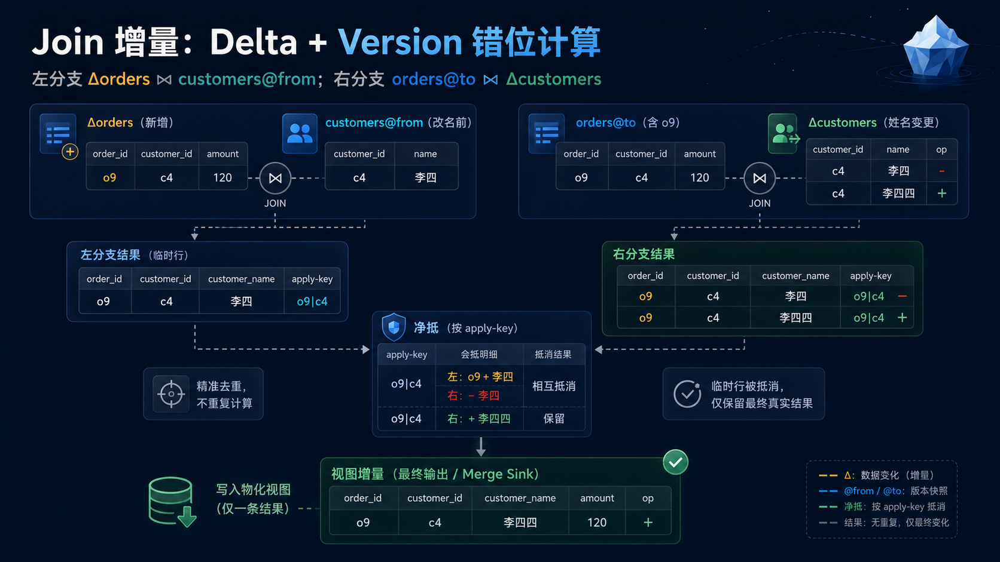

<!--
Mermaid 逻辑图:Join Delta + Version。注释掉以避免 preview 渲染,保留核心逻辑。
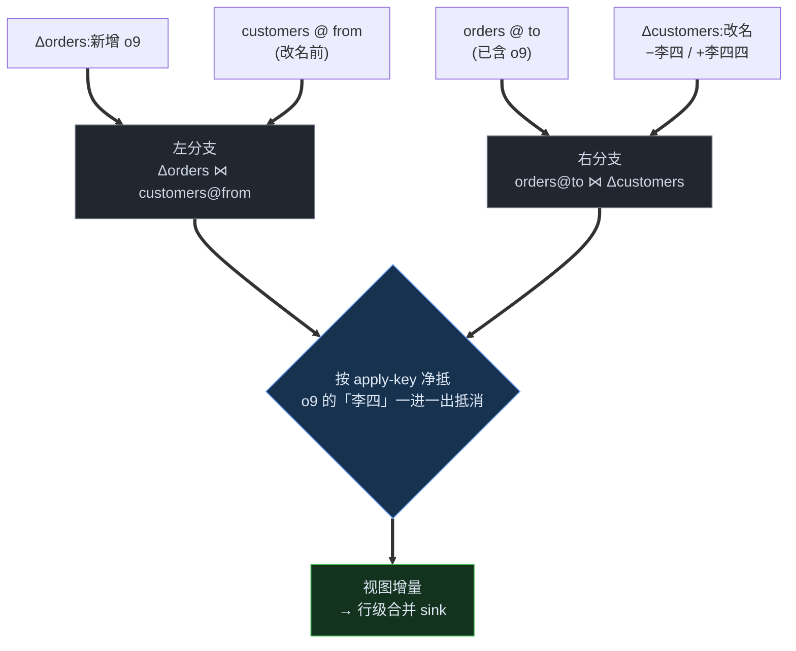
-->

### NovaRocks 怎么用 Iceberg 实现 Delta 和 Version

漂亮的地方在于:这两个算子**不需要任何额外的状态系统**,它们都是 Iceberg 快照模型的直接产物。

- **`Version(R, v)` = 按快照 id 的时间旅行读。** Iceberg 的快照不可变、可寻址;`from` 是上次刷新锚定的快照 id,`to` 是当前快照 id,
  「读某个版本的 R」就是 Iceberg 原生的 time-travel 扫描。一致的时点读是**白送的**,不必自己维护历史副本。
- **`Delta(R)` = 两个快照之间的差。** 正是第二、三节讲的那套:沿快照父链把 `from → to` 之间的提交按 Append / Delete / Overwrite / Replace 分类,
  枚举新增 / 删除的数据文件、产出带 `__change_op` 的流;压实型 `REPLACE` 被识别后跳过,删除靠 DV / position-delete 反投影。

换句话说,增量计算的两个基本算子,一个是「读某快照」、一个是「读两快照之差」——**整套增量都骑在 Iceberg 不可变快照链上**,
NovaRocks 不需要独立的 changelog,也不需要 state store。剩下的工作只是规则改写:把根部的 `Delta` 沿计划树逐层下推
(`Delta` 遇到 join 不向下分配、整体委派给增量规则递归,`Version` 则可以下穿、`Version(Join(A,B)) ≡ Join(Version(A),Version(B))`),
直到整棵树被拆成若干「时间旅行读」与「快照差读」的组合。每种算子贡献自己的一条下推规则,框架用定点把它们组合起来。

而这些规则组合出的那棵树,**每一行的「身份」到底是什么**——这正是下一节要回答的、也是把增量真正落到目标表上的最后一道坎。

---

## 六、不同 SQL 的「唯一行 id」:刷新属性框架

第四节埋了个词:apply 要靠一个 **apply-key**——视图每一行的稳定唯一 id——才能定位「该改目标表里的哪一行」。先看单个算子,它的 row id 其实都很自然,而且**每个都有道理**:

- **过滤 / 投影**:它既不新建、也不合并行,只是放行或丢弃,所以输出行的身份**直接继承**底表 `_row_id`;
- **join**:一条 join 结果行,本质就是「左边某一行 × 右边某一行」配成的对——那么这个**配对** `(左 _row_id, 右 _row_id)` 就唯一标识它(NovaRocks 把这对哈希成一个稳定字符串 key);
- **聚合**:它把一个分组里的所有行**坍缩**成一行,输出行之间唯一的区别就是**分组键**,所以身份 = `GROUP BY` 的键。注意这里发生了一件要紧的事:**输入行的身份被丢弃了**——这也正是为什么聚合之下 join 套得再深,到了聚合这层一概坍缩成「按分组键定位」。

到这儿,一个真正的难题冒出来了。**既然 join 和聚合各有各的 row id 规则,那它们组合到一起时,row id 该听谁的?**
而 MV 偏偏就是算子的组合:聚合套在 join 上、join 又接在另一个聚合的结果上、union 把好几棵子树并起来……
每种算子的 id 规则都不一样,**可组合方式理论上是无穷的**。难道每冒出一种新组合,就得重新拍一遍它的 row id 怎么定?

NovaRocks 的答案是:不去枚举组合,而是让**身份沿计划树自底向上综合**。每个算子只回答一个局部问题——「给定我孩子的身份,我这层输出行的身份是什么」:

- `Scan` 报出 `BaseRowId`;
- `Join` 把两个孩子的身份**组合**成 `JoinRowKey`;
- `Aggregate` 把孩子的身份**丢弃、换成** `GroupRowId`;
- `Union` 给每个孩子的身份**套一层**「这是哪个分支」,得到 `BranchScoped(...)`。

规则就这么几条,但因为它们可组合,无穷的 SQL 组合都被覆盖了——身份不是查出来的,是**算出来的**。拿一个三表 join + 聚合的视图对照看:

```sql
CREATE MATERIALIZED VIEW city_sales AS
SELECT c.city, SUM(o.amount) AS total
FROM orders o
JOIN customers c ON o.customer_id = c.id
JOIN regions   r ON c.region_id   = r.id
GROUP BY c.city;
```

它的身份沿树自底向上是这样综合的:

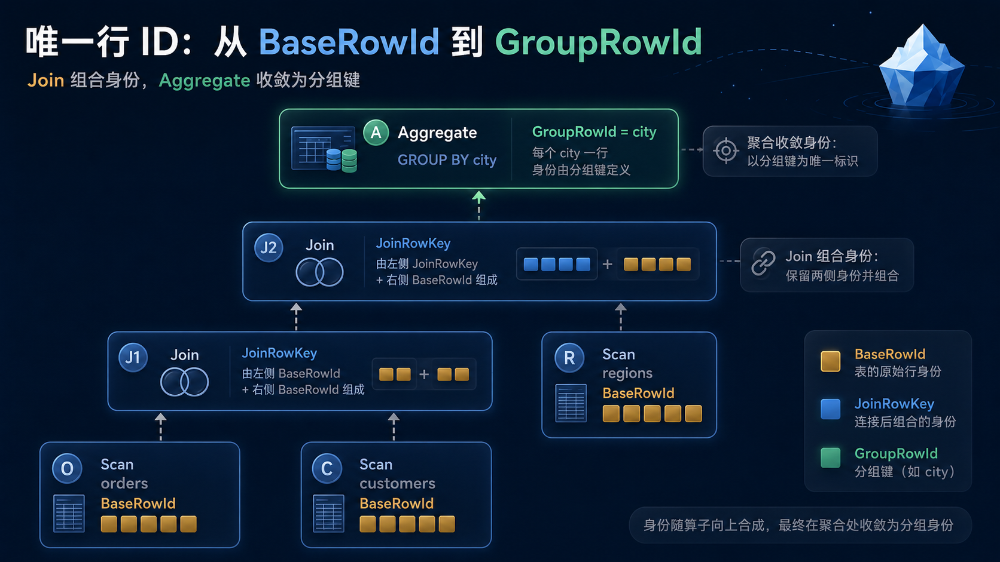

<!--
Mermaid 逻辑图:刷新属性综合。注释掉以避免 preview 渲染,保留核心逻辑。
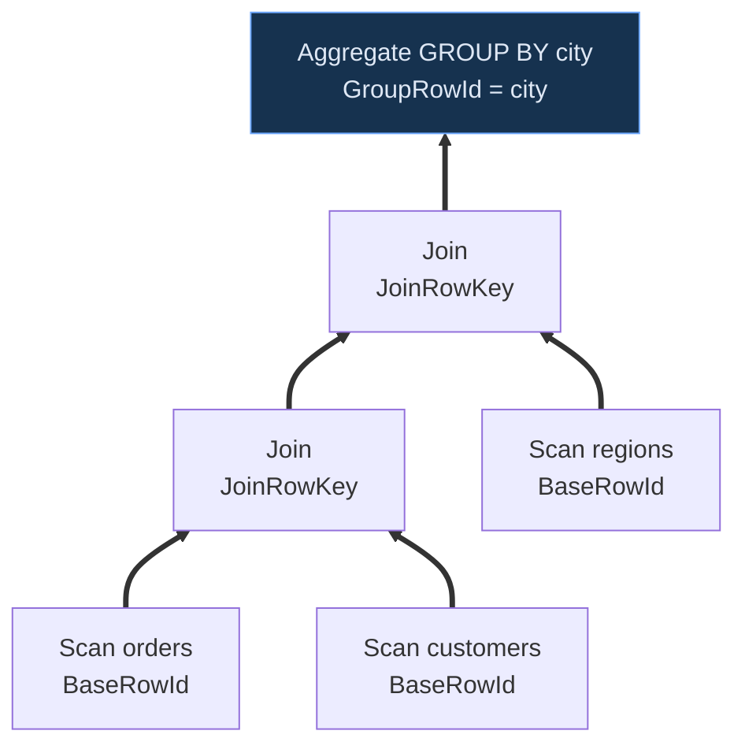
-->

下面 join 了三张表、嵌了两层,可一旦到了 `GROUP BY city`,这些全都**坍缩**掉——`city_sales` 每行的唯一 id 就是 `city`,
apply 时只需「按 `city` 定位分组、合并聚合态」(正是第四节聚合态合并那套),根本不关心底下 join 长什么样。这就是身份综合的威力:**复杂度在该消失的地方消失了。**

最后一种算子 `Union`,藏着一个不那么显然、却最能说明「身份」为何重要的坑。看一个把「订单额」和「退款额」都按城市汇总、再并起来的视图:

```sql
CREATE MATERIALIZED VIEW city_volume AS
SELECT city, SUM(amount) AS total FROM orders  GROUP BY city
UNION ALL
SELECT city, SUM(refund) AS total FROM refunds GROUP BY city;
```

两个分支各自是聚合,各自的身份都是 `GroupRowId = city`。坑就在这儿:两个分支**可以聚出同一个 city**——
`orders` 这边有一行 `SH → 320`,`refunds` 那边也有一行 `SH → 40`。在 `UNION ALL` 的结果里,这是**两条理应并存的不同行**,
可它们的 `GroupRowId` 一模一样、都是 `SH`。如果就拿 `GroupRowId` 当 apply-key,这两行就**撞到同一个 key 上**了——
一笔退款引发的「`SH` 分组」变更,会在目标表里错误地定位到、甚至覆盖掉 `orders` 那行 `SH`:

| 只用 `GroupRowId` 当 key | apply-key | total |
|:-:|:-:|:-:|
| orders 分支 | `SH` | 320 |
| refunds 分支 | `SH` | 40 |
| | ↑ **两行撞同一个 key** | |

`BranchScoped` 正是来消除这次相撞的:它在每行身份前面**再缀一个「来自哪个分支」**,把 `GroupRowId` 升级成 `(分支, GroupRowId)`:

| 用 `BranchScoped(GroupRowId)` | apply-key | total |
|:-:|:-:|:-:|
| orders 分支 | `(orders, SH)` | 320 |
| refunds 分支 | `(refunds, SH)` | 40 |

两个 `SH` 各归各的分支,退款变更只落到 `(refunds, SH)`,绝不会碰 `(orders, SH)`。**这就是为什么 `Union` 必须在孩子身份之外再叠一个 branch 维度**——
因为兄弟分支会各自独立地产出**相同的内层身份**,不加分支标签,它们就会在并起来的目标表里相撞。

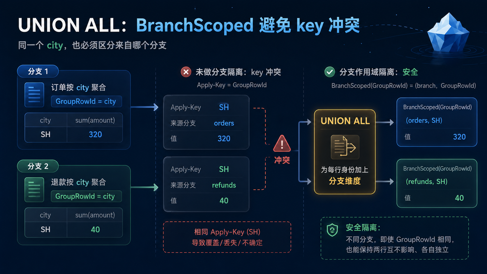

<!--
Mermaid 逻辑图:UNION ALL 分支身份。注释掉以避免 preview 渲染,保留核心逻辑。
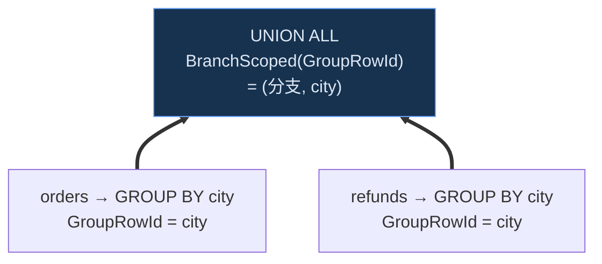
-->

而这个 branch 维度有两个好性质:它**与分支内部是什么无关**(分支里是聚合、join、还是又一个 union,都不影响「缀一个分支标签」这件事),
而且**幂等**——`branch ∘ branch = branch`,嵌套的 union 不会越缀越多层,而是收敛成一条「分支路径」。
正因如此,`Union(Agg(Join(...)), Agg(Union(...)))` 这种层层嵌套也**自然**被覆盖:每个分支各自递归算出自己的身份,`Union` 只在外面缀分支路径,不必为「带 join 的 union」单列一种规则。

这里有一个刻意的设计取舍:**身份属性能综合出的组合,比刷新实际能驱动的集合更大。** 收口只在一个地方——
把综合出的身份属性映射到可执行刷新契约的那一步;无法增量执行的组合会落到 catch-all 分支被拒绝,并在 **CREATE 时就 fail-fast**(而不是悄悄给出错误结果)。
代价是读者要理解「能综合 ≠ 能执行」;收益是**新支持一种 SQL = 复用已有的身份规则去组合,而不是再造一种形态**。

---

## 七、失败可恢复:全靠 Iceberg 的三个原语

刷新会失败——进程崩溃、和别的写入撞车。NovaRocks 做到「要么干净地前进一步,要么什么都没发生」,靠的不是外部协调器、也不是两阶段提交,而是 Iceberg 本身的几个原语。先补一点背景。

### 先认识 Iceberg 的快照模型

一张 Iceberg 表 = 一堆**不可变**的数据文件 + 一条**快照(snapshot)链**。每次写入(增 / 删 / 改)都不原地改老文件,而是产生一个**新快照**:它是整张表在那一刻的完整、不可变视图,有自己的快照 id,并指向父快照,串成表的历史。老快照一直可读——这就是「时间旅行」的由来。

「表现在是什么样」其实只是表元数据里的一个**指针**,指向「当前快照」。所谓提交,就是**原子地**把这个指针挪到新快照上;而且带**乐观并发**:只有当「表还停在我开始时看到的那个快照」时,这次挪动才成功,否则失败重来。

除了 main 这条主线,Iceberg 还支持**分支 / 标签(branch / tag)**:给某个快照起名的指针,很像 git 的 ref。写一个分支只推进那个分支的指针,main 看不见。

记住三点就够了——**快照不可变且可寻址、当前态是个可原子 CAS 的指针、分支是命名的快照指针**。下面三个保证,正好各对应其一。

### ① 分支(命名 ref)→ 隔离

刷新不直接写 main,而是先写到一个私有分支 `__nova_mv_refresh_*`。写分支只产生「只有该 ref 能到达」的新快照,main 始终看不见这些中间态。于是一次刷新可以放心地多步写入(删旧组、写新行、合并聚合态),全程对读者不可见。

### ② 原子 CAS → 发布

一切就绪后,发布是一次**带守卫的 fast-forward**:把 main 指向 staging 分支的最新快照,但**仅当 main 仍停在我开始时记下的那个快照**时才生效。这正是上面说的那个原子 compare-and-swap——若这期间别的写入推进了 main,CAS 失败,这次刷新**整体作废、下次重来**,绝不会写出一半。发布之所以原子,是因为它直接复用了 Iceberg 提交的并发语义,而不是自己造锁。

### ③ 不可变快照 → 一致读 + 持久恢复

第五节的 `Version` 读、以及这里的隔离与守卫,全都建立在「快照不可变、可寻址」之上:刷新读的是 pin 住的 `from` / `to` 快照,不受并发写入干扰。而 staging 分支作为一个 ref,**本身就持久化在表元数据里**——进程崩溃重启后,NovaRocks 只要列出还挂着的 `__nova_mv_refresh_*` ref 就能对账:要么发现刷新其实已发布、清掉残留分支,要么发现是半路夭折的尝试、回收它。**恢复所需的全部状态都在 Iceberg 元数据里,不需要第二份事务日志。**

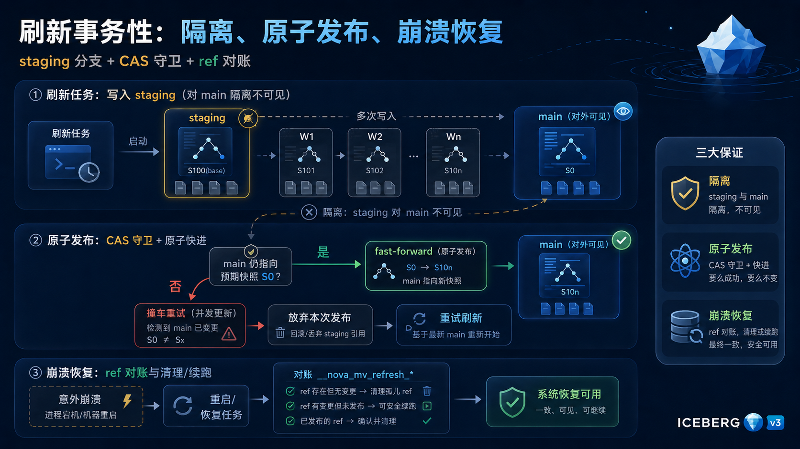

<!--
Mermaid 逻辑图:刷新事务性。注释掉以避免 preview 渲染,保留核心逻辑。
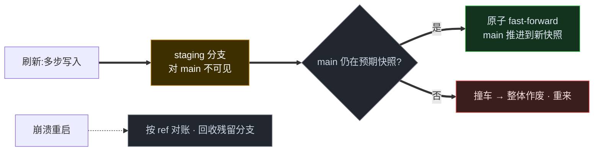
-->

把这三点合起来——**隔离、原子发布、崩溃恢复**——一件在分布式系统里通常要专门子系统(协调器、独立事务日志)去保证的事,在这里被三个 Iceberg 原语兜住了:NovaRocks 没有为物化视图的事务性另起炉灶,而是直接复用了表本身的能力。
