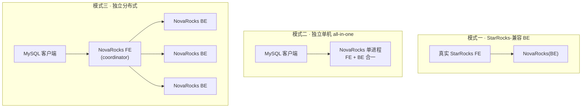

# NovaRocks 是什么:从一个 mock BE,到 Iceberg-原生的 OLAP 引擎

> 项目地址:<https://github.com/NovaRocks/NovaRocks>

一句话:**NovaRocks 是一个用 Rust 写的分析型(OLAP)查询引擎,云原生、对存算分离友好;它对 Iceberg v3 做了强绑定的专属优化,并以增量物化视图(IVM)作为核心特色功能。** 它既能藏在 StarRocks FE 背后当一个后端(BE),也能完全脱离 StarRocks 独立运行。

但它最有意思的地方不在这句定义,而在它**为什么会长成今天这样**——这是一个目标一路「长大」的项目。

---

## 一、起点:一个很具体的小目标

NovaRocks 一开始想解决的问题特别小、特别具体。

StarRocks 的 BE 是 C++ 写的,在 Mac 上做开发并不友好:编译链重、构建慢、调试环境搭起来费劲。作者在开发 StarRocks 时被这件事反复硌到,于是冒出一个念头:**能不能做一个简单的「mock BE」,配合真正的 StarRocks FE 跑起来?**

目标就这么朴素——有了一个轻量、好启动、好调试的假 BE,就可以:

- 让 **AI 自动复现 bug**:很多 FE 侧的问题需要一个能应答的 BE 才能跑通链路,一个轻量 BE 让「复现」这件事可以被自动化驱动;
- **加速 FE 功能模块的开发**:开发 FE 的某个功能时,不必每次都背上一整套沉重的 C++ BE。

换句话说,NovaRocks 的初心不是「再造一个查询引擎」,而是「给 StarRocks FE 配一个趁手的陪练」。

---

## 二、转折:从「mock BE」到「验证思路的平台」

随着这个 mock BE 越做越能跑,作者意识到它的价值远不止陪练。

关键在于 **Rust 的编译链与工程体验**:迭代快、重构稳、原型成型的成本低。于是 NovaRocks 的定位升级成了**一个验证思路的平台**——

> 用 Rust 快速验证一些功能思路和架构原型,验证清楚之后,再把这些经过实证的原型**反哺回 StarRocks**。

这是一个很务实的分工:在 NovaRocks 里,「想清楚一个设计该怎么做」的成本很低;一旦在这里把原型跑通、把权衡想透,这份认知就能带回那个更重、更成熟的 C++ 工程里去落地。NovaRocks 因此既是陪练,也是**试验场**。

正是这个定位,催生了它的三种部署模式。

---

## 三、三种部署模式

同一套 Rust 执行内核,按「需要它扮演什么角色」摆出三种形态:

- **模式一:StarRocks-兼容 BE。** NovaRocks 作为一个后端挂在真实的 StarRocks FE 之下,严格按 FE 下发的 thrift 计划与类型元数据执行。这是项目的**初心形态**——给 FE 当陪练、复现 bug、加速 FE 开发。
- **模式二:独立单机(all-in-one)。** 不需要任何 StarRocks FE。NovaRocks 自己开一个 MySQL 兼容的服务,**FE 与 BE 合在一个进程里**:自己解析 SQL、做分析与 CBO 优化、codegen,再本地执行。一条 `mysql` 命令就能连上用。
- **模式三:独立分布式。** 还是不需要 StarRocks FE,但把角色拆开跨进程部署:一个 **FE 角色当 coordinator**(只跑 MySQL、优化器和分发协调,不在本地执行),配上**多个 BE 角色**承担真正的 fragment 执行。这让分布式执行的思路与原型也能在 NovaRocks 里被验证。

三种模式,对应了项目两次身份的叠加:模式一是「陪练」,模式二、三是「独立的引擎 + 分布式试验场」。

---

## 四、现在的 NovaRocks:一个能独立运行的完整 OLAP 引擎

如果说模式一时它还只是个「假 BE」,那么经过这么长时间的发展,**今天的 NovaRocks 已经是一个可以完全独立运行的、五脏俱全的 OLAP 查询引擎**。在独立模式下,一条 SQL 从进来到出结果,全程由它自己负责:

- **SQL 前端**:解析、语义分析、名字与表达式解析;
- **CBO 优化器**:逻辑/物理改写规则、统计与代价估计、join reorder、物理属性(分布/有序)感知的搜索,以及把优化产物下沉成可执行计划的 codegen;
- **执行引擎**:pipeline 化的算子执行、跨节点 exchange、运行时调度;
- **连接器与格式**:Iceberg、JDBC/MySQL、HDFS 等扫描连接器,Parquet / ORC 等格式读取;
- **Iceberg catalog**:memory、hadoop、REST、Hive(HMS)等多种 catalog 接入,读写与 DML 一应俱全;
- **MySQL 协议**:对外就是一个 MySQL 兼容服务,BI 工具与现有客户端可以直接连。

而在「完整 OLAP 引擎」这个共性之上,NovaRocks 有两个鲜明的、刻意选择的**专属定位**:

- **对 Iceberg v3 强绑定、专属优化。** 它不是「顺便支持一下 Iceberg」,而是把 Iceberg v3 当成一等公民来设计——从读写、catalog,到下面要说的物化视图,都深度利用 v3 的能力(行血缘、快照血缘、删除向量等)。
- **以增量物化视图(IVM)作为核心特色功能。** 这是 NovaRocks 最与众不同的地方:它把 Iceberg v3 表的提交历史当作 changelog,用行血缘做跨快照稳定的行身份,实现**增量**维护物化视图,而不必全量重算。原理见专文:[用 Iceberg v3 实现增量物化视图的原理](incremental-materialized-views-on-iceberg-v3.md)。

---

## 五、一个项目,两重身份

回头看,NovaRocks 同时是两样东西:

- 对 StarRocks 而言,它是一个**轻快的陪练与试验场**——用 Rust 的低成本迭代验证思路与原型,再把实证后的设计反哺回去;
- 对它自己而言,它已经是一个**能独立运行的、Iceberg v3 原生、以 IVM 为核心特色的 OLAP 查询引擎**。

一个最初只想「在 Mac 上少受点编译之苦」的小念头,长成了一个既能反哺上游、又能独当一面的引擎。
