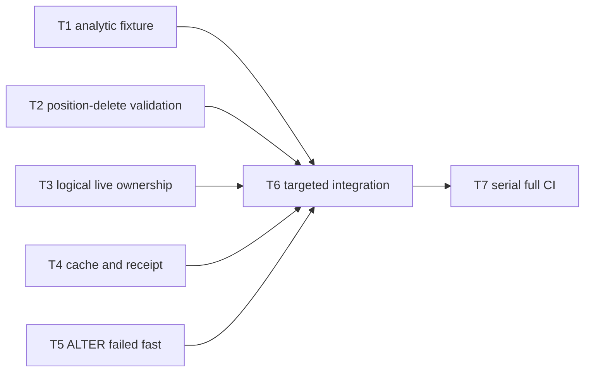

# CI-20260803 CI 回归修复实现计划

## 目标与完成定义

在不放宽 ADR-0029/ADR-0030 安全边界、不更新 SQL golden 的前提下，修复四个确定性 CI 失败及 ALTER FAILED 诊断缺口；最终以 cross-process 1FE+3BE targeted serial SQL 全绿和 `SQL_QUERY_TIMEOUT_SECONDS=180 ./tools/ci/local-full-ci.sh` 串行全量通过为完成条件。

## 输入与设计约束

- Spec：[[CI-20260803-analytic-hadoop-ctas-fixture]]
- Spec：[[CI-20260803-distributed-rewrite-correctness]]
- ADR：`docs/adr/ADR-0029-connector-distributed-rewrite-contract.md`
- ADR：`docs/adr/ADR-0030-frontend-ctas-staged-publication.md`
- 不实现 Hadoop atomic staged publication，不增加 partial rewrite fallback，不猜测 unknown commit，不更新 golden。
- distributed 1FE+3BE 是生产形态验证基线。

## 代码现状

- analytic fixture 用 CTAS 创建 `nt1`、`nt2`，与其测试目标无关。
- distributed rewrite planner 在文件分类前做 v3 guard。
- selected rewrite ownership 使用跨 manifest 的 `is_alive()` 并集，与 read snapshot 的逻辑 live set不一致。
- distributed rewrite finalize 未刷新 table cache，receipt 丢失已有 committed facts。
- SQL runner wait helper 只识别 `FINISHED`。

## Task DAG

T3 是高风险关键路径；T1、T2、T4、T5 在代码所有权上独立，但本次由 main agent 顺序执行。T6 是行为收敛点，T7 是 goal 完成门。

## 并行调度表

| Task | Depends on | Wave | Label | File scope | Output | Validation | Commit |
|---|---|---|---|---|---|---|---|
| T1 | — | 1 | main-agent | `sql-tests/analytic/sql/analytic_test_window_function_with_join.sql` | fixture 不再依赖 CTAS | targeted analytic | no |
| T2 | — | 1 | main-agent | `novarocks/core/src/connector/iceberg/distributed_rewrite.rs` | 恢复精确 V2 错误与 no-op 顺序 | core unit + SQL case | no |
| T3 | — | 1 | serial | Iceberg read/commit live-file helpers | planner/committer 使用同一 logical live set | core unit + uniqueness SQL | yes |
| T4 | T3 | 2 | main-agent | distributed rewrite adapter/receipt | 新 snapshot 立即可见且 receipt 保留 committed facts | unit + row-lineage SQL | no |
| T5 | — | 1 | main-agent | `tests/sql-test-runner/src/main.rs` 及测试 | FAILED 立即终止并打印错误 | runner unit | no |
| T6 | T1,T2,T3,T4,T5 | 3 | serial | integration only | 五个相关 SQL case 全绿 | cross-process 1FE+3BE `-j 1` | yes |
| T7 | T6 | 4 | serial | repository-wide | stable full CI 全绿 | local-full-ci | no |

## 任务明细

### T1：解除 analytic fixture 的 CTAS 依赖

- **Depends on**：无
- **Wave / Label**：1 / main-agent
- **目标**：显式创建并填充 `nt1`、`nt2`，query 2-5 与 golden 不变。
- **文件所有权**：`sql-tests/analytic/sql/analytic_test_window_function_with_join.sql`
- **验证**：targeted analytic cross-process serial；Hadoop CTAS 负向 case 保持通过。
- **完成证据**：case PASS 且 result golden 无 diff。
- **本地 commit 检查点**：不需要。

### T2：恢复 position-delete provider-specific 校验顺序

- **Depends on**：无
- **Wave / Label**：1 / main-agent
- **目标**：先识别 Parquet/Puffin candidate，再对实际 Puffin rewrite 应用 v3 guard。
- **文件所有权**：Iceberg distributed rewrite planner 与相邻 unit tests。
- **验证**：core unit tests；`iceberg_spark_procedures_errors`。
- **完成证据**：V2 Parquet 精确错误恢复，空 candidate no-op 不回归。
- **本地 commit 检查点**：不需要。

### T3：补齐孤立 live delete-file ownership

- **Depends on**：无
- **Wave / Label**：1 / serial
- **目标**：planner 在保留 read-snapshot cohort 语义的同时，补齐当前 snapshot 中未附着到 data cohort 的 live delete paths，使 frozen ownership 与 commit validator 的完整 live set 一致。
- **文件所有权**：Iceberg distributed rewrite planner、live delete manifest helper 与相邻 tests。
- **输入 / 输出契约**：输入 frozen base snapshot；输出全部 live data paths 与恰好归属一次的全部 live delete paths。
- **实现约束**：禁止把 equality 降为 subset；禁止忽略孤立 delete files；canonical 归属必须稳定且不改变 row-lineage/data cohort 事实。
- **验证**：新增 COW history regression unit/integration；row-lineage uniqueness targeted SQL。
- **完成证据**：ownership 不再误报且 one aggregate Replace snapshot 成立。
- **本地 commit 检查点**：完成本高风险切片后可创建。

### T4：提交后 cache 可见性与 receipt facts

- **Depends on**：T3
- **Wave / Label**：2 / main-agent
- **目标**：direct commit 和 reconcile-to-committed 后刷新 exact table cache；final receipt 保留 snapshot id 与 resulting row count。
- **文件所有权**：distributed rewrite adapter/committer 及 unit tests。
- **验证**：adapter tests；`iceberg_v3_optimize_row_lineage`。
- **完成证据**：`$snapshots` 立即看到 Replace；receipt 不再硬编码丢失已有事实。
- **本地 commit 检查点**：不需要。

### T5：ALTER FAILED 快速诊断

- **Depends on**：无
- **Wave / Label**：1 / main-agent
- **目标**：wait helper 结构化识别 FINISHED/FAILED，FAILED 立即返回并记录 error message。
- **文件所有权**：SQL runner wait helper 与测试。
- **验证**：runner unit tests。
- **完成证据**：FAILED 不再等待 300 次，非终态继续轮询。
- **本地 commit 检查点**：不需要。

### T6：Targeted integration 收敛

- **Depends on**：T1-T5
- **Wave / Label**：3 / serial
- **目标**：相关成功、错误和诊断路径在 cross-process 1FE+3BE 下共同通过。
- **验证**：analytic case；三个失败 Iceberg case；两个相邻 rewrite guard cases，全部 `-j 1`。
- **完成证据**：targeted serial runner 0 fail，无残留进程。
- **本地 commit 检查点**：完成后可创建单一实现检查点。

### T7：串行全量 CI

- **Depends on**：T6
- **Wave / Label**：4 / serial
- **目标**：最新本地修复在 canonical stable full CI 中全绿。
- **验证**：`SQL_QUERY_TIMEOUT_SECONDS=180 ./tools/ci/local-full-ci.sh`。
- **完成证据**：最新 `summary.md` 为 PASS，Rust/SQL stages 全通过，无残留 standalone-server。
- **本地 commit 检查点**：不需要。

## Wave 集成与验证

### Wave 1-2

- **集成顺序**：T1 → T2 → T3 → T4 → T5。
- **组合验证**：先 unit，再最小 targeted SQL；T3/T4 组合后重跑两条 row-lineage cases。
- **冲突处理**：以 frozen snapshot exactness、ADR-0029 one-snapshot contract 为准，不放宽断言。
- **检查点 commit**：T3 高风险切片验证后可选。

### Wave 3-4

- **集成顺序**：targeted cross-process serial → full CI。
- **组合验证**：golden diff、tracked worktree、残留进程一起检查。
- **检查点 commit**：targeted 全绿后可选；execute 阶段不 push、不建 PR。

## 可由执行者决定的事项

- logical live helper 的模块位置，只要权威实现唯一并保留完整 commit metadata。
- cache invalidation 的具体 hook，只要 direct/reconcile committed 两条路径都覆盖。
- runner 状态解析的局部结构，只要不靠无边界 substring 猜状态。

## 必须回到设计讨论的变化

- 需要 partial rewrite、放宽 exact ownership、改变 durable SPI/payload version、改变 unknown commit 语义或支持 Hadoop CTAS。
- 无法在不推进 `next_row_id` 的情况下保留 row-lineage。

## 最终验证

- 定向验证：相关 crate unit tests。
- Wave 组合验证：6 个 targeted SQL cases，cross-process 1FE+3BE，`-j 1`。
- 最终集成验证：canonical serial full CI。
- 生产部署形态验证：cross-process 1FE+3BE，不以 all-in-one 代替。

## 本地 Commit 策略

- 只在 `codex/fix-ci-daily-regressions` 本地分支操作。
- 完整切片完成后或高风险改动前可创建检查点 commit。
- execute 阶段禁止 push 和 PR。

## 执行记录

| Task / Wave | Owner | Status | Commit | Evidence |
|---|---|---|---|---|
| T1-T5 | main agent | completed | — | core rewrite tests 9/9; runner ALTER test 1/1 |
| T6 | main agent | completed | — | analytic 1/1 and iceberg 5/5; cross-process 1FE+3BE; `-j 1` |
| T7 | main agent | completed | — | `logs/ci-full/20260803-210446/summary.md`: PASS, 3694s |
